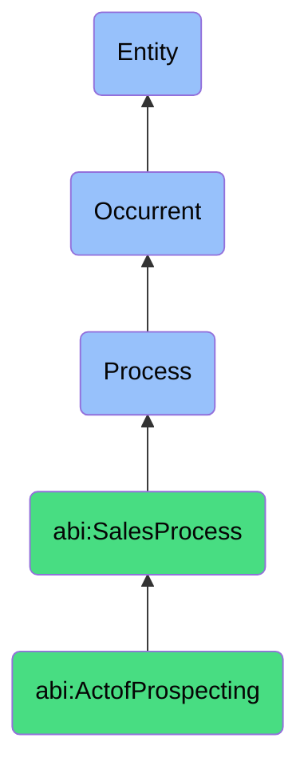

# ActofProspecting

## Definition
An act of prospecting is an occurrent process that unfolds through time, involving the systematic identification, discovery, and qualification of potential clients or leads based on predefined criteria, data sources, or signals of interest to create a pool of prospects that align with target customer profiles and exhibit potential for conversion into sales opportunities.

## Hierarchy in BFO


## Ontological Schema (TBox)
```turtle
abi:ActofProspecting a owl:Class ;
  rdfs:subClassOf abi:SalesProcess ;
  rdfs:label "Act of Prospecting" ;
  skos:definition "A process that identifies potential clients or leads based on signals, targeting logic, or inbound interest." .

abi:SalesProcess a owl:Class ;
  rdfs:subClassOf bfo:0000015 ;
  rdfs:label "Sales Process" ;
  skos:definition "A time-bound interaction or conversion of relationships into economic transactions." .

abi:has_prospector a owl:ObjectProperty ;
  rdfs:domain abi:ActofProspecting ;
  rdfs:range abi:Prospector ;
  rdfs:label "has prospector" .

abi:analyzes_data_source a owl:ObjectProperty ;
  rdfs:domain abi:ActofProspecting ;
  rdfs:range abi:ProspectingDataSource ;
  rdfs:label "analyzes data source" .

abi:applies_targeting_criteria a owl:ObjectProperty ;
  rdfs:domain abi:ActofProspecting ;
  rdfs:range abi:TargetingCriteria ;
  rdfs:label "applies targeting criteria" .

abi:identifies_prospect a owl:ObjectProperty ;
  rdfs:domain abi:ActofProspecting ;
  rdfs:range abi:Prospect ;
  rdfs:label "identifies prospect" .

abi:employs_prospecting_technique a owl:ObjectProperty ;
  rdfs:domain abi:ActofProspecting ;
  rdfs:range abi:ProspectingTechnique ;
  rdfs:label "employs prospecting technique" .

abi:matches_ideal_customer_profile a owl:ObjectProperty ;
  rdfs:domain abi:ActofProspecting ;
  rdfs:range abi:IdealCustomerProfile ;
  rdfs:label "matches ideal customer profile" .

abi:produces_prospect_list a owl:ObjectProperty ;
  rdfs:domain abi:ActofProspecting ;
  rdfs:range abi:ProspectList ;
  rdfs:label "produces prospect list" .

abi:has_execution_frequency a owl:DatatypeProperty ;
  rdfs:domain abi:ActofProspecting ;
  rdfs:range xsd:string ;
  rdfs:label "has execution frequency" .

abi:has_yield_rate a owl:DatatypeProperty ;
  rdfs:domain abi:ActofProspecting ;
  rdfs:range xsd:decimal ;
  rdfs:label "has yield rate" .

abi:has_prospect_count a owl:DatatypeProperty ;
  rdfs:domain abi:ActofProspecting ;
  rdfs:range xsd:integer ;
  rdfs:label "has prospect count" .
```

## Ontological Instance (ABox)
```turtle
ex:WeeklyCRMLinkedInProspectingProcess a abi:ActofProspecting ;
  rdfs:label "Weekly CRM and LinkedIn Prospecting Process" ;
  abi:has_prospector ex:SalesAssistant ;
  abi:analyzes_data_source ex:CRMDatabase, ex:LinkedInSalesNavigator ;
  abi:applies_targeting_criteria ex:IndustryFilter, ex:CompanySizeFilter, ex:TechnologyStackFilter ;
  abi:identifies_prospect ex:EnterpriseITDirector, ex:MidMarketCIO ;
  abi:employs_prospecting_technique ex:LookalikeModeling, ex:BehavioralSignalAnalysis ;
  abi:matches_ideal_customer_profile ex:EnterpriseITPurchaserProfile, ex:TechDecisionMakerProfile ;
  abi:produces_prospect_list ex:WeeklyHighPotentialProspectList ;
  abi:has_execution_frequency "Weekly on Mondays" ;
  abi:has_yield_rate "0.32"^^xsd:decimal ;
  abi:has_prospect_count "18"^^xsd:integer .

ex:InboundLeadProcessingProspectingProcess a abi:ActofProspecting ;
  rdfs:label "Inbound Lead Processing Prospecting Process" ;
  abi:has_prospector ex:MarketingAutomationSystem ;
  abi:analyzes_data_source ex:WebsiteFormSubmissions, ex:EventRegistrations, ex:ContentDownloads ;
  abi:applies_targeting_criteria ex:LeadScoreThreshold, ex:BudgetIndicator, ex:TimelineSignal ;
  abi:identifies_prospect ex:SaaS_DecisionMaker, ex:EnterpriseProjectManager ;
  abi:employs_prospecting_technique ex:DigitalBodyLanguageAnalysis, ex:EngagementScoring ;
  abi:matches_ideal_customer_profile ex:HighGrowthSaaSProfile, ex:EnterpriseTransformationLeaderProfile ;
  abi:produces_prospect_list ex:QualifiedInboundLeadList ;
  abi:has_execution_frequency "Daily, real-time processing" ;
  abi:has_yield_rate "0.45"^^xsd:decimal ;
  abi:has_prospect_count "24"^^xsd:integer .
```

## Related Classes
- **abi:ActofOutreach** - A process that typically follows prospecting to initiate contact with identified prospects.
- **abi:ActofLeadQualification** - A process that further evaluates prospects identified during prospecting.
- **abi:ActofTrackingEngagement** - A process that monitors prospect interactions which may inform prospecting criteria.
- **abi:DataEnrichmentProcess** - A process that enhances prospect data with additional information.
- **abi:MarketSegmentationProcess** - A process that defines target segments which inform prospecting criteria. 