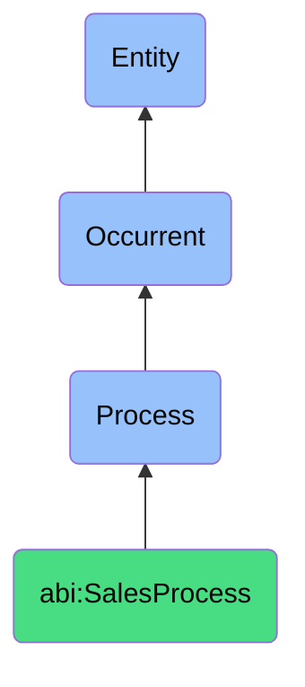

# SalesProcess

## Definition
A sales process is an occurrent that unfolds through time, involving structured interactions, communications, and evaluations aimed at identifying, engaging, nurturing, and converting potential clients into economic relationships through a sequence of defined stages from initial prospecting to final transaction closure.

## Hierarchy in BFO


## Ontological Schema (TBox)
```turtle
abi:SalesProcess a owl:Class ;
  rdfs:subClassOf bfo:0000015 ;
  rdfs:label "Sales Process" ;
  skos:definition "A time-bound interaction or conversion of relationships into economic transactions." .

abi:has_sales_agent a owl:ObjectProperty ;
  rdfs:domain abi:SalesProcess ;
  rdfs:range abi:SalesAgent ;
  rdfs:label "has sales agent" .

abi:involves_prospect a owl:ObjectProperty ;
  rdfs:domain abi:SalesProcess ;
  rdfs:range abi:Prospect ;
  rdfs:label "involves prospect" .

abi:follows_sales_methodology a owl:ObjectProperty ;
  rdfs:domain abi:SalesProcess ;
  rdfs:range abi:SalesMethodology ;
  rdfs:label "follows sales methodology" .

abi:occurs_in_sales_context a owl:ObjectProperty ;
  rdfs:domain abi:SalesProcess ;
  rdfs:range abi:SalesContext ;
  rdfs:label "occurs in sales context" .

abi:applies_sales_technique a owl:ObjectProperty ;
  rdfs:domain abi:SalesProcess ;
  rdfs:range abi:SalesTechnique ;
  rdfs:label "applies sales technique" .

abi:produces_sales_artifact a owl:ObjectProperty ;
  rdfs:domain abi:SalesProcess ;
  rdfs:range abi:SalesArtifact ;
  rdfs:label "produces sales artifact" .

abi:advances_sales_opportunity a owl:ObjectProperty ;
  rdfs:domain abi:SalesProcess ;
  rdfs:range abi:SalesOpportunity ;
  rdfs:label "advances sales opportunity" .

abi:has_process_duration a owl:DatatypeProperty ;
  rdfs:domain abi:SalesProcess ;
  rdfs:range xsd:duration ;
  rdfs:label "has process duration" .

abi:has_process_status a owl:DatatypeProperty ;
  rdfs:domain abi:SalesProcess ;
  rdfs:range xsd:string ;
  rdfs:label "has process status" .

abi:has_probability_of_success a owl:DatatypeProperty ;
  rdfs:domain abi:SalesProcess ;
  rdfs:range xsd:decimal ;
  rdfs:label "has probability of success" .
```

## Ontological Instance (ABox)
```turtle
# SalesProcess is a parent class with subclasses:
# - abi:ActofProspecting
# - abi:ActofOutreach
# - abi:ActofLeadQualification
# - abi:ActofMeeting
# - abi:ActofDealCreation
# - abi:ActofNegotiation
# - abi:ActofClosing
# and other sales-related processes
```

## Related Classes
- **abi:ActofProspecting** - A process that identifies potential clients or leads.
- **abi:ActofOutreach** - A process of initiating communication with a prospect.
- **abi:ActofLeadQualification** - A process that evaluates lead fit for sales pipeline progression.
- **abi:ActofMeeting** - A process involving exchange between sales and prospect.
- **abi:ActofDealCreation** - A process where a sales opportunity is structured and priced.
- **abi:ActofNegotiation** - A process of refining terms between parties.
- **abi:ActofClosing** - A process that concludes a deal through mutual agreement.
- **abi:MarketingProcess** - A related process that often precedes and supports sales processes. 