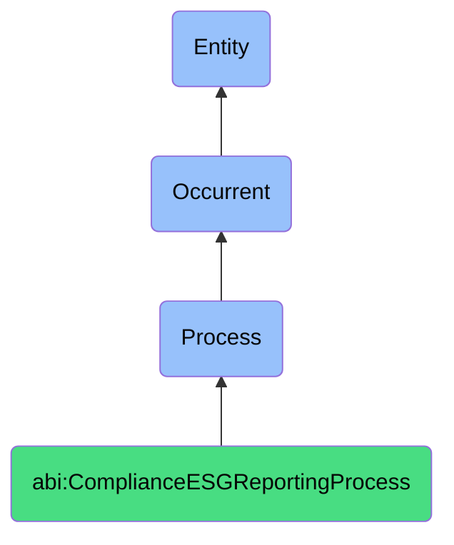

# ComplianceESGReportingProcess

## Definition
A compliance ESG reporting process is an occurrent that unfolds through time, involving the systematic evaluation, documentation, monitoring, or verification of organizational practices, policies, operations, or outcomes against established regulatory requirements, industry standards, environmental metrics, social responsibility frameworks, or governance principles, ensuring accountability, transparency, risk mitigation, and conformance to legal, ethical, or sustainability expectations through structured assessment methodologies and reporting mechanisms.

## Hierarchy in BFO


## Ontological Schema (TBox)
```turtle
abi:ComplianceESGReportingProcess a owl:Class ;
  rdfs:subClassOf bfo:0000015 ;
  rdfs:label "Compliance ESG Reporting Process" ;
  skos:definition "A time-bound process related to the evaluation, documentation, or verification of organizational practices against regulatory requirements, industry standards, or ESG frameworks." .

abi:has_compliance_agent a owl:ObjectProperty ;
  rdfs:domain abi:ComplianceESGReportingProcess ;
  rdfs:range abi:ComplianceAgent ;
  rdfs:label "has compliance agent" .

abi:evaluates_organizational_practice a owl:ObjectProperty ;
  rdfs:domain abi:ComplianceESGReportingProcess ;
  rdfs:range abi:OrganizationalPractice ;
  rdfs:label "evaluates organizational practice" .

abi:references_compliance_standard a owl:ObjectProperty ;
  rdfs:domain abi:ComplianceESGReportingProcess ;
  rdfs:range abi:ComplianceStandard ;
  rdfs:label "references compliance standard" .

abi:follows_assessment_methodology a owl:ObjectProperty ;
  rdfs:domain abi:ComplianceESGReportingProcess ;
  rdfs:range abi:AssessmentMethodology ;
  rdfs:label "follows assessment methodology" .

abi:addresses_compliance_domain a owl:ObjectProperty ;
  rdfs:domain abi:ComplianceESGReportingProcess ;
  rdfs:range abi:ComplianceDomain ;
  rdfs:label "addresses compliance domain" .

abi:identifies_compliance_issue a owl:ObjectProperty ;
  rdfs:domain abi:ComplianceESGReportingProcess ;
  rdfs:range abi:ComplianceIssue ;
  rdfs:label "identifies compliance issue" .

abi:produces_compliance_documentation a owl:ObjectProperty ;
  rdfs:domain abi:ComplianceESGReportingProcess ;
  rdfs:range abi:ComplianceDocumentation ;
  rdfs:label "produces compliance documentation" .

abi:has_assessment_period_start a owl:DatatypeProperty ;
  rdfs:domain abi:ComplianceESGReportingProcess ;
  rdfs:range xsd:date ;
  rdfs:label "has assessment period start" .

abi:has_assessment_period_end a owl:DatatypeProperty ;
  rdfs:domain abi:ComplianceESGReportingProcess ;
  rdfs:range xsd:date ;
  rdfs:label "has assessment period end" .

abi:has_compliance_status a owl:DatatypeProperty ;
  rdfs:domain abi:ComplianceESGReportingProcess ;
  rdfs:range xsd:string ;
  rdfs:label "has compliance status" .
```

## Ontological Instance (ABox)
```turtle
# ComplianceESGReportingProcess is a parent class with subclasses:
# - abi:ActofESGComplianceReview
# - abi:ActofSafetyInspection
# and other compliance and ESG reporting-related processes
```

## Related Classes
- **abi:ActofESGComplianceReview** - A process that compares operational practices against ESG benchmarks, policies, or regulations.
- **abi:ActofSafetyInspection** - A formal process of checking equipment, layout, or procedures for health and safety risks.
- **abi:RegulatoryReportingProcess** - A process for preparing and submitting required reports to regulatory bodies.
- **abi:SustainabilityMetricsProcess** - A process for gathering and analyzing sustainability performance data.
- **abi:CorporateGovernanceReviewProcess** - A process for evaluating the effectiveness of governance structures and practices.
- **abi:EthicsComplianceAuditProcess** - A process for assessing adherence to ethical standards and policies.
- **abi:StakeholderDisclosureProcess** - A process for communicating compliance and ESG information to stakeholders. 