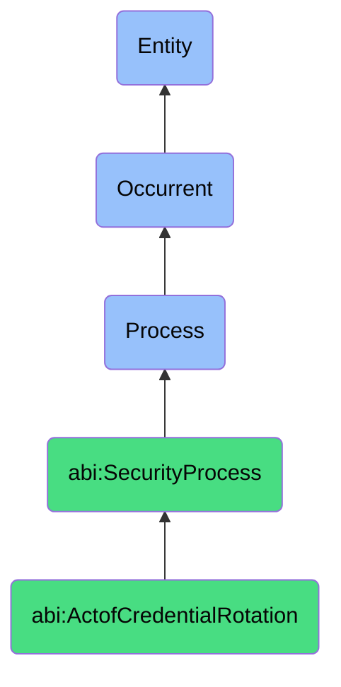

# ActofCredentialRotation

## Definition
An act of credential rotation is an occurrent process that unfolds through time, involving the systematic replacement or renewal of authentication credentials (passwords, keys, certificates, tokens, or other security artifacts) used by users, services, applications, or systems to access digital resources. This process follows predefined schedules or is triggered by security events, personnel changes, or compliance requirements to mitigate the risk of unauthorized access from credential theft, compromise, or expiration while ensuring operational continuity during the transition to new credentials.

## Hierarchy in BFO


## Ontological Schema (TBox)
```turtle
abi:ActofCredentialRotation a owl:Class ;
  rdfs:subClassOf abi:SecurityProcess ;
  rdfs:label "Act of Credential Rotation" ;
  skos:definition "A process that systematically replaces or renews authentication credentials to enhance security." .

abi:SecurityProcess a owl:Class ;
  rdfs:subClassOf bfo:0000015 ;
  rdfs:label "Security Process" ;
  skos:definition "A time-bound process related to the protection, monitoring, and management of digital assets, systems, and information against security threats and vulnerabilities." .

abi:has_rotation_performer a owl:ObjectProperty ;
  rdfs:domain abi:ActofCredentialRotation ;
  rdfs:range abi:CredentialRotationPerformer ;
  rdfs:label "has rotation performer" .

abi:rotates_credential_type a owl:ObjectProperty ;
  rdfs:domain abi:ActofCredentialRotation ;
  rdfs:range abi:CredentialType ;
  rdfs:label "rotates credential type" .

abi:affects_credential_subject a owl:ObjectProperty ;
  rdfs:domain abi:ActofCredentialRotation ;
  rdfs:range abi:CredentialSubject ;
  rdfs:label "affects credential subject" .

abi:follows_rotation_policy a owl:ObjectProperty ;
  rdfs:domain abi:ActofCredentialRotation ;
  rdfs:range abi:RotationPolicy ;
  rdfs:label "follows rotation policy" .

abi:uses_rotation_method a owl:ObjectProperty ;
  rdfs:domain abi:ActofCredentialRotation ;
  rdfs:range abi:RotationMethod ;
  rdfs:label "uses rotation method" .

abi:requires_rotation_verification a owl:ObjectProperty ;
  rdfs:domain abi:ActofCredentialRotation ;
  rdfs:range abi:RotationVerification ;
  rdfs:label "requires rotation verification" .

abi:produces_rotation_record a owl:ObjectProperty ;
  rdfs:domain abi:ActofCredentialRotation ;
  rdfs:range abi:RotationRecord ;
  rdfs:label "produces rotation record" .

abi:has_rotation_timestamp a owl:DatatypeProperty ;
  rdfs:domain abi:ActofCredentialRotation ;
  rdfs:range xsd:dateTime ;
  rdfs:label "has rotation timestamp" .

abi:has_rotation_frequency a owl:DatatypeProperty ;
  rdfs:domain abi:ActofCredentialRotation ;
  rdfs:range xsd:string ;
  rdfs:label "has rotation frequency" .

abi:has_rotation_trigger a owl:DatatypeProperty ;
  rdfs:domain abi:ActofCredentialRotation ;
  rdfs:range xsd:string ;
  rdfs:label "has rotation trigger" .
```

## Ontological Instance (ABox)
```turtle
ex:QuarterlyDatabaseCredentialRotation a abi:ActofCredentialRotation ;
  rdfs:label "Quarterly Database Credential Rotation" ;
  abi:has_rotation_performer ex:DatabaseAdministrator, ex:SecurityOperationsTeam ;
  abi:rotates_credential_type ex:DatabasePassword, ex:APIKey ;
  abi:affects_credential_subject ex:ProductionDatabases, ex:DatabaseServiceAccounts ;
  abi:follows_rotation_policy ex:EnterprisePasswordPolicy, ex:DatabaseAccessStandard ;
  abi:uses_rotation_method ex:AutomatedSecretManager, ex:PasswordGenerationAlgorithm ;
  abi:requires_rotation_verification ex:ServiceAvailabilityCheck, ex:AuthenticationValidation ;
  abi:produces_rotation_record ex:RotationCompletionReport, ex:AuditLog ;
  abi:has_rotation_timestamp "2023-12-15T02:30:00Z"^^xsd:dateTime ;
  abi:has_rotation_frequency "Quarterly"^^xsd:string ;
  abi:has_rotation_trigger "ScheduledMaintenance"^^xsd:string .

ex:CertificateExpirationRotation a abi:ActofCredentialRotation ;
  rdfs:label "TLS Certificate Expiration-Based Rotation" ;
  abi:has_rotation_performer ex:SecurityEngineer, ex:InfrastructureTeam ;
  abi:rotates_credential_type ex:TLSCertificate, ex:SigningKey ;
  abi:affects_credential_subject ex:WebServers, ex:LoadBalancers, ex:APIGateways ;
  abi:follows_rotation_policy ex:CertificateLifecyclePolicy, ex:CryptographicStandardsPolicy ;
  abi:uses_rotation_method ex:AutomatedCertManager, ex:PKIInfrastructure ;
  abi:requires_rotation_verification ex:CertificateValidation, ex:BrowserCompatibilityCheck ;
  abi:produces_rotation_record ex:CertificateInventoryUpdate, ex:ComplianceDocumentation ;
  abi:has_rotation_timestamp "2023-10-05T14:15:00Z"^^xsd:dateTime ;
  abi:has_rotation_frequency "30DaysBeforeExpiration"^^xsd:string ;
  abi:has_rotation_trigger "CertificateExpirationThreshold"^^xsd:string .
```

## Related Classes
- **abi:ActofAccessReview** - A process that may identify credentials requiring rotation.
- **abi:ActofThreatDetection** - A process that may trigger emergency credential rotation.
- **abi:ActofIncidentResponse** - A process that often includes credential rotation as a remediation step.
- **abi:ActofSecurityAudit** - A process that may verify credential rotation compliance.
- **abi:SecretsManagementProcess** - A broader process that encompasses credential rotation activities.
- **abi:KeyRotationProcess** - A specialized process focused on cryptographic key rotation.
- **abi:AuthenticationLifecycleProcess** - A broader process that includes credential rotation as a component. 