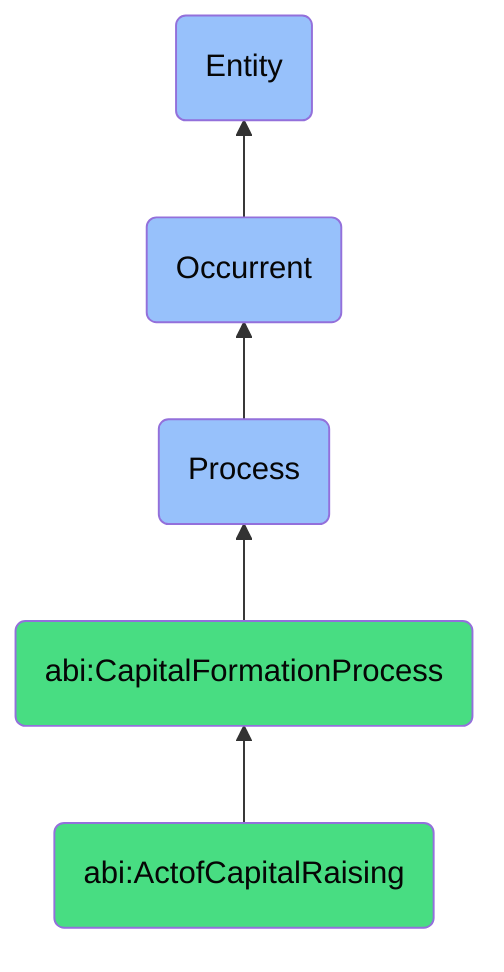

# ActofCapitalRaising

## Definition
An act of capital raising is an occurrent process that unfolds through time, involving the comprehensive and coordinated activities through which a company identifies potential funding sources, articulates its value proposition, engages with investors, negotiates terms, and ultimately secures financial investment from external entities to support its operational needs, strategic initiatives, or growth objectives.

## Hierarchy in BFO


## Ontological Schema (TBox)
```turtle
abi:ActofCapitalRaising a owl:Class ;
  rdfs:subClassOf abi:CapitalFormationProcess ;
  rdfs:label "Act of Capital Raising" ;
  skos:definition "A process through which a company seeks and secures financial investment from external sources." .

abi:CapitalFormationProcess a owl:Class ;
  rdfs:subClassOf bfo:0000015 ;
  rdfs:label "Capital Formation Process" ;
  skos:definition "A time-bound process related to attracting, securing, and managing financial investments from external sources." .

abi:has_fundraising_lead a owl:ObjectProperty ;
  rdfs:domain abi:ActofCapitalRaising ;
  rdfs:range abi:FundraisingLead ;
  rdfs:label "has fundraising lead" .

abi:targets_investor_category a owl:ObjectProperty ;
  rdfs:domain abi:ActofCapitalRaising ;
  rdfs:range abi:InvestorCategory ;
  rdfs:label "targets investor category" .

abi:offers_security_type a owl:ObjectProperty ;
  rdfs:domain abi:ActofCapitalRaising ;
  rdfs:range abi:SecurityType ;
  rdfs:label "offers security type" .

abi:employs_fundraising_method a owl:ObjectProperty ;
  rdfs:domain abi:ActofCapitalRaising ;
  rdfs:range abi:FundraisingMethod ;
  rdfs:label "employs fundraising method" .

abi:presents_business_case a owl:ObjectProperty ;
  rdfs:domain abi:ActofCapitalRaising ;
  rdfs:range abi:BusinessCase ;
  rdfs:label "presents business case" .

abi:produces_fundraising_material a owl:ObjectProperty ;
  rdfs:domain abi:ActofCapitalRaising ;
  rdfs:range abi:FundraisingMaterial ;
  rdfs:label "produces fundraising material" .

abi:results_in_investment_outcome a owl:ObjectProperty ;
  rdfs:domain abi:ActofCapitalRaising ;
  rdfs:range abi:InvestmentOutcome ;
  rdfs:label "results in investment outcome" .

abi:has_fundraising_start_date a owl:DatatypeProperty ;
  rdfs:domain abi:ActofCapitalRaising ;
  rdfs:range xsd:date ;
  rdfs:label "has fundraising start date" .

abi:has_capital_raise_amount a owl:DatatypeProperty ;
  rdfs:domain abi:ActofCapitalRaising ;
  rdfs:range xsd:decimal ;
  rdfs:label "has capital raise amount" .

abi:has_company_valuation a owl:DatatypeProperty ;
  rdfs:domain abi:ActofCapitalRaising ;
  rdfs:range xsd:decimal ;
  rdfs:label "has company valuation" .
```

## Ontological Instance (ABox)
```turtle
ex:SeriesARoundCapitalRaise a abi:ActofCapitalRaising ;
  rdfs:label "Series A Round Capital Raise" ;
  abi:has_fundraising_lead ex:CompanyCEO, ex:ChiefFinancialOfficer ;
  abi:targets_investor_category ex:VentureCapitalFirm, ex:AngelInvestorNetwork ;
  abi:offers_security_type ex:PreferredEquitySeries ;
  abi:employs_fundraising_method ex:RoadshowPresentation, ex:DirectInvestorOutreach ;
  abi:presents_business_case ex:MarketExpansionCase, ex:ProductDevelopmentCase ;
  abi:produces_fundraising_material ex:InvestorPitchDeck, ex:FinancialProjections, ex:MarketAnalysis ;
  abi:results_in_investment_outcome ex:SuccessfulCapitalClose ;
  abi:has_fundraising_start_date "2023-03-15"^^xsd:date ;
  abi:has_capital_raise_amount "5000000.00"^^xsd:decimal ;
  abi:has_company_valuation "20000000.00"^^xsd:decimal .

ex:ConvertibleNoteFinancing a abi:ActofCapitalRaising ;
  rdfs:label "Convertible Note Bridge Financing" ;
  abi:has_fundraising_lead ex:StartupFounder, ex:InvestmentAdvisor ;
  abi:targets_investor_category ex:ExistingShareholderGroup, ex:StrategicInvestors ;
  abi:offers_security_type ex:ConvertibleDebtInstrument ;
  abi:employs_fundraising_method ex:TargetedPitching, ex:NetworkLeveraging ;
  abi:presents_business_case ex:BridgeToSeriesBCase, ex:MilestoneAchievementCase ;
  abi:produces_fundraising_material ex:ConvertibleNoteTermSheet, ex:CapTableProjection, ex:BusinessUpdateMemo ;
  abi:results_in_investment_outcome ex:PartialFundraisingSuccess ;
  abi:has_fundraising_start_date "2023-09-01"^^xsd:date ;
  abi:has_capital_raise_amount "1200000.00"^^xsd:decimal ;
  abi:has_company_valuation "8000000.00"^^xsd:decimal .
```

## Related Classes
- **abi:ActofInvestorOutreach** - A subprocess within capital raising focused on initial investor contact.
- **abi:ActofFundraisingCommunication** - A process for creating materials used in capital raising.
- **abi:ActofInvestorMeeting** - A process that occurs during capital raising to present to investors.
- **abi:ActofDueDiligence** - A process that investors conduct as part of the capital raising process.
- **abi:ActofTermSheetNegotiation** - A critical phase within the capital raising process.
- **abi:ActofClosingInvestment** - The culminating process of successful capital raising.
- **abi:StrategicPlanningProcess** - A process that informs and directs capital raising efforts. 