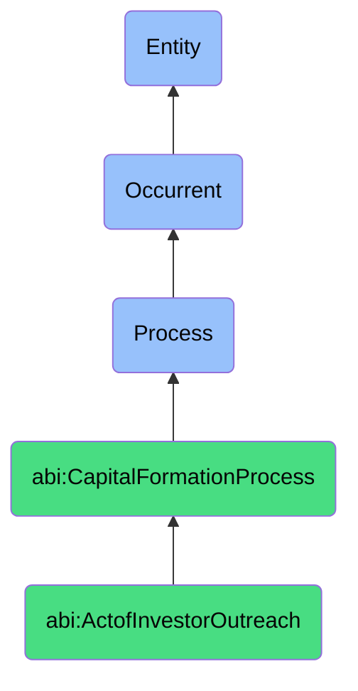

# ActofInvestorOutreach

## Definition
An act of investor outreach is an occurrent process that unfolds through time, involving the strategic identification, targeting, and initial engagement with potential investors through various communication channels, including direct messages, warm introductions, network referrals, or participation in industry events, with the aim of establishing preliminary interest and creating opportunities for more substantive interactions regarding potential investment.

## Hierarchy in BFO


## Ontological Schema (TBox)
```turtle
abi:ActofInvestorOutreach a owl:Class ;
  rdfs:subClassOf abi:CapitalFormationProcess ;
  rdfs:label "Act of Investor Outreach" ;
  skos:definition "A process of initiating contact with potential investors through messages, referrals, or events." .

abi:CapitalFormationProcess a owl:Class ;
  rdfs:subClassOf bfo:0000015 ;
  rdfs:label "Capital Formation Process" ;
  skos:definition "A time-bound process related to attracting, securing, and managing financial investments from external sources." .

abi:has_outreach_initiator a owl:ObjectProperty ;
  rdfs:domain abi:ActofInvestorOutreach ;
  rdfs:range abi:OutreachInitiator ;
  rdfs:label "has outreach initiator" .

abi:identifies_target_investor a owl:ObjectProperty ;
  rdfs:domain abi:ActofInvestorOutreach ;
  rdfs:range abi:TargetInvestor ;
  rdfs:label "identifies target investor" .

abi:utilizes_outreach_channel a owl:ObjectProperty ;
  rdfs:domain abi:ActofInvestorOutreach ;
  rdfs:range abi:OutreachChannel ;
  rdfs:label "utilizes outreach channel" .

abi:employs_introduction_method a owl:ObjectProperty ;
  rdfs:domain abi:ActofInvestorOutreach ;
  rdfs:range abi:IntroductionMethod ;
  rdfs:label "employs introduction method" .

abi:communicates_investment_opportunity a owl:ObjectProperty ;
  rdfs:domain abi:ActofInvestorOutreach ;
  rdfs:range abi:InvestmentOpportunity ;
  rdfs:label "communicates investment opportunity" .

abi:includes_outreach_material a owl:ObjectProperty ;
  rdfs:domain abi:ActofInvestorOutreach ;
  rdfs:range abi:OutreachMaterial ;
  rdfs:label "includes outreach material" .

abi:results_in_investor_response a owl:ObjectProperty ;
  rdfs:domain abi:ActofInvestorOutreach ;
  rdfs:range abi:InvestorResponse ;
  rdfs:label "results in investor response" .

abi:has_outreach_date a owl:DatatypeProperty ;
  rdfs:domain abi:ActofInvestorOutreach ;
  rdfs:range xsd:date ;
  rdfs:label "has outreach date" .

abi:has_investor_targeting_criteria a owl:DatatypeProperty ;
  rdfs:domain abi:ActofInvestorOutreach ;
  rdfs:range xsd:string ;
  rdfs:label "has investor targeting criteria" .

abi:has_response_rate a owl:DatatypeProperty ;
  rdfs:domain abi:ActofInvestorOutreach ;
  rdfs:range xsd:decimal ;
  rdfs:label "has response rate" .
```

## Ontological Instance (ABox)
```turtle
ex:VCSeedRoundOutreach a abi:ActofInvestorOutreach ;
  rdfs:label "Venture Capital Seed Round Outreach Campaign" ;
  abi:has_outreach_initiator ex:CompanyFounder, ex:StartupAdvisor ;
  abi:identifies_target_investor ex:EarlyStageTechVCFirm, ex:SeedFocusedAngelGroup ;
  abi:utilizes_outreach_channel ex:EmailCommunication, ex:LinkedInMessaging, ex:InvestorPlatform ;
  abi:employs_introduction_method ex:WarmIntroductionFromAdvisor, ex:IndustryConferenceConnection ;
  abi:communicates_investment_opportunity ex:AIStartupSeedRound, ex:PlatformExpansionRound ;
  abi:includes_outreach_material ex:ExecutiveSummaryDoc, ex:OnePagerTeaser ;
  abi:results_in_investor_response ex:InitialInterestExpression, ex:MeetingRequest, ex:InformationRequest ;
  abi:has_outreach_date "2023-04-15"^^xsd:date ;
  abi:has_investor_targeting_criteria "B2B SaaS investors with $2-5M ticket size" ;
  abi:has_response_rate "0.24"^^xsd:decimal .

ex:StrategicInvestorOutreach a abi:ActofInvestorOutreach ;
  rdfs:label "Strategic Corporate Investor Outreach" ;
  abi:has_outreach_initiator ex:ChiefExecutiveOfficer, ex:ChiefStrategyOfficer ;
  abi:identifies_target_investor ex:IndustryCorporateVC, ex:StrategicPartnerInvestmentArm ;
  abi:utilizes_outreach_channel ex:DirectExecutiveEmail, ex:IndustryRoundtable ;
  abi:employs_introduction_method ex:BoardMemberConnection, ex:InvestmentBankerIntroduction ;
  abi:communicates_investment_opportunity ex:StrategicGrowthRound, ex:MarketExpansionInvestment ;
  abi:includes_outreach_material ex:StrategicValueProposition, ex:SynergySummaryDocument ;
  abi:results_in_investor_response ex:DueDiligenceRequest, ex:FollowupCallScheduled ;
  abi:has_outreach_date "2023-08-10"^^xsd:date ;
  abi:has_investor_targeting_criteria "Industry leaders with strategic alignment and prior startup investments" ;
  abi:has_response_rate "0.35"^^xsd:decimal .
```

## Related Classes
- **abi:ActofCapitalRaising** - A broader process that includes investor outreach as a component.
- **abi:ActofFundraisingCommunication** - A process that creates materials used in investor outreach.
- **abi:ActofInvestorMeeting** - A process that typically follows successful investor outreach.
- **abi:LeadGenerationProcess** - A related process for identifying potential investors.
- **abi:NetworkingProcess** - A process that supports investor outreach through relationship building.
- **abi:InvestorMappingProcess** - A process for systematically identifying target investors.
- **abi:InvestorRelationshipManagementProcess** - A process for maintaining investor connections over time. 