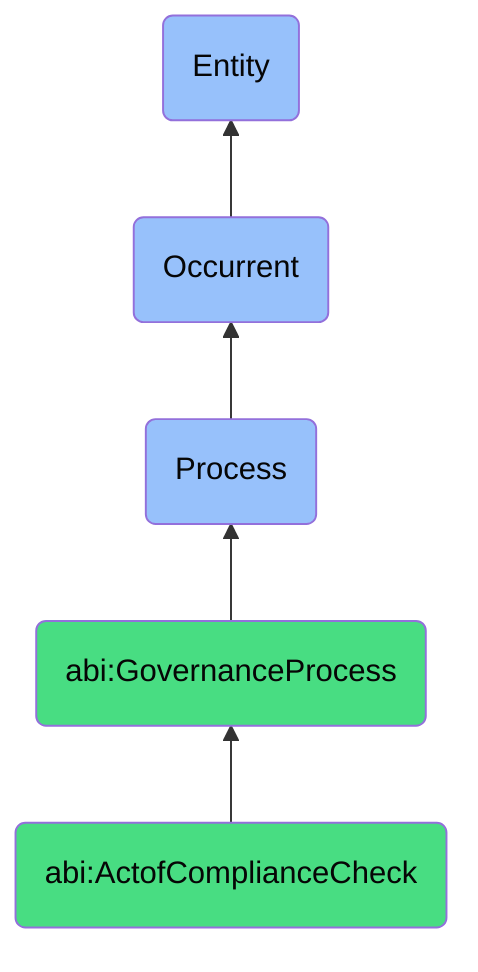

# ActofComplianceCheck

## Definition
An act of compliance check is an occurrent process that unfolds through time, involving the systematic verification, testing, and assessment of organizational systems, processes, products, services, or behaviors against established regulatory requirements, industry standards, certification criteria, or internal policies to identify conformance gaps, deviations, or risks, resulting in documented compliance status, remediation recommendations, and assurance reporting that supports governance objectives and regulatory obligations.

## Hierarchy in BFO


## Ontological Schema (TBox)
```turtle
abi:ActofComplianceCheck a owl:Class ;
  rdfs:subClassOf abi:GovernanceProcess ;
  rdfs:label "Act of Compliance Check" ;
  skos:definition "A process that validates system behavior against external regulations or internal standards." .

abi:GovernanceProcess a owl:Class ;
  rdfs:subClassOf bfo:0000015 ;
  rdfs:label "Governance Process" ;
  skos:definition "A time-bound process related to the oversight, assessment, and management of organizational activities to ensure compliance with regulations, standards, and internal policies." .

abi:has_compliance_checker a owl:ObjectProperty ;
  rdfs:domain abi:ActofComplianceCheck ;
  rdfs:range abi:ComplianceChecker ;
  rdfs:label "has compliance checker" .

abi:checks_compliance_subject a owl:ObjectProperty ;
  rdfs:domain abi:ActofComplianceCheck ;
  rdfs:range abi:ComplianceSubject ;
  rdfs:label "checks compliance subject" .

abi:applies_compliance_control a owl:ObjectProperty ;
  rdfs:domain abi:ActofComplianceCheck ;
  rdfs:range abi:ComplianceControl ;
  rdfs:label "applies compliance control" .

abi:verifies_against_requirement a owl:ObjectProperty ;
  rdfs:domain abi:ActofComplianceCheck ;
  rdfs:range abi:ComplianceRequirement ;
  rdfs:label "verifies against requirement" .

abi:uses_compliance_method a owl:ObjectProperty ;
  rdfs:domain abi:ActofComplianceCheck ;
  rdfs:range abi:ComplianceMethod ;
  rdfs:label "uses compliance method" .

abi:identifies_compliance_issue a owl:ObjectProperty ;
  rdfs:domain abi:ActofComplianceCheck ;
  rdfs:range abi:ComplianceIssue ;
  rdfs:label "identifies compliance issue" .

abi:produces_compliance_evidence a owl:ObjectProperty ;
  rdfs:domain abi:ActofComplianceCheck ;
  rdfs:range abi:ComplianceEvidence ;
  rdfs:label "produces compliance evidence" .

abi:has_check_date a owl:DatatypeProperty ;
  rdfs:domain abi:ActofComplianceCheck ;
  rdfs:range xsd:date ;
  rdfs:label "has check date" .

abi:has_compliance_status a owl:DatatypeProperty ;
  rdfs:domain abi:ActofComplianceCheck ;
  rdfs:range xsd:string ;
  rdfs:label "has compliance status" .

abi:has_remediation_deadline a owl:DatatypeProperty ;
  rdfs:domain abi:ActofComplianceCheck ;
  rdfs:range xsd:date ;
  rdfs:label "has remediation deadline" .
```

## Ontological Instance (ABox)
```turtle
ex:GDPRDataExportComplianceCheck a abi:ActofComplianceCheck ;
  rdfs:label "GDPR Data Export Module Compliance Verification" ;
  abi:has_compliance_checker ex:DataPrivacyOfficer, ex:ComplianceSpecialist, ex:ExternalGDPRConsultant ;
  abi:checks_compliance_subject ex:DataExportModule, ex:CustomerDataRepository, ex:CrossBorderDataFlows ;
  abi:applies_compliance_control ex:DataTransferRestrictionsControl, ex:ConsentVerificationControl, ex:MinimizationControl ;
  abi:verifies_against_requirement ex:ArticleV_DataTransferSafeguards, ex:ArticleVI_LawfulBasis, ex:ChapterIII_DataSubjectRights ;
  abi:uses_compliance_method ex:CodeReview, ex:ProcessTesting, ex:DocumentationReview, ex:UserJourneySimulation ;
  abi:identifies_compliance_issue ex:IncompleteConsentRecords, ex:MissingDataMinimizationFilters, ex:UndocumentedDataRecipients ;
  abi:produces_compliance_evidence ex:ConsentManagementScreenshots, ex:DataFlowDiagrams, ex:ProcessDocumentation ;
  abi:has_check_date "2023-11-05"^^xsd:date ;
  abi:has_compliance_status "PartiallyCompliant"^^xsd:string ;
  abi:has_remediation_deadline "2023-12-15"^^xsd:date .

ex:SOC2SecurityComplianceCheck a abi:ActofComplianceCheck ;
  rdfs:label "SOC2 Security Control Annual Compliance Assessment" ;
  abi:has_compliance_checker ex:ChiefInformationSecurityOfficer, ex:InternalAuditor, ex:ExternalSOC2Auditor ;
  abi:checks_compliance_subject ex:AccessControlSystems, ex:ChangeManagementProcesses, ex:DataEncryptionImplementation ;
  abi:applies_compliance_control ex:LogicalAccessControl, ex:ChangeAuthorizationControl, ex:EncryptionStandardsControl ;
  abi:verifies_against_requirement ex:CommonCriteria3_2_AccessControl, ex:CommonCriteria8_1_ChangeManagement, ex:CommonCriteria3_5_Encryption ;
  abi:uses_compliance_method ex:SystemConfigurationReview, ex:PolicyComplianceAssessment, ex:ControlTestingInterview ;
  abi:identifies_compliance_issue ex:InconsistentAccessReviewDocumentation, ex:ChangeManagementBypassInstances, ex:EncryptionGapsInTransit ;
  abi:produces_compliance_evidence ex:AccessControlMatrix, ex:ChangeTicketSamples, ex:EncryptionImplementationReport ;
  abi:has_check_date "2023-09-20"^^xsd:date ;
  abi:has_compliance_status "MateriallyCompliant"^^xsd:string ;
  abi:has_remediation_deadline "2023-10-30"^^xsd:date .
```

## Related Classes
- **abi:ActofPolicyReview** - A process that establishes or updates the standards against which compliance is checked.
- **abi:ActofAuditTrailReview** - A process that provides evidence used during compliance verification.
- **abi:ComplianceRemediationProcess** - A process initiated to address issues identified during compliance checks.
- **abi:CertificationPreparationProcess** - A process for preparing documentation and systems for formal certification.
- **abi:RegulatoryReportingProcess** - A process for communicating compliance status to regulatory authorities.
- **abi:ControlEffectivenessTestingProcess** - A process for verifying that controls achieve their intended outcomes.
- **abi:ComplianceRiskAssessmentProcess** - A process for evaluating the impact and likelihood of compliance failures. 