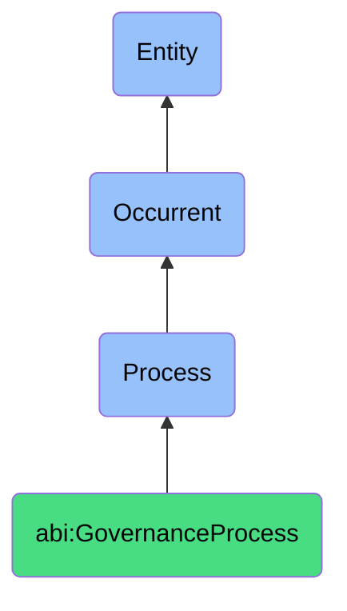

# GovernanceProcess

## Definition
A governance process is an occurrent that unfolds through time, involving the systematic oversight, monitoring, and management of organizational activities, policies, and procedures to ensure alignment with regulatory requirements, internal standards, and ethical principles, through structured evaluation, documentation, and improvement mechanisms that verify compliance, maintain accountability, and mitigate risks associated with operational, legal, and reputational concerns.

## Hierarchy in BFO


## Ontological Schema (TBox)
```turtle
abi:GovernanceProcess a owl:Class ;
  rdfs:subClassOf bfo:0000015 ;
  rdfs:label "Governance Process" ;
  skos:definition "A time-bound process related to the oversight, assessment, and management of organizational activities to ensure compliance with regulations, standards, and internal policies." .

abi:has_governance_agent a owl:ObjectProperty ;
  rdfs:domain abi:GovernanceProcess ;
  rdfs:range abi:GovernanceAgent ;
  rdfs:label "has governance agent" .

abi:governs_subject a owl:ObjectProperty ;
  rdfs:domain abi:GovernanceProcess ;
  rdfs:range abi:GovernanceSubject ;
  rdfs:label "governs subject" .

abi:applies_governance_framework a owl:ObjectProperty ;
  rdfs:domain abi:GovernanceProcess ;
  rdfs:range abi:GovernanceFramework ;
  rdfs:label "applies governance framework" .

abi:follows_compliance_standard a owl:ObjectProperty ;
  rdfs:domain abi:GovernanceProcess ;
  rdfs:range abi:ComplianceStandard ;
  rdfs:label "follows compliance standard" .

abi:uses_governance_tool a owl:ObjectProperty ;
  rdfs:domain abi:GovernanceProcess ;
  rdfs:range abi:GovernanceTool ;
  rdfs:label "uses governance tool" .

abi:produces_governance_artifact a owl:ObjectProperty ;
  rdfs:domain abi:GovernanceProcess ;
  rdfs:range abi:GovernanceArtifact ;
  rdfs:label "produces governance artifact" .

abi:addresses_governance_risk a owl:ObjectProperty ;
  rdfs:domain abi:GovernanceProcess ;
  rdfs:range abi:GovernanceRisk ;
  rdfs:label "addresses governance risk" .

abi:has_governance_timestamp a owl:DatatypeProperty ;
  rdfs:domain abi:GovernanceProcess ;
  rdfs:range xsd:dateTime ;
  rdfs:label "has governance timestamp" .

abi:has_governance_status a owl:DatatypeProperty ;
  rdfs:domain abi:GovernanceProcess ;
  rdfs:range xsd:string ;
  rdfs:label "has governance status" .

abi:has_governance_frequency a owl:DatatypeProperty ;
  rdfs:domain abi:GovernanceProcess ;
  rdfs:range xsd:string ;
  rdfs:label "has governance frequency" .
```

## Ontological Instance (ABox)
```turtle
# GovernanceProcess is a parent class with subclasses:
# - abi:ActofPolicyReview
# - abi:ActofComplianceCheck
# - abi:ActofAuditTrailReview
# and other governance-related processes
```

## Related Classes
- **abi:ActofPolicyReview** - A process where existing internal policies are checked for consistency, compliance, and current relevance.
- **abi:ActofComplianceCheck** - A process that validates system behavior against external regulations or internal standards.
- **abi:ActofAuditTrailReview** - A process that analyzes the activity logs associated with sensitive actions or systems.
- **abi:RegulatoryAssessmentProcess** - A process for evaluating organizational alignment with government regulations.
- **abi:CorporateGovernanceProcess** - A process related to oversight of executive decision-making and accountability.
- **abi:RiskManagementProcess** - A process for identifying, assessing, and mitigating organizational risks.
- **abi:EthicsManagementProcess** - A process for ensuring organizational activities align with ethical standards. 