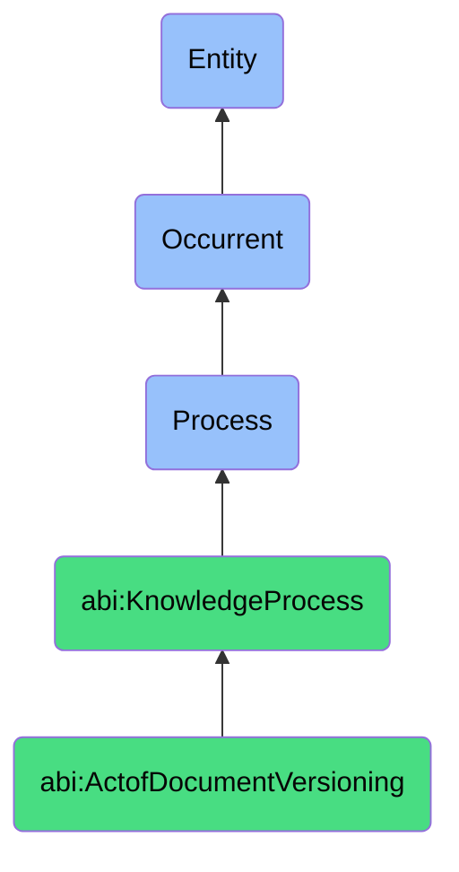

# ActofDocumentVersioning

## Definition
An act of document versioning is an occurrent process that unfolds through time, involving the systematic tracking, management, and preservation of sequential states or iterations of content artifacts, ensuring that changes are captured, attributed, and recoverable, while maintaining a complete history of modifications, enabling comparison between versions, facilitating collaborative development, supporting audit requirements, and providing mechanisms for reverting to previous states when necessary.

## Hierarchy in BFO


## Ontological Schema (TBox)
```turtle
abi:ActofDocumentVersioning a owl:Class ;
  rdfs:subClassOf abi:KnowledgeProcess ;
  rdfs:label "Act of Document Versioning" ;
  skos:definition "A process that tracks and maintains version states for evolving knowledge or policy artifacts." .

abi:KnowledgeProcess a owl:Class ;
  rdfs:subClassOf bfo:0000015 ;
  rdfs:label "Knowledge Process" ;
  skos:definition "A time-bound process related to the creation, capture, organization, transfer, maintenance, or application of knowledge within an organizational context." .

abi:has_document_owner a owl:ObjectProperty ;
  rdfs:domain abi:ActofDocumentVersioning ;
  rdfs:range abi:DocumentOwner ;
  rdfs:label "has document owner" .

abi:versions_document a owl:ObjectProperty ;
  rdfs:domain abi:ActofDocumentVersioning ;
  rdfs:range abi:VersionedDocument ;
  rdfs:label "versions document" .

abi:applies_version_control a owl:ObjectProperty ;
  rdfs:domain abi:ActofDocumentVersioning ;
  rdfs:range abi:VersionControlMethod ;
  rdfs:label "applies version control" .

abi:tracks_document_change a owl:ObjectProperty ;
  rdfs:domain abi:ActofDocumentVersioning ;
  rdfs:range abi:DocumentChange ;
  rdfs:label "tracks document change" .

abi:follows_document_workflow a owl:ObjectProperty ;
  rdfs:domain abi:ActofDocumentVersioning ;
  rdfs:range abi:DocumentWorkflow ;
  rdfs:label "follows document workflow" .

abi:manages_access_permission a owl:ObjectProperty ;
  rdfs:domain abi:ActofDocumentVersioning ;
  rdfs:range abi:AccessPermission ;
  rdfs:label "manages access permission" .

abi:produces_version_artifact a owl:ObjectProperty ;
  rdfs:domain abi:ActofDocumentVersioning ;
  rdfs:range abi:VersionArtifact ;
  rdfs:label "produces version artifact" .

abi:has_version_timestamp a owl:DatatypeProperty ;
  rdfs:domain abi:ActofDocumentVersioning ;
  rdfs:range xsd:dateTime ;
  rdfs:label "has version timestamp" .

abi:has_version_number a owl:DatatypeProperty ;
  rdfs:domain abi:ActofDocumentVersioning ;
  rdfs:range xsd:string ;
  rdfs:label "has version number" .

abi:has_change_significance a owl:DatatypeProperty ;
  rdfs:domain abi:ActofDocumentVersioning ;
  rdfs:range xsd:string ;
  rdfs:label "has change significance" .
```

## Ontological Instance (ABox)
```turtle
ex:PitchDeckVersioning a abi:ActofDocumentVersioning ;
  rdfs:label "Investor Pitch Deck Versioning" ;
  abi:has_document_owner ex:MarketingDirector, ex:ChiefExecutiveOfficer ;
  abi:versions_document ex:InvestorPitchDeck, ex:FinancialProjectionsSlide, ex:CompetitiveAnalysisSection ;
  abi:applies_version_control ex:CloudStorageVersioning, ex:SemanticVersioningScheme, ex:ChangeLogMaintenance ;
  abi:tracks_document_change ex:FinancialDataUpdate, ex:VisualDesignRefinement, ex:MessagingAdjustment, ex:ProductRoadmapRevision ;
  abi:follows_document_workflow ex:StakeholderReviewProcess, ex:ExecutiveApprovalProcess, ex:BrandAlignmentCheck ;
  abi:manages_access_permission ex:ExecutiveEditAccess, ex:InvestorViewOnlyAccess, ex:MarketingTeamContributorAccess ;
  abi:produces_version_artifact ex:MajorReleaseArchive, ex:InvestorSpecificVariants, ex:ChangeHistoryLog ;
  abi:has_version_timestamp "2023-11-15T10:45:00Z"^^xsd:dateTime ;
  abi:has_version_number "3.2.1" ;
  abi:has_change_significance "Minor" .

ex:ProductDocumentationVersioning a abi:ActofDocumentVersioning ;
  rdfs:label "API Documentation Version Control" ;
  abi:has_document_owner ex:TechnicalDocumentationManager, ex:APITeamLead ;
  abi:versions_document ex:APIDocumentation, ex:EndpointSpecifications, ex:CodeExamples, ex:IntegrationGuide ;
  abi:applies_version_control ex:GitBasedDocumentation, ex:DockerizedEnvironment, ex:AutomatedBuildProcess ;
  abi:tracks_document_change ex:EndpointParameterChanges, ex:AuthenticationFlowUpdate, ex:DeprecationNotices, ex:SchemaModifications ;
  abi:follows_document_workflow ex:TechnicalReviewWorkflow, ex:DeveloperFeedbackIncorporation, ex:ReleaseAlignmentProcess ;
  abi:manages_access_permission ex:DocumentationTeamFullAccess, ex:DeveloperReadAccess, ex:PartnerDocsAccess ;
  abi:produces_version_artifact ex:VersionedDocSite, ex:ChangelogDocument, ex:HistoricalAPIReferences ;
  abi:has_version_timestamp "2023-10-25T16:30:00Z"^^xsd:dateTime ;
  abi:has_version_number "2.4.0" ;
  abi:has_change_significance "Major" .
```

## Related Classes
- **abi:ActofKnowledgeCapture** - A process that often precedes document versioning by creating content to be versioned.
- **abi:ActofSOPExecution** - A process that may be guided by specific document versions of operating procedures.
- **abi:DocumentApprovalProcess** - A process for reviewing and authorizing document versions.
- **abi:ChangeTrackingProcess** - A process focused on identifying and recording content modifications.
- **abi:DocumentReleaseProcess** - A process for publishing specific document versions to target audiences.
- **abi:VersionControlSystemManagementProcess** - A process for maintaining the systems that support document versioning.
- **abi:CollaborativeEditingProcess** - A process enabling multiple contributors to modify versioned documents. 