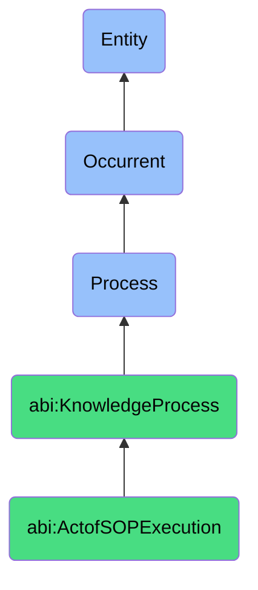

# ActofSOPExecution

## Definition
An act of SOP execution is an occurrent process that unfolds through time, involving the methodical implementation and adherence to documented standard operating procedures, protocols, or defined workflows, ensuring consistent execution of routine organizational activities through step-by-step guidance, verification checkpoints, quality standards, and compliance requirements, thereby promoting operational consistency, risk mitigation, regulatory adherence, knowledge transfer, and process repeatability across different individuals, teams, or organizational units.

## Hierarchy in BFO


## Ontological Schema (TBox)
```turtle
abi:ActofSOPExecution a owl:Class ;
  rdfs:subClassOf abi:KnowledgeProcess ;
  rdfs:label "Act of SOP Execution" ;
  skos:definition "A process that instantiates and follows a defined standard operating procedure." .

abi:KnowledgeProcess a owl:Class ;
  rdfs:subClassOf bfo:0000015 ;
  rdfs:label "Knowledge Process" ;
  skos:definition "A time-bound process related to the creation, capture, organization, transfer, maintenance, or application of knowledge within an organizational context." .

abi:has_sop_executor a owl:ObjectProperty ;
  rdfs:domain abi:ActofSOPExecution ;
  rdfs:range abi:SOPExecutor ;
  rdfs:label "has sop executor" .

abi:follows_procedure a owl:ObjectProperty ;
  rdfs:domain abi:ActofSOPExecution ;
  rdfs:range abi:Procedure ;
  rdfs:label "follows procedure" .

abi:applies_to_domain a owl:ObjectProperty ;
  rdfs:domain abi:ActofSOPExecution ;
  rdfs:range abi:ProcedureDomain ;
  rdfs:label "applies to domain" .

abi:requires_input a owl:ObjectProperty ;
  rdfs:domain abi:ActofSOPExecution ;
  rdfs:range abi:ProcedureInput ;
  rdfs:label "requires input" .

abi:produces_output a owl:ObjectProperty ;
  rdfs:domain abi:ActofSOPExecution ;
  rdfs:range abi:ProcedureOutput ;
  rdfs:label "produces output" .

abi:validates_compliance a owl:ObjectProperty ;
  rdfs:domain abi:ActofSOPExecution ;
  rdfs:range abi:ComplianceRequirement ;
  rdfs:label "validates compliance" .

abi:documents_execution a owl:ObjectProperty ;
  rdfs:domain abi:ActofSOPExecution ;
  rdfs:range abi:ExecutionRecord ;
  rdfs:label "documents execution" .

abi:has_execution_timestamp a owl:DatatypeProperty ;
  rdfs:domain abi:ActofSOPExecution ;
  rdfs:range xsd:dateTime ;
  rdfs:label "has execution timestamp" .

abi:has_execution_status a owl:DatatypeProperty ;
  rdfs:domain abi:ActofSOPExecution ;
  rdfs:range xsd:string ;
  rdfs:label "has execution status" .

abi:has_execution_duration a owl:DatatypeProperty ;
  rdfs:domain abi:ActofSOPExecution ;
  rdfs:range xsd:duration ;
  rdfs:label "has execution duration" .
```

## Ontological Instance (ABox)
```turtle
ex:EmployeeOnboardingExecution a abi:ActofSOPExecution ;
  rdfs:label "New Employee HR Onboarding Process Execution" ;
  abi:has_sop_executor ex:HRSpecialist, ex:ITSupportTechnician, ex:DepartmentManager ;
  abi:follows_procedure ex:EmployeeOnboardingProcedure, ex:SystemAccessProvisioningWorkflow, ex:ComplianceTrainingProcess ;
  abi:applies_to_domain ex:HumanResources, ex:InformationTechnology, ex:OrganizationalCompliance ;
  abi:requires_input ex:EmployeePersonalInformation, ex:RoleRequirements, ex:DepartmentAccessNeeds ;
  abi:produces_output ex:CompletedEmployeeRecord, ex:SystemAccountCredentials, ex:TrainingCompletionCertificates ;
  abi:validates_compliance ex:EmploymentLawRequirements, ex:DataPrivacyRegulations, ex:InternalSecurityPolicies ;
  abi:documents_execution ex:OnboardingChecklistCompletion, ex:SystemSetupVerification, ex:SignedPolicyAcknowledgements ;
  abi:has_execution_timestamp "2023-11-01T09:00:00Z"^^xsd:dateTime ;
  abi:has_execution_status "Completed" ;
  abi:has_execution_duration "P5D"^^xsd:duration .

ex:ProductReleaseExecution a abi:ActofSOPExecution ;
  rdfs:label "Software Product Release Procedure Execution" ;
  abi:has_sop_executor ex:ReleaseManager, ex:QualityAssuranceSpecialist, ex:ProductManager, ex:DevOpsEngineer ;
  abi:follows_procedure ex:SoftwareReleaseProtocol, ex:ChangeManagementProcess, ex:RegressionTestingProcedure ;
  abi:applies_to_domain ex:SoftwareDevelopment, ex:ProductManagement, ex:CustomerSupport ;
  abi:requires_input ex:ReleaseCandidateBuild, ex:FeatureSpecifications, ex:ReleaseNotes, ex:TestResults ;
  abi:produces_output ex:PublishedSoftwarePackage, ex:DeploymentConfirmation, ex:CustomerNotifications ;
  abi:validates_compliance ex:QualityAssuranceStandards, ex:ServiceLevelAgreements, ex:RegulatoryRequirements ;
  abi:documents_execution ex:ReleaseSignoff, ex:DeploymentLogs, ex:PostReleaseMetrics ;
  abi:has_execution_timestamp "2023-10-15T16:00:00Z"^^xsd:dateTime ;
  abi:has_execution_status "Completed" ;
  abi:has_execution_duration "PT8H"^^xsd:duration .
```

## Related Classes
- **abi:ActofKnowledgeCapture** - A process that may document improvements or issues discovered during SOP execution.
- **abi:ActofDocumentVersioning** - A process that maintains the evolving versions of standard operating procedures.
- **abi:ProcedureDesignProcess** - A process for creating and structuring standard operating procedures.
- **abi:WorkflowAutomationProcess** - A process for implementing technology-enabled procedure execution.
- **abi:ComplianceVerificationProcess** - A process for confirming adherence to required standards during SOP execution.
- **abi:ProcessExceptionHandlingProcess** - A specialized process for managing deviations from standard procedures.
- **abi:OperationalQualityAssuranceProcess** - A process for evaluating the effectiveness of executed procedures. 