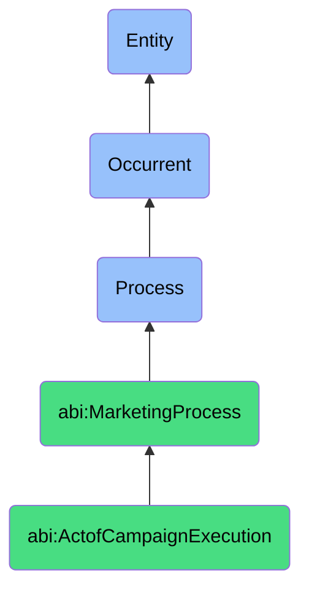

# ActofCampaignExecution

## Definition
An act of campaign execution is an occurrent process that unfolds through time, involving the coordinated implementation of multiple marketing activities, communications, and deliverables within defined time boundaries, operational parameters, and strategic objectives to achieve targeted business outcomes such as awareness, engagement, or conversion.

## Hierarchy in BFO


## Ontological Schema (TBox)
```turtle
abi:ActofCampaignExecution a owl:Class ;
  rdfs:subClassOf abi:MarketingProcess ;
  rdfs:label "Act of Campaign Execution" ;
  skos:definition "A process that coordinates time-bound marketing actions." .

abi:MarketingProcess a owl:Class ;
  rdfs:subClassOf bfo:0000015 ;
  rdfs:label "Marketing Process" ;
  skos:definition "A process involving the strategic planning, execution, measurement, or optimization of activities designed to promote products, services, or ideas and create customer engagement." .

abi:has_campaign_coordinator a owl:ObjectProperty ;
  rdfs:domain abi:ActofCampaignExecution ;
  rdfs:range abi:CampaignCoordinator ;
  rdfs:label "has campaign coordinator" .

abi:executes_campaign_plan a owl:ObjectProperty ;
  rdfs:domain abi:ActofCampaignExecution ;
  rdfs:range abi:CampaignPlan ;
  rdfs:label "executes campaign plan" .

abi:orchestrates_marketing_activity a owl:ObjectProperty ;
  rdfs:domain abi:ActofCampaignExecution ;
  rdfs:range abi:MarketingActivity ;
  rdfs:label "orchestrates marketing activity" .

abi:follows_campaign_timeline a owl:ObjectProperty ;
  rdfs:domain abi:ActofCampaignExecution ;
  rdfs:range abi:CampaignTimeline ;
  rdfs:label "follows campaign timeline" .

abi:deploys_campaign_asset a owl:ObjectProperty ;
  rdfs:domain abi:ActofCampaignExecution ;
  rdfs:range abi:CampaignAsset ;
  rdfs:label "deploys campaign asset" .

abi:adheres_to_campaign_budget a owl:ObjectProperty ;
  rdfs:domain abi:ActofCampaignExecution ;
  rdfs:range abi:CampaignBudget ;
  rdfs:label "adheres to campaign budget" .

abi:addresses_campaign_goal a owl:ObjectProperty ;
  rdfs:domain abi:ActofCampaignExecution ;
  rdfs:range abi:CampaignGoal ;
  rdfs:label "addresses campaign goal" .

abi:has_campaign_duration a owl:DatatypeProperty ;
  rdfs:domain abi:ActofCampaignExecution ;
  rdfs:range xsd:duration ;
  rdfs:label "has campaign duration" .

abi:has_execution_status a owl:DatatypeProperty ;
  rdfs:domain abi:ActofCampaignExecution ;
  rdfs:range xsd:string ;
  rdfs:label "has execution status" .

abi:has_completion_percentage a owl:DatatypeProperty ;
  rdfs:domain abi:ActofCampaignExecution ;
  rdfs:range xsd:decimal ;
  rdfs:label "has completion percentage" .
```

## Ontological Instance (ABox)
```turtle
ex:Q2EventsMarketingCampaignProcess a abi:ActofCampaignExecution ;
  rdfs:label "Q2 Events Marketing Campaign Process" ;
  abi:has_campaign_coordinator ex:MarketingBot ;
  abi:executes_campaign_plan ex:Q2EventsCampaignPlan ;
  abi:orchestrates_marketing_activity ex:VirtualConferencePromotion, ex:IndustryWebinarSeries, ex:TradeShowParticipation ;
  abi:follows_campaign_timeline ex:AprilJuneEventSchedule ;
  abi:deploys_campaign_asset ex:EventInvitationEmail, ex:SpeakerAnnouncementGraphic, ex:RegistrationLandingPage ;
  abi:adheres_to_campaign_budget ex:Q2EventsBudgetAllocation ;
  abi:addresses_campaign_goal ex:LeadGenerationGoal, ex:ThoughtLeadershipGoal, ex:ProductDemoOpportunityGoal ;
  abi:has_campaign_duration "P3M"^^xsd:duration ;
  abi:has_execution_status "In Progress" ;
  abi:has_completion_percentage "0.65"^^xsd:decimal .

ex:ProductLaunchCampaignProcess a abi:ActofCampaignExecution ;
  rdfs:label "New Product Launch Campaign Process" ;
  abi:has_campaign_coordinator ex:MarketingAutomationSystem ;
  abi:executes_campaign_plan ex:ProductLaunchMarketingPlan ;
  abi:orchestrates_marketing_activity ex:PressReleaseDistribution, ex:InfluencerOutreach, ex:PaidMediaCampaign, ex:EmailAnnouncementSequence ;
  abi:follows_campaign_timeline ex:SixWeekLaunchTimeline ;
  abi:deploys_campaign_asset ex:ProductVideoTeaser, ex:FeatureBenefitsInfographic, ex:EarlyAdopterPromotion ;
  abi:adheres_to_campaign_budget ex:LaunchMarketingBudget ;
  abi:addresses_campaign_goal ex:ProductAwarenessGoal, ex:FirstMonthSalesGoal, ex:MarketPositioningGoal ;
  abi:has_campaign_duration "P6W"^^xsd:duration ;
  abi:has_execution_status "Completed" ;
  abi:has_completion_percentage "1.0"^^xsd:decimal .
```

## Related Classes
- **abi:ActofTrackingEngagement** - A process that monitors the results and interactions from campaign execution.
- **abi:ActofPublishing** - A process often used within campaigns to distribute content through channels.
- **abi:ActofGenerating** - A process that creates content used in marketing campaigns.
- **abi:CampaignPlanningProcess** - A preceding process that develops the strategy and plan for campaign execution.
- **abi:CampaignAnalysisProcess** - A subsequent process that evaluates campaign performance and results. 