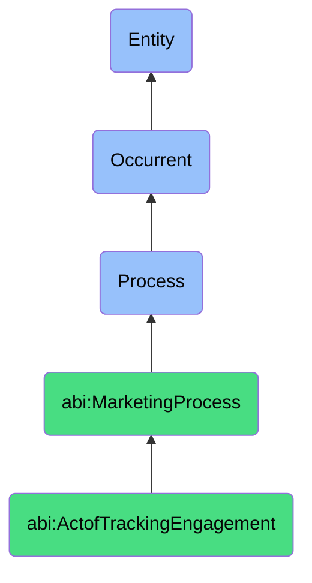

# ActofTrackingEngagement

## Definition
An act of tracking engagement is an occurrent process that unfolds through time, involving the systematic observation, measurement, recording, and analysis of audience interactions, reactions, or responses to marketing content, communications, or experiences to derive insights about effectiveness, audience preferences, or behavioral patterns.

## Hierarchy in BFO


## Ontological Schema (TBox)
```turtle
abi:ActofTrackingEngagement a owl:Class ;
  rdfs:subClassOf abi:MarketingProcess ;
  rdfs:label "Act of Tracking Engagement" ;
  skos:definition "A process that monitors reactions or interactions." .

abi:MarketingProcess a owl:Class ;
  rdfs:subClassOf bfo:0000015 ;
  rdfs:label "Marketing Process" ;
  skos:definition "A process involving the strategic planning, execution, measurement, or optimization of activities designed to promote products, services, or ideas and create customer engagement." .

abi:has_engagement_tracker a owl:ObjectProperty ;
  rdfs:domain abi:ActofTrackingEngagement ;
  rdfs:range abi:EngagementTracker ;
  rdfs:label "has engagement tracker" .

abi:monitors_content a owl:ObjectProperty ;
  rdfs:domain abi:ActofTrackingEngagement ;
  rdfs:range abi:EngageableContent ;
  rdfs:label "monitors content" .

abi:tracks_engagement_metric a owl:ObjectProperty ;
  rdfs:domain abi:ActofTrackingEngagement ;
  rdfs:range abi:EngagementMetric ;
  rdfs:label "tracks engagement metric" .

abi:applies_tracking_method a owl:ObjectProperty ;
  rdfs:domain abi:ActofTrackingEngagement ;
  rdfs:range abi:TrackingMethod ;
  rdfs:label "applies tracking method" .

abi:captures_audience_response a owl:ObjectProperty ;
  rdfs:domain abi:ActofTrackingEngagement ;
  rdfs:range abi:AudienceResponse ;
  rdfs:label "captures audience response" .

abi:generates_engagement_report a owl:ObjectProperty ;
  rdfs:domain abi:ActofTrackingEngagement ;
  rdfs:range abi:EngagementReport ;
  rdfs:label "generates engagement report" .

abi:identifies_engagement_pattern a owl:ObjectProperty ;
  rdfs:domain abi:ActofTrackingEngagement ;
  rdfs:range abi:EngagementPattern ;
  rdfs:label "identifies engagement pattern" .

abi:has_tracking_frequency a owl:DatatypeProperty ;
  rdfs:domain abi:ActofTrackingEngagement ;
  rdfs:range xsd:string ;
  rdfs:label "has tracking frequency" .

abi:has_data_granularity a owl:DatatypeProperty ;
  rdfs:domain abi:ActofTrackingEngagement ;
  rdfs:range xsd:string ;
  rdfs:label "has data granularity" .

abi:has_tracking_timespan a owl:DatatypeProperty ;
  rdfs:domain abi:ActofTrackingEngagement ;
  rdfs:range xsd:duration ;
  rdfs:label "has tracking timespan" .
```

## Ontological Instance (ABox)
```turtle
ex:InstagramPostEngagementTrackingProcess a abi:ActofTrackingEngagement ;
  rdfs:label "Instagram Post Engagement Tracking Process" ;
  abi:has_engagement_tracker ex:AIAssistant ;
  abi:monitors_content ex:ProductFeaturePost, ex:BrandStoryPost, ex:UGCCampaignPost ;
  abi:tracks_engagement_metric ex:LikeCount, ex:CommentVolume, ex:ShareActivity, ex:SaveRate, ex:ImpressionMetric ;
  abi:applies_tracking_method ex:SocialMediaAPIMonitoring, ex:SentimentAnalysis ;
  abi:captures_audience_response ex:CommentSentiment, ex:FollowerGrowth, ex:ProfileVisitsAfterPost ;
  abi:generates_engagement_report ex:WeeklySocialMediaPerformanceReport, ex:ContentTypeComparisonReport ;
  abi:identifies_engagement_pattern ex:OptimalPostingTimePattern, ex:ContentThemePreferencePattern ;
  abi:has_tracking_frequency "Real-time with daily aggregation" ;
  abi:has_data_granularity "Post-level with demographic segmentation" ;
  abi:has_tracking_timespan "P30D"^^xsd:duration .

ex:EmailCampaignEngagementTrackingProcess a abi:ActofTrackingEngagement ;
  rdfs:label "Email Campaign Engagement Tracking Process" ;
  abi:has_engagement_tracker ex:MarketingAutomationPlatform ;
  abi:monitors_content ex:WelcomeSequenceEmail, ex:ProductAnnouncementEmail, ex:EducationalNewsletterEmail ;
  abi:tracks_engagement_metric ex:OpenRate, ex:ClickThroughRate, ex:ConversionRate, ex:UnsubscribeRate ;
  abi:applies_tracking_method ex:EmailPixelTracking, ex:LinkRedirectTracking, ex:WebsiteEventTracking ;
  abi:captures_audience_response ex:EmailClientUsage, ex:DeviceTypeDistribution, ex:GeographicalOpenPattern ;
  abi:generates_engagement_report ex:EmailCampaignPerformanceDashboard, ex:SegmentResponseComparisonReport ;
  abi:identifies_engagement_pattern ex:ContentPreferencePattern, ex:ResponseTimePattern, ex:EngagementDecayPattern ;
  abi:has_tracking_frequency "Hourly with campaign-length analysis" ;
  abi:has_data_granularity "Individual recipient with behavioral segmentation" ;
  abi:has_tracking_timespan "P14D"^^xsd:duration .
```

## Related Classes
- **abi:ActofCampaignExecution** - A process that implements marketing activities whose engagement is subsequently tracked.
- **abi:ActofGenerating** - A process that creates content whose performance is measured through engagement tracking.
- **abi:ActofPublishing** - A process that distributes content to channels where engagement is monitored.
- **abi:DataAnalysisProcess** - A related process that examines engagement data to derive deeper insights.
- **abi:AudienceSegmentationProcess** - A process that uses engagement data to group audiences by behavior patterns. 