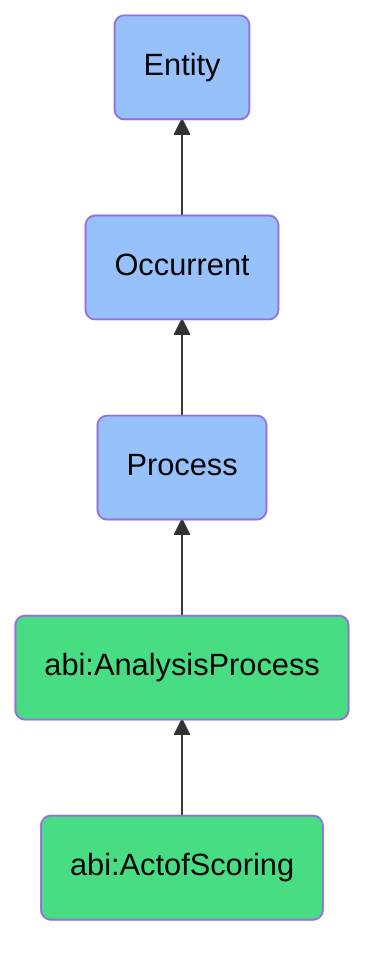

# ActofScoring

## Definition
An act of scoring is an occurrent process that unfolds through time, involving the systematic application of evaluative frameworks, criteria, or algorithms to assess, rate, or quantify the characteristics, qualities, performance, or potential of a subject or observation, resulting in numeric, categorical, or comparative values that facilitate comparison, prioritization, or decision-making.

## Hierarchy in BFO


## Ontological Schema (TBox)
```turtle
abi:ActofScoring a owl:Class ;
  rdfs:subClassOf abi:AnalysisProcess ;
  rdfs:label "Act of Scoring" ;
  skos:definition "A process that applies evaluative metrics to a subject or observation." .

abi:AnalysisProcess a owl:Class ;
  rdfs:subClassOf bfo:0000015 ;
  rdfs:label "Analysis Process" ;
  skos:definition "A process involving the systematic examination, evaluation, or interpretation of data or phenomena to extract insights or support decisions." .

abi:has_scorer a owl:ObjectProperty ;
  rdfs:domain abi:ActofScoring ;
  rdfs:range abi:Scorer ;
  rdfs:label "has scorer" .

abi:evaluates_subject a owl:ObjectProperty ;
  rdfs:domain abi:ActofScoring ;
  rdfs:range abi:ScoringSubject ;
  rdfs:label "evaluates subject" .

abi:applies_scoring_criteria a owl:ObjectProperty ;
  rdfs:domain abi:ActofScoring ;
  rdfs:range abi:ScoringCriteria ;
  rdfs:label "applies scoring criteria" .

abi:uses_scoring_method a owl:ObjectProperty ;
  rdfs:domain abi:ActofScoring ;
  rdfs:range abi:ScoringMethod ;
  rdfs:label "uses scoring method" .

abi:produces_score a owl:ObjectProperty ;
  rdfs:domain abi:ActofScoring ;
  rdfs:range abi:Score ;
  rdfs:label "produces score" .

abi:references_benchmark a owl:ObjectProperty ;
  rdfs:domain abi:ActofScoring ;
  rdfs:range abi:ScoringBenchmark ;
  rdfs:label "references benchmark" .

abi:supports_decision a owl:ObjectProperty ;
  rdfs:domain abi:ActofScoring ;
  rdfs:range abi:ScoreBasedDecision ;
  rdfs:label "supports decision" .

abi:has_scoring_duration a owl:DatatypeProperty ;
  rdfs:domain abi:ActofScoring ;
  rdfs:range xsd:duration ;
  rdfs:label "has scoring duration" .

abi:has_confidence_level a owl:DatatypeProperty ;
  rdfs:domain abi:ActofScoring ;
  rdfs:range xsd:decimal ;
  rdfs:label "has confidence level" .

abi:has_scale_type a owl:DatatypeProperty ;
  rdfs:domain abi:ActofScoring ;
  rdfs:range xsd:string ;
  rdfs:label "has scale type" .
```

## Ontological Instance (ABox)
```turtle
ex:PersonaMatchScoringProcess a abi:ActofScoring ;
  rdfs:label "Persona Match Scoring Process" ;
  abi:has_scorer ex:AIAssistant ;
  abi:evaluates_subject ex:LeadProfile, ex:CustomerInteractionHistory ;
  abi:applies_scoring_criteria ex:DemographicMatchCriteria, ex:BehavioralPatternCriteria, ex:NeedAlignmentCriteria ;
  abi:uses_scoring_method ex:MultiAttributeScoring, ex:WeightedCriteriaAggregation ;
  abi:produces_score ex:PersonaFitScore, ex:BuyingPotentialScore ;
  abi:references_benchmark ex:IdealCustomerProfile, ex:HighValueCustomerBenchmark ;
  abi:supports_decision ex:LeadPrioritizationDecision, ex:MarketingApproachSelection ;
  abi:has_scoring_duration "PT45S"^^xsd:duration ;
  abi:has_confidence_level "0.87"^^xsd:decimal ;
  abi:has_scale_type "Percentage (0-100%)" .

ex:CreditRiskScoringProcess a abi:ActofScoring ;
  rdfs:label "Credit Risk Scoring Process" ;
  abi:has_scorer ex:CreditAssessmentSystem ;
  abi:evaluates_subject ex:LoanApplication, ex:FinancialHistory, ex:RepaymentBehavior ;
  abi:applies_scoring_criteria ex:PaymentHistoryCriteria, ex:DebtToIncomeCriteria, ex:CreditUtilizationCriteria ;
  abi:uses_scoring_method ex:StatisticalModeling, ex:MachineLearningClassification ;
  abi:produces_score ex:CreditRiskScore, ex:DefaultProbabilityScore ;
  abi:references_benchmark ex:IndustryDefaultRates, ex:RegulatoryRiskThresholds ;
  abi:supports_decision ex:LoanApprovalDecision, ex:InterestRateDetermination ;
  abi:has_scoring_duration "PT2M"^^xsd:duration ;
  abi:has_confidence_level "0.92"^^xsd:decimal ;
  abi:has_scale_type "Numeric scale (300-850)" .
```

## Related Classes
- **abi:ActofObserving** - A process that often precedes scoring by gathering information to be evaluated.
- **abi:ActofExplaining** - A process that may provide justification for scores or interpretation of scoring results.
- **abi:RankingProcess** - A specialized process that orders multiple scored subjects relative to each other.
- **abi:ThresholdingProcess** - A process that applies cutoff values to scores to make binary or categorical decisions.
- **abi:ScoreCalibrationProcess** - A process that adjusts scoring methods to improve accuracy or alignment with outcomes. 