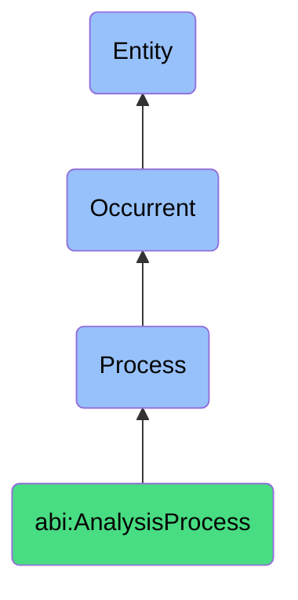

# AnalysisProcess

## Definition
An analysis process is an occurrent that unfolds through time, involving the systematic examination, evaluation, or interpretation of data, observations, or phenomena to extract meaningful information, identify patterns, draw conclusions, or generate insights that support understanding or decision-making.

## Hierarchy in BFO


## Ontological Schema (TBox)
```turtle
abi:AnalysisProcess a owl:Class ;
  rdfs:subClassOf bfo:0000015 ;
  rdfs:label "Analysis Process" ;
  skos:definition "A process involving the systematic examination, evaluation, or interpretation of data or phenomena to extract insights or support decisions." .

abi:has_participant a owl:ObjectProperty ;
  rdfs:domain abi:AnalysisProcess ;
  rdfs:range abi:Analyst ;
  rdfs:label "has participant" .

abi:analyzes_input a owl:ObjectProperty ;
  rdfs:domain abi:AnalysisProcess ;
  rdfs:range abi:AnalysisInput ;
  rdfs:label "analyzes input" .

abi:applies_method a owl:ObjectProperty ;
  rdfs:domain abi:AnalysisProcess ;
  rdfs:range abi:AnalysisMethod ;
  rdfs:label "applies method" .

abi:produces_output a owl:ObjectProperty ;
  rdfs:domain abi:AnalysisProcess ;
  rdfs:range abi:AnalysisOutput ;
  rdfs:label "produces output" .

abi:follows_protocol a owl:ObjectProperty ;
  rdfs:domain abi:AnalysisProcess ;
  rdfs:range abi:AnalysisProtocol ;
  rdfs:label "follows protocol" .

abi:occurs_in_context a owl:ObjectProperty ;
  rdfs:domain abi:AnalysisProcess ;
  rdfs:range abi:AnalysisContext ;
  rdfs:label "occurs in context" .

abi:has_duration a owl:DatatypeProperty ;
  rdfs:domain abi:AnalysisProcess ;
  rdfs:range xsd:duration ;
  rdfs:label "has duration" .

abi:has_complexity_level a owl:DatatypeProperty ;
  rdfs:domain abi:AnalysisProcess ;
  rdfs:range xsd:string ;
  rdfs:label "has complexity level" .

abi:has_accuracy_metric a owl:DatatypeProperty ;
  rdfs:domain abi:AnalysisProcess ;
  rdfs:range xsd:decimal ;
  rdfs:label "has accuracy metric" .
```

## Ontological Instance (ABox)
```turtle
# AnalysisProcess is a parent class with subclasses:
# - abi:ActofObserving
# - abi:ActofScoring
# - abi:ActofExplaining
# and other analysis-related processes
```

## Related Classes
- **abi:ActofObserving** - A specialized process for gathering information about entities, situations, or signals.
- **abi:ActofScoring** - A specialized process for applying evaluative metrics to subjects or observations.
- **abi:ActofExplaining** - A specialized process for producing justifications or interpretations of findings.
- **abi:DataTransformationProcess** - A process that prepares or converts data for analysis.
- **abi:DecisionMakingProcess** - A process that uses analysis outputs to determine courses of action. 