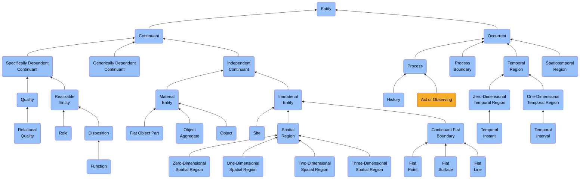
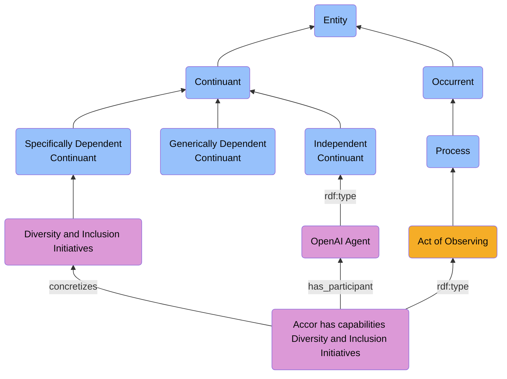

# Act of Observing


## Aristotelian Definitions of `abi:Actof...` Classes

Each `Actof` is defined as a subclass of `bfo:0000015` (Process), using an Aristotelian genus–differentia structure: 
> *An X is a process that Y.*


### abi:ActofObserving
- **Definition**: An act of observing is a process that involves perceiving, detecting, or identifying entities, patterns, or phenomena.
- **Genus**: bfo:0000015 (Process)
- **Differentia**: that is directed toward acquiring information or knowledge about reality.


## Extended Ontology: ABI-Aligned `Actof...` Processes

### 🛰 Open Source Intelligence

- **abi:ActofScraping**: A process that extracts data from web-based or digital content sources using automated agents.
- **abi:ActofCrawling**: A process that systematically navigates digital networks to index or discover content.
- **abi:ActofEnrichment**: A process that augments data by linking it to external classifications, ontologies, or tags.
- **abi:ActofTagging**: A process that assigns semantic labels to entities, documents, or data points.
- **abi:ActofSignalDetection**: A process that identifies relevant or anomalous signals within a noisy information environment.
- **abi:ActofObservation**: A process that captures and records a change or feature of reality.


### 🧠 Content Creation

- **abi:ActofIdeation**: A process that generates conceptual representations or potential communication artifacts.
- **abi:ActofDrafting**: A process that initiates the formal creation of content in raw or outline form.
- **abi:ActofGeneration**: A process that produces a complete piece of content, possibly using machine learning models.
- **abi:ActofReviewing**: A process that evaluates, edits, or approves content through human judgment.
- **abi:ActofPublishing**: A process that distributes a content item to a specific communication channel.
- **abi:ActofRecycling**: A process that reuses or transforms existing content into a new format or context.


### 📣 Growth Marketing

- **abi:ActofCampaignPlanning**: A process that defines objectives, channels, and audiences for a marketing campaign.
- **abi:ActofLaunching**: A process that initiates the release of planned communication or promotion.
- **abi:ActofTrackingEngagement**: A process that monitors interactions with distributed media.
- **abi:ActofScoringEngagement**: A process that evaluates the quality or relevance of interactions.
- **abi:ActofAttribution**: A process that links downstream actions (e.g., conversions) to upstream touchpoints.


### 🤝 Sales Conversion

- **abi:ActofProspecting**: A process that identifies and qualifies new sales leads or opportunities.
- **abi:ActofOutreach**: A process that initiates contact with potential clients or stakeholders.
- **abi:ActofMeeting**: A process that facilitates live or asynchronous interaction between buyer and seller.
- **abi:ActofDealCreation**: A process that defines the parameters of a business transaction.
- **abi:ActofNegotiation**: A process that iteratively adjusts deal terms through offer and response.
- **abi:ActofClosing**: A process that finalizes a transaction through agreement or signature.


### ⚙ Operational Efficiency

- **abi:ActofTaskAssignment**: A process that designates responsibility for a specific task to an agent.
- **abi:ActofWorkflowExecution**: A process that performs a set of interrelated operational tasks.
- **abi:ActofAssetManagement**: A process that organizes, stores, and updates internal resources.
- **abi:ActofKnowledgeCapture**: A process that records expert input, feedback, or decision context.
- **abi:ActofReporting**: A process that generates formal representations of operational status.


### 💰 Finance & Cash Flow

- **abi:ActofContractCreation**: A process that establishes formal legal agreements.
- **abi:ActofBilling**: A process that issues financial demands based on contract terms.
- **abi:ActofAccountsReceivableTracking**: A process that monitors expected incoming payments.
- **abi:ActofAccountsPayableTracking**: A process that monitors obligations to external parties.
- **abi:ActofCashReconciliation**: A process that validates the alignment between expected and actual cash movements.
- **abi:ActofCashForecasting**: A process that estimates future cash positions.
- **abi:ActofRevenueRecognition**: A process that matches realized value to accounting periods.


### 🧩 Cross-Domain

- **abi:ActofValidation**: A process that verifies the correctness, reliability, or applicability of an observation or action.
- **abi:ActofScoring**: A process that assigns a numerical or qualitative assessment to an entity.
- **abi:ActofDecisionMaking**: A process that selects one or more courses of action based on observations.
- **abi:ActofAnnotation**: A process that adds contextual metadata to a resource.
- **abi:ActofExplanation**: A process that generates a justification or rationale for an action, classification, or observation.


> Each `Actof...` is a subclass of `bfo:0000015 (Process)` and can be directly tied to observations, agents, roles, and outcomes in the ABI ontology.

## Hierarchy Representation




## Class & subClassOf

```turtle
abi:ActofObserving a owl:Class ;
    rdfs:subClassOf abi:ont00000300 ;
    rdfs:comment "An act of observing is an act of perceiving, which is an act of observing."@en ;
    rdfs:label "Act of Observing"@en ;
    skos:definition "An act of observing is an act of perceiving, which is an act of observing."@en .
```

## Object Properties & subPropertyOf

