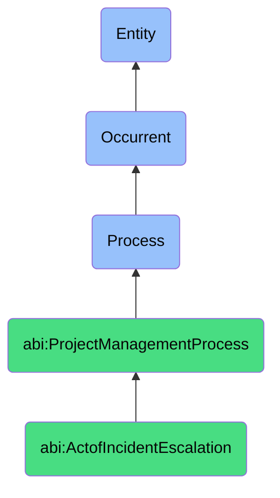

# ActofIncidentEscalation

## Definition
An act of incident escalation is an occurrent process that unfolds through time, involving the structured elevation, communication, and assignment of operational incidents, issues, blockers, or service disruptions to appropriate stakeholders, decision-makers, or resolution teams based on predefined severity classifications, impact assessments, resolution timeframes, or escalation pathways, ensuring timely awareness, appropriate attention, resource mobilization, and accountability for critical situations that exceed standard handling thresholds or require specialized intervention to maintain service continuity.

## Hierarchy in BFO


## Ontological Schema (TBox)
```turtle
abi:ActofIncidentEscalation a owl:Class ;
  rdfs:subClassOf abi:ProjectManagementProcess ;
  rdfs:label "Act of Incident Escalation" ;
  skos:definition "A process that elevates operational issues when thresholds, delays, or quality issues are detected." .

abi:ProjectManagementProcess a owl:Class ;
  rdfs:subClassOf bfo:0000015 ;
  rdfs:label "Project Management Process" ;
  skos:definition "A time-bound process related to the planning, execution, monitoring, and control of project activities to achieve specific objectives." .

abi:has_escalation_initiator a owl:ObjectProperty ;
  rdfs:domain abi:ActofIncidentEscalation ;
  rdfs:range abi:EscalationInitiator ;
  rdfs:label "has escalation initiator" .

abi:escalates_incident a owl:ObjectProperty ;
  rdfs:domain abi:ActofIncidentEscalation ;
  rdfs:range abi:Incident ;
  rdfs:label "escalates incident" .

abi:assigns_to_resolver a owl:ObjectProperty ;
  rdfs:domain abi:ActofIncidentEscalation ;
  rdfs:range abi:IncidentResolver ;
  rdfs:label "assigns to resolver" .

abi:follows_escalation_path a owl:ObjectProperty ;
  rdfs:domain abi:ActofIncidentEscalation ;
  rdfs:range abi:EscalationPath ;
  rdfs:label "follows escalation path" .

abi:applies_severity_classification a owl:ObjectProperty ;
  rdfs:domain abi:ActofIncidentEscalation ;
  rdfs:range abi:SeverityClassification ;
  rdfs:label "applies severity classification" .

abi:documents_business_impact a owl:ObjectProperty ;
  rdfs:domain abi:ActofIncidentEscalation ;
  rdfs:range abi:BusinessImpact ;
  rdfs:label "documents business impact" .

abi:produces_escalation_record a owl:ObjectProperty ;
  rdfs:domain abi:ActofIncidentEscalation ;
  rdfs:range abi:EscalationRecord ;
  rdfs:label "produces escalation record" .

abi:has_escalation_timestamp a owl:DatatypeProperty ;
  rdfs:domain abi:ActofIncidentEscalation ;
  rdfs:range xsd:dateTime ;
  rdfs:label "has escalation timestamp" .

abi:has_response_sla a owl:DatatypeProperty ;
  rdfs:domain abi:ActofIncidentEscalation ;
  rdfs:range xsd:duration ;
  rdfs:label "has response sla" .

abi:has_escalation_priority a owl:DatatypeProperty ;
  rdfs:domain abi:ActofIncidentEscalation ;
  rdfs:range xsd:string ;
  rdfs:label "has escalation priority" .
```

## Ontological Instance (ABox)
```turtle
ex:TaskBlockerEscalation a abi:ActofIncidentEscalation ;
  rdfs:label "Blocked Task Escalation to Delivery Lead" ;
  abi:has_escalation_initiator ex:ProjectManager, ex:WorkflowAutomation ;
  abi:escalates_incident ex:DependencyBlocker, ex:MissingApproval, ex:ResourceShortage ;
  abi:assigns_to_resolver ex:DeliveryLead, ex:DepartmentHead ;
  abi:follows_escalation_path ex:StandardBlockerEscalationProcess, ex:ManagementChainPath ;
  abi:applies_severity_classification ex:HighImpactOnTimeline, ex:MediumImpactOnResources ;
  abi:documents_business_impact ex:ClientDeliverableDelay, ex:ResourceUtilizationImpact ;
  abi:produces_escalation_record ex:EscalationTicket, ex:ManagementNotification, ex:StatusUpdate ;
  abi:has_escalation_timestamp "2023-11-17T13:45:00Z"^^xsd:dateTime ;
  abi:has_response_sla "PT4H"^^xsd:duration ;
  abi:has_escalation_priority "High" .

ex:SystemOutageEscalation a abi:ActofIncidentEscalation ;
  rdfs:label "Critical API Service Outage Escalation" ;
  abi:has_escalation_initiator ex:MonitoringSystem, ex:SupportTier1 ;
  abi:escalates_incident ex:APIServiceFailure, ex:DatabaseUnresponsive, ex:AuthenticationSystemError ;
  abi:assigns_to_resolver ex:IncidentCommander, ex:TechnicalLead, ex:OnCallEngineer ;
  abi:follows_escalation_path ex:EmergencyResponseProcess, ex:TechnicalEscalationPath ;
  abi:applies_severity_classification ex:Severity1Critical, ex:ProductionImpacting ;
  abi:documents_business_impact ex:UserServiceDisruption, ex:RevenueImpact, ex:DataIntegrityRisk ;
  abi:produces_escalation_record ex:IncidentRecord, ex:WarRoomInvitation, ex:StatusPageUpdate, ex:CommunicationLog ;
  abi:has_escalation_timestamp "2023-11-18T02:30:00Z"^^xsd:dateTime ;
  abi:has_response_sla "PT15M"^^xsd:duration ;
  abi:has_escalation_priority "Critical" .
```

## Related Classes
- **abi:ActofServiceDelivery** - A process that may be affected by incidents requiring escalation.
- **abi:ActofUptimeMonitoring** - A process that often identifies issues triggering incident escalation.
- **abi:ActofRunbookExecution** - A process that may be initiated following incident escalation.
- **abi:ActofServiceLevelReview** - A process that evaluates handling of incidents post-resolution.
- **abi:IncidentManagementProcess** - A broader process that includes escalation as a component.
- **abi:CommunicationProtocolProcess** - A process guiding communications during escalations.
- **abi:PostMortemAnalysisProcess** - A process for reviewing incident causes and response effectiveness.