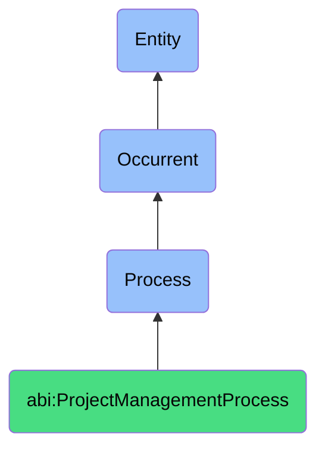

# ProjectManagementProcess

## Definition
A project management process is an occurrent that unfolds through time, involving the systematic planning, organizing, coordinating, controlling, and monitoring of resources, activities, and communications required to achieve specific project objectives within defined constraints of scope, time, cost, and quality, through structured methodologies, tools, and techniques that enable effective decision-making, risk management, stakeholder alignment, and delivery of intended outcomes.

## Hierarchy in BFO


## Ontological Schema (TBox)
```turtle
abi:ProjectManagementProcess a owl:Class ;
  rdfs:subClassOf bfo:0000015 ;
  rdfs:label "Project Management Process" ;
  skos:definition "A time-bound process related to the planning, execution, monitoring, and control of project activities to achieve specific objectives." .

abi:has_project_manager a owl:ObjectProperty ;
  rdfs:domain abi:ProjectManagementProcess ;
  rdfs:range abi:ProjectManager ;
  rdfs:label "has project manager" .

abi:manages_project a owl:ObjectProperty ;
  rdfs:domain abi:ProjectManagementProcess ;
  rdfs:range abi:Project ;
  rdfs:label "manages project" .

abi:involves_project_resource a owl:ObjectProperty ;
  rdfs:domain abi:ProjectManagementProcess ;
  rdfs:range abi:ProjectResource ;
  rdfs:label "involves project resource" .

abi:follows_project_methodology a owl:ObjectProperty ;
  rdfs:domain abi:ProjectManagementProcess ;
  rdfs:range abi:ProjectMethodology ;
  rdfs:label "follows project methodology" .

abi:uses_project_tool a owl:ObjectProperty ;
  rdfs:domain abi:ProjectManagementProcess ;
  rdfs:range abi:ProjectTool ;
  rdfs:label "uses project tool" .

abi:produces_project_artifact a owl:ObjectProperty ;
  rdfs:domain abi:ProjectManagementProcess ;
  rdfs:range abi:ProjectArtifact ;
  rdfs:label "produces project artifact" .

abi:addresses_project_constraint a owl:ObjectProperty ;
  rdfs:domain abi:ProjectManagementProcess ;
  rdfs:range abi:ProjectConstraint ;
  rdfs:label "addresses project constraint" .

abi:has_process_start_date a owl:DatatypeProperty ;
  rdfs:domain abi:ProjectManagementProcess ;
  rdfs:range xsd:date ;
  rdfs:label "has process start date" .

abi:has_process_completion_date a owl:DatatypeProperty ;
  rdfs:domain abi:ProjectManagementProcess ;
  rdfs:range xsd:date ;
  rdfs:label "has process completion date" .

abi:has_process_status a owl:DatatypeProperty ;
  rdfs:domain abi:ProjectManagementProcess ;
  rdfs:range xsd:string ;
  rdfs:label "has process status" .
```

## Ontological Instance (ABox)
```turtle
# ProjectManagementProcess is a parent class with subclasses:
# - abi:ActofProjectPlanning
# - abi:ActofTaskScheduling
# - abi:ActofProjectTracking
# - abi:ActofMilestoneReview
# - abi:ActofRetrospectiveReview
# and other project management-related processes
```

## Related Classes
- **abi:ActofProjectPlanning** - A process that defines the goals, milestones, resources, scope, and timeline for a bounded set of coordinated activities.
- **abi:ActofTaskScheduling** - A process that assigns timeframes, dependencies, and owners to tasks within a project.
- **abi:ActofProjectTracking** - A recurring process that monitors task completion, blockers, status updates, and burndown velocity.
- **abi:ActofMilestoneReview** - A process that verifies whether key outcomes have been achieved by specific delivery checkpoints.
- **abi:ActofRetrospectiveReview** - A process conducted after a project or sprint to extract learnings, feedback, and future optimizations.
- **abi:RiskManagementProcess** - A process for identifying, assessing, and mitigating project risks.
- **abi:StakeholderCommunicationProcess** - A process for managing information flow to project stakeholders. 