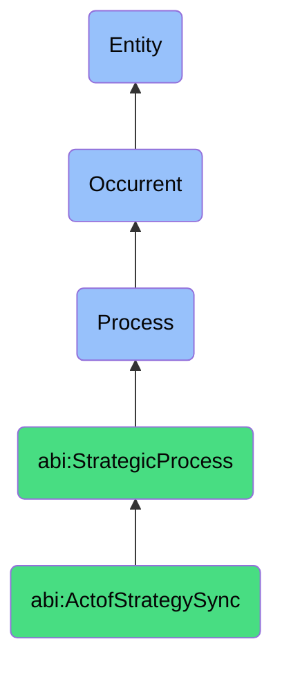

# ActofStrategySync

## Definition
An act of strategy sync is an occurrent process that unfolds through time, involving the deliberate collaborative alignment, recalibration, and harmonization of tactical plans, resource allocation, operational priorities, and decision-making frameworks with overarching strategic objectives, in response to new information, changing conditions, performance feedback, or identified misalignments, ensuring that day-to-day activities and near-term initiatives coherently advance the organization's strategic intent while adapting to evolving context.

## Hierarchy in BFO


## Ontological Schema (TBox)
```turtle
abi:ActofStrategySync a owl:Class ;
  rdfs:subClassOf abi:StrategicProcess ;
  rdfs:label "Act of Strategy Sync" ;
  skos:definition "A scheduled or ad hoc process in which leadership or assistants realign plans with strategic intent." .

abi:StrategicProcess a owl:Class ;
  rdfs:subClassOf bfo:0000015 ;
  rdfs:label "Strategic Process" ;
  skos:definition "A time-bound process related to the assessment, alignment, articulation, or evolution of organizational purpose, principles, direction, and capabilities." .

abi:has_strategy_participant a owl:ObjectProperty ;
  rdfs:domain abi:ActofStrategySync ;
  rdfs:range abi:StrategyParticipant ;
  rdfs:label "has strategy participant" .

abi:aligns_operational_plan a owl:ObjectProperty ;
  rdfs:domain abi:ActofStrategySync ;
  rdfs:range abi:OperationalPlan ;
  rdfs:label "aligns operational plan" .

abi:references_strategic_objective a owl:ObjectProperty ;
  rdfs:domain abi:ActofStrategySync ;
  rdfs:range abi:StrategicObjective ;
  rdfs:label "references strategic objective" .

abi:considers_contextual_factor a owl:ObjectProperty ;
  rdfs:domain abi:ActofStrategySync ;
  rdfs:range abi:ContextualFactor ;
  rdfs:label "considers contextual factor" .

abi:identifies_strategic_tension a owl:ObjectProperty ;
  rdfs:domain abi:ActofStrategySync ;
  rdfs:range abi:StrategicTension ;
  rdfs:label "identifies strategic tension" .

abi:adjusts_tactical_approach a owl:ObjectProperty ;
  rdfs:domain abi:ActofStrategySync ;
  rdfs:range abi:TacticalApproach ;
  rdfs:label "adjusts tactical approach" .

abi:updates_strategic_coordination a owl:ObjectProperty ;
  rdfs:domain abi:ActofStrategySync ;
  rdfs:range abi:StrategicCoordination ;
  rdfs:label "updates strategic coordination" .

abi:has_sync_date a owl:DatatypeProperty ;
  rdfs:domain abi:ActofStrategySync ;
  rdfs:range xsd:date ;
  rdfs:label "has sync date" .

abi:has_sync_trigger a owl:DatatypeProperty ;
  rdfs:domain abi:ActofStrategySync ;
  rdfs:range xsd:string ;
  rdfs:label "has sync trigger" .

abi:has_alignment_outcome a owl:DatatypeProperty ;
  rdfs:domain abi:ActofStrategySync ;
  rdfs:range xsd:string ;
  rdfs:label "has alignment outcome" .
```

## Ontological Instance (ABox)
```turtle
ex:ProductGrowthStrategySync a abi:ActofStrategySync ;
  rdfs:label "Product and Growth Team Strategic Alignment Session" ;
  abi:has_strategy_participant ex:ChiefProductOfficer, ex:HeadOfGrowth, ex:ProductTeamLeads, ex:MarketingDirector ;
  abi:aligns_operational_plan ex:ProductRoadmap, ex:UserAcquisitionCampaign, ex:RetentionInitiatives, ex:FeatureActivationTactics ;
  abi:references_strategic_objective ex:MarketShareExpansion, ex:UserEngagementIntensification, ex:RevenueStreamDiversification ;
  abi:considers_contextual_factor ex:CompetitorFeatureLaunch, ex:UserBehaviorShift, ex:CACAdjustment, ex:ResourceConstraints ;
  abi:identifies_strategic_tension ex:QualityVsSpeedTrade-off, ex:GrowthVsRetentionBalancing, ex:Short-termVsLong-termInvestment ;
  abi:adjusts_tactical_approach ex:CampaignMessageRealignment, ex:FeaturePriorityResequencing, ex:ResourceReallocation ;
  abi:updates_strategic_coordination ex:CrossTeamCommunicationProtocol, ex:MetricsAlignmentFramework, ex:StakeholderExpectationReset ;
  abi:has_sync_date "2023-11-08"^^xsd:date ;
  abi:has_sync_trigger "Campaign Performance Below Projections" ;
  abi:has_alignment_outcome "Campaign Redirection and Feature Priority Adjustment" .

ex:QuarterlyOrganizationalStrategySync a abi:ActofStrategySync ;
  rdfs:label "Quarterly Business Strategy Synchronization Session" ;
  abi:has_strategy_participant ex:ExecutiveLeadershipTeam, ex:DepartmentHeads, ex:StrategicPlanningLead, ex:FinanceDirector ;
  abi:aligns_operational_plan ex:QuarterlyDepartmentalObjectives, ex:BudgetAllocationPlan, ex:ResourceDistributionModel, ex:InnovationInvestments ;
  abi:references_strategic_objective ex:MarketLeadershipSustainment, ex:OperationalExcellence, ex:InnovationPipeline, ex:TalentDevelopment ;
  abi:considers_contextual_factor ex:MarketConditionChanges, ex:RegulatoryDevelopments, ex:TalentMarketDynamics, ex:TechnologyAdvances ;
  abi:identifies_strategic_tension ex:GrowthVsProfitability, ex:InnovationVsStability, ex:CentralizationVsDecentralization, ex:SpeedVsQuality ;
  abi:adjusts_tactical_approach ex:BudgetRealignment, ex:CapacityRebalancing, ex:InitiativeReprioritization, ex:GoToMarketAdjustment ;
  abi:updates_strategic_coordination ex:CrossFunctionalInitiatives, ex:InterdepartmentalMetricsHarmonization, ex:CommunicationCadenceUpdate ;
  abi:has_sync_date "2023-10-02"^^xsd:date ;
  abi:has_sync_trigger "Scheduled Quarterly Strategic Review" ;
  abi:has_alignment_outcome "Revised Quarterly Priorities and Resource Realignment" .
```

## Related Classes
- **abi:ActofMissionReview** - A process that may inform strategy sync by evaluating mission alignment.
- **abi:ActofValueManifestationReview** - A process that may highlight value considerations for strategy sync.
- **abi:StrategicPlanningProcess** - A more comprehensive process that establishes the strategy to be synced.
- **abi:OperationalPlanningProcess** - A process for developing the tactical plans that are aligned during strategy sync.
- **abi:ResourceAllocationProcess** - A process for distributing resources based on strategic priorities.
- **abi:PerformanceReviewProcess** - A process that may identify the need for strategy sync based on results.
- **abi:CrossFunctionalCoordinationProcess** - A process for facilitating collaboration across departmental boundaries. 