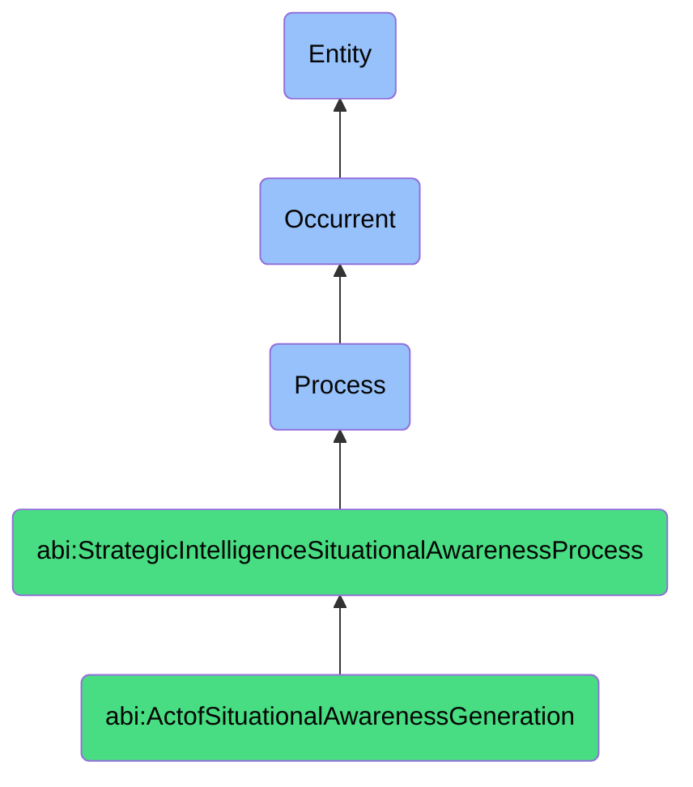

# ActofSituationalAwarenessGeneration

## Definition
An act of situational awareness generation is an occurrent process that unfolds through time, involving the deliberate synthesis, interpretation, and organization of diverse internal and external signals, data points, trends, or contexts into a coherent, comprehensive, and shareable representation of current conditions, enabling stakeholders to develop a common understanding of existing realities, emerging patterns, or contextual factors through structured methodologies that transform assessed situations into accessible models, narratives, or visualizations that facilitate perception, comprehension, and projection capabilities.

## Hierarchy in BFO


## Ontological Schema (TBox)
```turtle
abi:ActofSituationalAwarenessGeneration a owl:Class ;
  rdfs:subClassOf abi:StrategicIntelligenceSituationalAwarenessProcess ;
  rdfs:label "Act of Situational Awareness Generation" ;
  skos:definition "A process that synthesizes internal and external signals into a coherent, shareable model of what is happening now." .

abi:StrategicIntelligenceSituationalAwarenessProcess a owl:Class ;
  rdfs:subClassOf bfo:0000015 ;
  rdfs:label "Strategic Intelligence Situational Awareness Process" ;
  skos:definition "A time-bound process related to the collection, analysis, and synthesis of information to develop understanding of current situations, evaluate options, or support strategic decision-making." .

abi:has_awareness_generator a owl:ObjectProperty ;
  rdfs:domain abi:ActofSituationalAwarenessGeneration ;
  rdfs:range abi:AwarenessGenerator ;
  rdfs:label "has awareness generator" .

abi:synthesizes_signal_source a owl:ObjectProperty ;
  rdfs:domain abi:ActofSituationalAwarenessGeneration ;
  rdfs:range abi:SignalSource ;
  rdfs:label "synthesizes signal source" .

abi:integrates_contextual_domain a owl:ObjectProperty ;
  rdfs:domain abi:ActofSituationalAwarenessGeneration ;
  rdfs:range abi:ContextualDomain ;
  rdfs:label "integrates contextual domain" .

abi:applies_synthesis_method a owl:ObjectProperty ;
  rdfs:domain abi:ActofSituationalAwarenessGeneration ;
  rdfs:range abi:SynthesisMethod ;
  rdfs:label "applies synthesis method" .

abi:creates_awareness_representation a owl:ObjectProperty ;
  rdfs:domain abi:ActofSituationalAwarenessGeneration ;
  rdfs:range abi:AwarenessRepresentation ;
  rdfs:label "creates awareness representation" .

abi:identifies_situational_pattern a owl:ObjectProperty ;
  rdfs:domain abi:ActofSituationalAwarenessGeneration ;
  rdfs:range abi:SituationalPattern ;
  rdfs:label "identifies situational pattern" .

abi:produces_awareness_artifact a owl:ObjectProperty ;
  rdfs:domain abi:ActofSituationalAwarenessGeneration ;
  rdfs:range abi:AwarenessArtifact ;
  rdfs:label "produces awareness artifact" .

abi:has_generation_timestamp a owl:DatatypeProperty ;
  rdfs:domain abi:ActofSituationalAwarenessGeneration ;
  rdfs:range xsd:dateTime ;
  rdfs:label "has generation timestamp" .

abi:has_intended_audience a owl:DatatypeProperty ;
  rdfs:domain abi:ActofSituationalAwarenessGeneration ;
  rdfs:range xsd:string ;
  rdfs:label "has intended audience" .

abi:has_comprehensiveness_score a owl:DatatypeProperty ;
  rdfs:domain abi:ActofSituationalAwarenessGeneration ;
  rdfs:range xsd:decimal ;
  rdfs:label "has comprehensiveness score" .
```

## Ontological Instance (ABox)
```turtle
ex:AllHandsMeetingBriefingGeneration a abi:ActofSituationalAwarenessGeneration ;
  rdfs:label "Monday All-Hands Situational Awareness Briefing Generation" ;
  abi:has_awareness_generator ex:StrategicAssistant, ex:ExecutiveTeam, ex:BusinessIntelligenceAnalyst ;
  abi:synthesizes_signal_source ex:WeeklyPerformanceMetrics, ex:MarketIntelligence, ex:TeamStatusReports, ex:CustomerFeedback ;
  abi:integrates_contextual_domain ex:OrganizationalPerformance, ex:MarketDynamics, ex:ProductDevelopment, ex:OperationalIssues ;
  abi:applies_synthesis_method ex:CrossfunctionalCorrelation, ex:TrendNarrative, ex:VisualSummarization, ex:PriorityFiltering ;
  abi:creates_awareness_representation ex:SituationalOverview, ex:TrendVisualization, ex:PriorityIssueMatrix ;
  abi:identifies_situational_pattern ex:SalesConversionDecline, ex:ProductAdoptionGrowth, ex:TeamResourceConstraint ;
  abi:produces_awareness_artifact ex:BriefingDeck, ex:AlertNotifications, ex:NarrativeSummary, ex:ActionItems ;
  abi:has_generation_timestamp "2023-11-19T17:30:00Z"^^xsd:dateTime ;
  abi:has_intended_audience "All company employees" ;
  abi:has_comprehensiveness_score "0.89"^^xsd:decimal .

ex:MarketDisruptionAwarenessGeneration a abi:ActofSituationalAwarenessGeneration ;
  rdfs:label "Competitor Product Launch Situational Awareness Generation" ;
  abi:has_awareness_generator ex:CompetitiveIntelligenceTeam, ex:MarketAnalyst, ex:StrategyConsultant ;
  abi:synthesizes_signal_source ex:CompetitorAnnouncement, ex:SocialMediaReactions, ex:IndustryAnalystBriefings, ex:CustomerSurveys ;
  abi:integrates_contextual_domain ex:CompetitivePositioning, ex:ProductDifferentiation, ex:MarketPerception, ex:CustomerPreference ;
  abi:applies_synthesis_method ex:ImpactAssessment, ex:CompetitiveComparison, ex:MarketSegmentAnalysis, ex:ScenarioFraming ;
  abi:creates_awareness_representation ex:CompetitiveLandscapeMap, ex:FeatureComparisonMatrix, ex:CustomerSentimentAnalysis ;
  abi:identifies_situational_pattern ex:PricingStrategyShift, ex:TargetMarketExpansion, ex:TechnologyAdoptionTrend ;
  abi:produces_awareness_artifact ex:CompetitiveResponseBriefing, ex:MarketPositioningGuidance, ex:ExecutiveSummary ;
  abi:has_generation_timestamp "2023-11-12T14:15:00Z"^^xsd:dateTime ;
  abi:has_intended_audience "Executive team and product leaders" ;
  abi:has_comprehensiveness_score "0.94"^^xsd:decimal .
```

## Related Classes
- **abi:ActofSituationAssessment** - A process that provides inputs for situational awareness generation.
- **abi:ActofSimulation** - A process that may use situational awareness as baseline for future projections.
- **abi:ActofStrategicOptionGeneration** - A process that develops options based on situational awareness.
- **abi:ActofNextBestMoveSelection** - A process that uses situational awareness to inform decision-making.
- **abi:NarrativeSynthesisProcess** - A process that creates coherent narratives from complex situations.
- **abi:InformationVisualizationProcess** - A process that creates visual representations of situational data.
- **abi:KnowledgeSharingProcess** - A process for distributing situational awareness to stakeholders. 