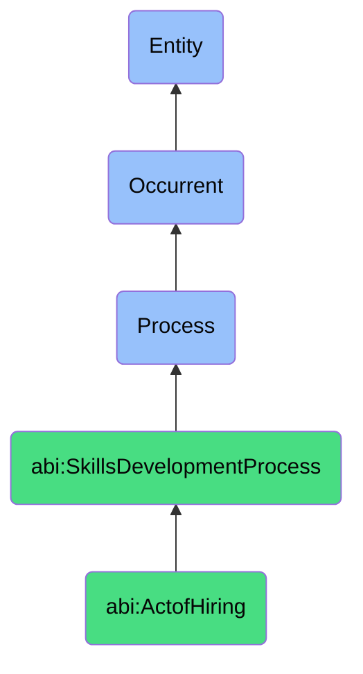

# ActofHiring

## Definition
An act of hiring is an occurrent process that unfolds through time, involving the systematic identification, attraction, assessment, selection, and formal engagement of qualified individuals to fulfill organizational roles, responsibilities, or expertise requirements, through structured evaluation of capabilities, experience, and alignment with organizational needs, culminating in a mutual commitment between the hiring organization and the selected contributor to establish a formal working relationship that addresses specific skills gaps, capacity needs, or strategic objectives.

## Hierarchy in BFO


## Ontological Schema (TBox)
```turtle
abi:ActofHiring a owl:Class ;
  rdfs:subClassOf abi:SkillsDevelopmentProcess ;
  rdfs:label "Act of Hiring" ;
  skos:definition "A process by which an organization identifies, evaluates, and commits to onboarding a new contributor." .

abi:SkillsDevelopmentProcess a owl:Class ;
  rdfs:subClassOf bfo:0000015 ;
  rdfs:label "Skills Development Process" ;
  skos:definition "A time-bound process related to the identification, acquisition, cultivation, enhancement, or transfer of knowledge, capabilities, competencies, or expertise within individuals or organizational contexts." .

abi:has_hiring_manager a owl:ObjectProperty ;
  rdfs:domain abi:ActofHiring ;
  rdfs:range abi:HiringManager ;
  rdfs:label "has hiring manager" .

abi:involves_recruitment_participant a owl:ObjectProperty ;
  rdfs:domain abi:ActofHiring ;
  rdfs:range abi:RecruitmentParticipant ;
  rdfs:label "involves recruitment participant" .

abi:identifies_candidate a owl:ObjectProperty ;
  rdfs:domain abi:ActofHiring ;
  rdfs:range abi:Candidate ;
  rdfs:label "identifies candidate" .

abi:evaluates_qualification a owl:ObjectProperty ;
  rdfs:domain abi:ActofHiring ;
  rdfs:range abi:Qualification ;
  rdfs:label "evaluates qualification" .

abi:follows_hiring_process a owl:ObjectProperty ;
  rdfs:domain abi:ActofHiring ;
  rdfs:range abi:HiringProcess ;
  rdfs:label "follows hiring process" .

abi:addresses_skill_requirement a owl:ObjectProperty ;
  rdfs:domain abi:ActofHiring ;
  rdfs:range abi:SkillRequirement ;
  rdfs:label "addresses skill requirement" .

abi:produces_hiring_outcome a owl:ObjectProperty ;
  rdfs:domain abi:ActofHiring ;
  rdfs:range abi:HiringOutcome ;
  rdfs:label "produces hiring outcome" .

abi:has_position_title a owl:DatatypeProperty ;
  rdfs:domain abi:ActofHiring ;
  rdfs:range xsd:string ;
  rdfs:label "has position title" .

abi:has_hiring_date a owl:DatatypeProperty ;
  rdfs:domain abi:ActofHiring ;
  rdfs:range xsd:date ;
  rdfs:label "has hiring date" .

abi:has_role_expertise_domain a owl:DatatypeProperty ;
  rdfs:domain abi:ActofHiring ;
  rdfs:range xsd:string ;
  rdfs:label "has role expertise domain" .
```

## Ontological Instance (ABox)
```turtle
ex:RiskLeadHiring a abi:ActofHiring ;
  rdfs:label "Risk Lead with Cyber Expertise Hiring Process" ;
  abi:has_hiring_manager ex:SecurityDirector, ex:HRBusinessPartner ;
  abi:involves_recruitment_participant ex:CyberSecurityTeam, ex:ExecutiveTeam, ex:ComplianceOfficer ;
  abi:identifies_candidate ex:SophieCandidate, ex:OtherShortlistCandidates ;
  abi:evaluates_qualification ex:CybersecurityExpertise, ex:RiskManagementExperience, ex:LeadershipCapabilities, ex:ComplianceKnowledge ;
  abi:follows_hiring_process ex:ExecutiveRecruitmentProcess, ex:SecurityClearanceVerification, ex:TechnicalAssessment ;
  abi:addresses_skill_requirement ex:CyberRiskAssessmentSkill, ex:SecurityGovernanceExpertise, ex:RegulatoryComplianceKnowledge ;
  abi:produces_hiring_outcome ex:JobOffer, ex:EmploymentContract, ex:OnboardingInitiation ;
  abi:has_position_title "Risk Lead" ;
  abi:has_hiring_date "2023-10-15"^^xsd:date ;
  abi:has_role_expertise_domain "Cyber Risk Management" .

ex:DataScienceTeamExpansion a abi:ActofHiring ;
  rdfs:label "Senior Data Scientist Hiring for AI Initiative" ;
  abi:has_hiring_manager ex:DataScienceDirector, ex:AIProjectLead ;
  abi:involves_recruitment_participant ex:DataEngineeringTeam, ex:MachineLearningTeam, ex:ProductManagement ;
  abi:identifies_candidate ex:TopMachineLearningCandidates, ex:InternalTransferCandidates ;
  abi:evaluates_qualification ex:DeepLearningExpertise, ex:LargeDatasetExperience, ex:ProgrammingProficiency, ex:BusinessUnderstanding ;
  abi:follows_hiring_process ex:TechnicalScreening, ex:CodingAssessment, ex:AlgorithmDesignChallenge, ex:TeamFitInterview ;
  abi:addresses_skill_requirement ex:NeuralNetworkImplementation, ex:DataPipeliningSkills, ex:ModelOptimizationKnowledge ;
  abi:produces_hiring_outcome ex:SeniorDataScientistOffer, ex:RelocationPackage, ex:EquityCompensation ;
  abi:has_position_title "Senior Data Scientist" ;
  abi:has_hiring_date "2023-09-01"^^xsd:date ;
  abi:has_role_expertise_domain "Machine Learning and AI" .
```

## Related Classes
- **abi:ActofOnboarding** - A process that follows hiring to integrate the new contributor into the organization.
- **abi:SkillAssessmentProcess** - A process used during hiring to evaluate candidate capabilities.
- **abi:RoleDefinitionProcess** - A process that precedes hiring to establish position requirements.
- **abi:RecruitmentMarketingProcess** - A process for attracting qualified candidates.
- **abi:BackgroundVerificationProcess** - A process for validating candidate information during hiring.
- **abi:CompensationNegotiationProcess** - A process for establishing employment terms during hiring.
- **abi:TeamIntegrationPlanningProcess** - A process for preparing the organization for the new hire. 