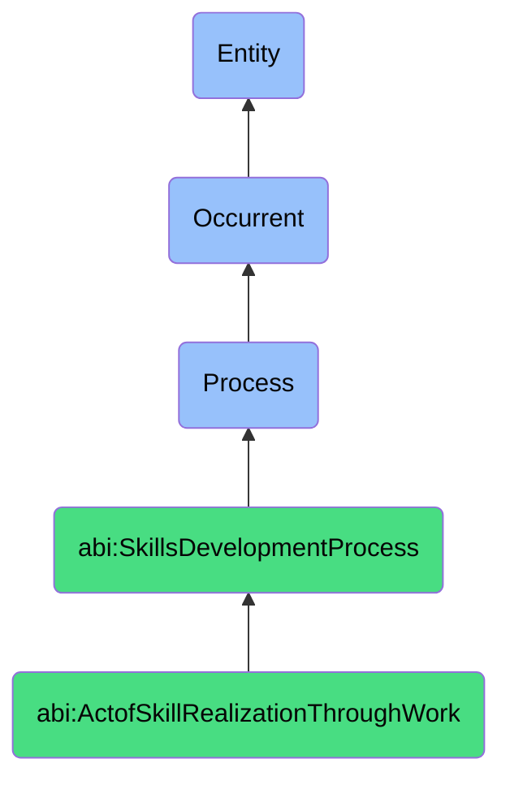

# ActofSkillRealizationThroughWork

## Definition
An act of skill realization through work is an occurrent process that unfolds through time, involving the progressive refinement, deepening, and embodiment of knowledge, capabilities, or expertise through sustained application in authentic work contexts, characterized by continuous practice, iterative improvement, feedback integration, obstacle navigation, and adaptation to varied scenarios, whereby theoretical understanding is transformed into intuitive mastery, tacit knowledge, fluent execution, and contextual judgment through experiential learning and reflective practice in the pursuit of meaningful organizational outcomes.

## Hierarchy in BFO


## Ontological Schema (TBox)
```turtle
abi:ActofSkillRealizationThroughWork a owl:Class ;
  rdfs:subClassOf abi:SkillsDevelopmentProcess ;
  rdfs:label "Act of Skill Realization Through Work" ;
  skos:definition "A long-running process in which a skill is refined through consistent application in real-world settings." .

abi:SkillsDevelopmentProcess a owl:Class ;
  rdfs:subClassOf bfo:0000015 ;
  rdfs:label "Skills Development Process" ;
  skos:definition "A time-bound process related to the identification, acquisition, cultivation, enhancement, or transfer of knowledge, capabilities, competencies, or expertise within individuals or organizational contexts." .

abi:has_skill_practitioner a owl:ObjectProperty ;
  rdfs:domain abi:ActofSkillRealizationThroughWork ;
  rdfs:range abi:SkillPractitioner ;
  rdfs:label "has skill practitioner" .

abi:realizes_skill a owl:ObjectProperty ;
  rdfs:domain abi:ActofSkillRealizationThroughWork ;
  rdfs:range abi:Skill ;
  rdfs:label "realizes skill" .

abi:occurs_within_work_context a owl:ObjectProperty ;
  rdfs:domain abi:ActofSkillRealizationThroughWork ;
  rdfs:range abi:WorkContext ;
  rdfs:label "occurs within work context" .

abi:involves_practice_scenario a owl:ObjectProperty ;
  rdfs:domain abi:ActofSkillRealizationThroughWork ;
  rdfs:range abi:PracticeScenario ;
  rdfs:label "involves practice scenario" .

abi:incorporates_performance_feedback a owl:ObjectProperty ;
  rdfs:domain abi:ActofSkillRealizationThroughWork ;
  rdfs:range abi:PerformanceFeedback ;
  rdfs:label "incorporates performance feedback" .

abi:overcomes_developmental_challenge a owl:ObjectProperty ;
  rdfs:domain abi:ActofSkillRealizationThroughWork ;
  rdfs:range abi:DevelopmentalChallenge ;
  rdfs:label "overcomes developmental challenge" .

abi:produces_skill_artifact a owl:ObjectProperty ;
  rdfs:domain abi:ActofSkillRealizationThroughWork ;
  rdfs:range abi:SkillArtifact ;
  rdfs:label "produces skill artifact" .

abi:has_realization_start_date a owl:DatatypeProperty ;
  rdfs:domain abi:ActofSkillRealizationThroughWork ;
  rdfs:range xsd:date ;
  rdfs:label "has realization start date" .

abi:has_practice_duration a owl:DatatypeProperty ;
  rdfs:domain abi:ActofSkillRealizationThroughWork ;
  rdfs:range xsd:duration ;
  rdfs:label "has practice duration" .

abi:has_proficiency_progression a owl:DatatypeProperty ;
  rdfs:domain abi:ActofSkillRealizationThroughWork ;
  rdfs:range xsd:string ;
  rdfs:label "has proficiency progression" .
```

## Ontological Instance (ABox)
```turtle
ex:InvestorOutreachSkillRealization a abi:ActofSkillRealizationThroughWork ;
  rdfs:label "Investor Outreach Skill Realization During Series A Campaign" ;
  abi:has_skill_practitioner ex:StartupFounder, ex:ChiefFinancialOfficer ;
  abi:realizes_skill ex:SkillOfInvestorOutreach, ex:PitchDeliveryCapability, ex:InvestmentNegotiationTechnique ;
  abi:occurs_within_work_context ex:SeriesAFundraisingCampaign, ex:VentureCapitalEcosystem ;
  abi:involves_practice_scenario ex:InvestorPresentations, ex:TermSheetNegotiations, ex:DueDiligenceResponses, ex:NetworkingEvents ;
  abi:incorporates_performance_feedback ex:InvestorQuestions, ex:MentorGuidance, ex:RejectionRationales, ex:SuccessfulEngagements ;
  abi:overcomes_developmental_challenge ex:ValuationObjections, ex:CompetitiveComparisons, ex:MarketUncertainties, ex:FinancialModelingGaps ;
  abi:produces_skill_artifact ex:RefinedPitchDeck, ex:InvestorFAQRepository, ex:EngagementPlaybook, ex:FollowupFramework ;
  abi:has_realization_start_date "2023-03-15"^^xsd:date ;
  abi:has_practice_duration "P6M"^^xsd:duration ;
  abi:has_proficiency_progression "Novice to Proficient Practitioner" .

ex:ProductDesignSkillRealization a abi:ActofSkillRealizationThroughWork ;
  rdfs:label "Product Design Expertise Realization Through Feature Development Cycles" ;
  abi:has_skill_practitioner ex:UXDesigner, ex:ProductManager ;
  abi:realizes_skill ex:UserCenteredDesignSkill, ex:DesignSystemImplementation, ex:AccessibilityCompliance ;
  abi:occurs_within_work_context ex:SaasPlatformEvolution, ex:AgileProductDevelopment ;
  abi:involves_practice_scenario ex:UserResearchSessions, ex:DesignReviews, ex:PrototypeTestings, ex:FeatureReleases ;
  abi:incorporates_performance_feedback ex:UserTestingResults, ex:TeamCritiques, ex:AccessibilityAudits, ex:UsageAnalytics ;
  abi:overcomes_developmental_challenge ex:CrossPlatformConsistency, ex:PerformanceConstraints, ex:StakeholderExpectations, ex:LegacySystemIntegration ;
  abi:produces_skill_artifact ex:DesignSystemDocumentation, ex:InteractionPatternLibrary, ex:AccessibilityGuidelines, ex:ResearchInsightRepository ;
  abi:has_realization_start_date "2023-01-10"^^xsd:date ;
  abi:has_practice_duration "P18M"^^xsd:duration ;
  abi:has_proficiency_progression "Competent to Expert" .
```

## Related Classes
- **abi:ActofHiring** - A process that may introduce practitioners to contexts for skill realization.
- **abi:ActofOnboarding** - A process that establishes foundational knowledge before skill realization.
- **abi:ActofInternalTraining** - A process that provides theoretical knowledge applied during skill realization.
- **abi:ActofMentoring** - A process that supports and accelerates skill realization through guidance.
- **abi:ActofSkillAssessment** - A process that measures progress during skill realization.
- **abi:ActofSkillRecognition** - A process that formally acknowledges skills after realization.
- **abi:ActofMissionAssignment** - A process that creates the context for skill realization through work. 