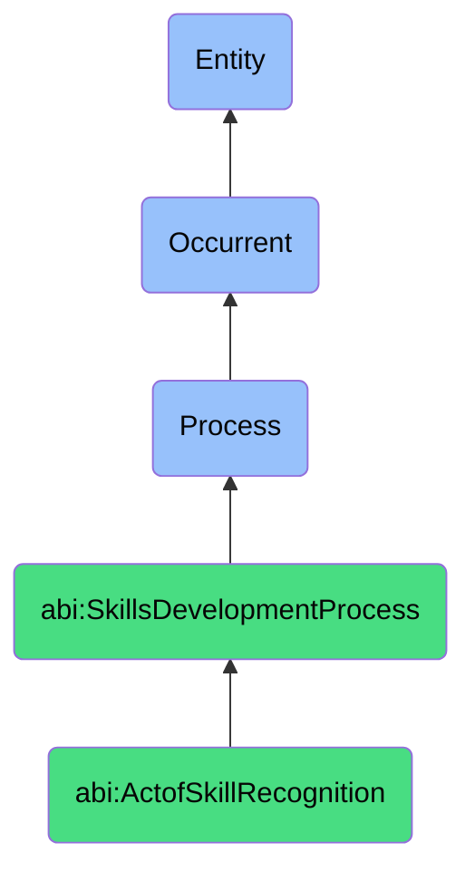

# ActofSkillRecognition

## Definition
An act of skill recognition is an occurrent process that unfolds through time, involving the formal acknowledgment, validation, and documentation of an individual's demonstrated capabilities, expertise, or competencies by authorized agents or systems, based on established criteria, performance evidence, assessment results, or experiential validation, resulting in official attribution, certification, credentialing, or digital documentation that enhances visibility, validates qualification, or enables specific role assignments within organizational, professional, or social contexts.

## Hierarchy in BFO


## Ontological Schema (TBox)
```turtle
abi:ActofSkillRecognition a owl:Class ;
  rdfs:subClassOf abi:SkillsDevelopmentProcess ;
  rdfs:label "Act of Skill Recognition" ;
  skos:definition "A process in which an agent or organization formally acknowledges that a skill or expertise has been acquired or demonstrated." .

abi:SkillsDevelopmentProcess a owl:Class ;
  rdfs:subClassOf bfo:0000015 ;
  rdfs:label "Skills Development Process" ;
  skos:definition "A time-bound process related to the identification, acquisition, cultivation, enhancement, or transfer of knowledge, capabilities, competencies, or expertise within individuals or organizational contexts." .

abi:has_recognition_authority a owl:ObjectProperty ;
  rdfs:domain abi:ActofSkillRecognition ;
  rdfs:range abi:RecognitionAuthority ;
  rdfs:label "has recognition authority" .

abi:recognizes_skill_bearer a owl:ObjectProperty ;
  rdfs:domain abi:ActofSkillRecognition ;
  rdfs:range abi:SkillBearer ;
  rdfs:label "recognizes skill bearer" .

abi:validates_skill a owl:ObjectProperty ;
  rdfs:domain abi:ActofSkillRecognition ;
  rdfs:range abi:Skill ;
  rdfs:label "validates skill" .

abi:applies_recognition_criteria a owl:ObjectProperty ;
  rdfs:domain abi:ActofSkillRecognition ;
  rdfs:range abi:RecognitionCriteria ;
  rdfs:label "applies recognition criteria" .

abi:references_evidence a owl:ObjectProperty ;
  rdfs:domain abi:ActofSkillRecognition ;
  rdfs:range abi:SkillEvidence ;
  rdfs:label "references evidence" .

abi:assigns_skill_identifier a owl:ObjectProperty ;
  rdfs:domain abi:ActofSkillRecognition ;
  rdfs:range abi:SkillIdentifier ;
  rdfs:label "assigns skill identifier" .

abi:produces_recognition_artifact a owl:ObjectProperty ;
  rdfs:domain abi:ActofSkillRecognition ;
  rdfs:range abi:RecognitionArtifact ;
  rdfs:label "produces recognition artifact" .

abi:has_recognition_date a owl:DatatypeProperty ;
  rdfs:domain abi:ActofSkillRecognition ;
  rdfs:range xsd:date ;
  rdfs:label "has recognition date" .

abi:has_recognition_validity_period a owl:DatatypeProperty ;
  rdfs:domain abi:ActofSkillRecognition ;
  rdfs:range xsd:duration ;
  rdfs:label "has recognition validity period" .

abi:has_expertise_level a owl:DatatypeProperty ;
  rdfs:domain abi:ActofSkillRecognition ;
  rdfs:range xsd:string ;
  rdfs:label "has expertise level" .
```

## Ontological Instance (ABox)
```turtle
ex:WorkflowAutomationSkillRecognition a abi:ActofSkillRecognition ;
  rdfs:label "Workflow Automation Expertise Recognition for Amel" ;
  abi:has_recognition_authority ex:TechnicalSkillsCommittee, ex:DepartmentHead ;
  abi:recognizes_skill_bearer ex:AmelEmployee ;
  abi:validates_skill ex:SkillOfWorkflowAutomation, ex:ProcessOptimizationExpertise ;
  abi:applies_recognition_criteria ex:DemonstratedProjectOutcomes, ex:PeerValidation, ex:TechnicalAssessment ;
  abi:references_evidence ex:AutomationProjectDeliverables, ex:EfficiencyMetrics, ex:TeamFeedback, ex:WorkflowDocumentation ;
  abi:assigns_skill_identifier ex:AutomationSpecialistDesignation, ex:WorkflowExpertTag ;
  abi:produces_recognition_artifact ex:DigitalSkillBadge, ex:ExpertiseDocumentation, ex:TalentDirectoryUpdate ;
  abi:has_recognition_date "2023-11-20"^^xsd:date ;
  abi:has_recognition_validity_period "P2Y"^^xsd:duration ;
  abi:has_expertise_level "Advanced Practitioner" .

ex:AISystemPromptEngineeringRecognition a abi:ActofSkillRecognition ;
  rdfs:label "AI Prompt Engineering Expertise Recognition" ;
  abi:has_recognition_authority ex:AICapabilityCenterDirector, ex:ContentStrategyLead ;
  abi:recognizes_skill_bearer ex:ContentSpecialist, ex:AIInteractionDesigner ;
  abi:validates_skill ex:PromptEngineeringExpertise, ex:AISystemCooperationSkill, ex:OutputQualityOptimizationSkill ;
  abi:applies_recognition_criteria ex:PromptEffectivenessMetrics, ex:ComplexitySolvingCapability, ex:ConsistencyOfResults ;
  abi:references_evidence ex:PromptPortfolio, ex:UserSatisfactionData, ex:SystemPerformanceMetrics, ex:UseCase ;
  abi:assigns_skill_identifier ex:AIPromptSpecialistDesignation, ex:AIInteractionExpertTag ;
  abi:produces_recognition_artifact ex:AIExpertiseCertification, ex:SkillProfileUpdate, ex:ProjectAssignmentEligibility ;
  abi:has_recognition_date "2023-10-01"^^xsd:date ;
  abi:has_recognition_validity_period "P1Y"^^xsd:duration ;
  abi:has_expertise_level "Specialist" .
```

## Related Classes
- **abi:ActofHiring** - A process that may reference previously recognized skills.
- **abi:ActofOnboarding** - A process that establishes baseline skill recognition needs.
- **abi:ActofInternalTraining** - A process that develops skills later subject to recognition.
- **abi:ActofMentoring** - A process that prepares individuals for skill recognition.
- **abi:ActofSkillAssessment** - A process that often precedes skill recognition to validate expertise.
- **abi:SkillCatalogueMaintenanceProcess** - A process for managing recognized skills within an organization.
- **abi:ExpertiseMatchingProcess** - A process that uses recognized skills to assign individuals to roles. 