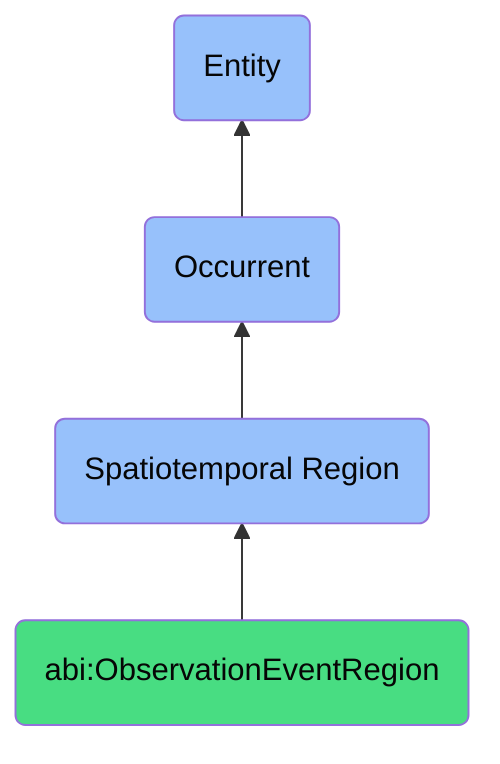

# ObservationEventRegion

## Definition
An observation event region is a specific type of spatiotemporal region (bfo:0000011) that represents the combined temporal and contextual dimensions of a data collection, measurement, or observation occurrence, establishing a framework for capturing not only when and where data was gathered but also the observational circumstances, methodologies, instruments, observer characteristics, and environmental factors that may influence the interpretation and validity of the captured information.

## Hierarchy in BFO


## Ontological Schema (TBox)
```turtle
abi:ObservationEventRegion a owl:Class ;
  rdfs:subClassOf bfo:0000011 ;
  rdfs:label "Observation Event Region" ;
  skos:definition "A region combining time and context for a specific data capture." .

bfo:0000011 a owl:Class ;
  rdfs:label "Spatiotemporal Region" ;
  skos:definition "The combination of spatial and temporal context for processes." .

abi:has_temporal_component a owl:ObjectProperty ;
  rdfs:domain abi:ObservationEventRegion ;
  rdfs:range bfo:0000008 ;
  rdfs:label "has temporal component" .

abi:has_spatial_component a owl:ObjectProperty ;
  rdfs:domain abi:ObservationEventRegion ;
  rdfs:range bfo:0000006 ;
  rdfs:label "has spatial component" .

abi:has_observation_timestamp a owl:DatatypeProperty ;
  rdfs:domain abi:ObservationEventRegion ;
  rdfs:range xsd:dateTime ;
  rdfs:label "has observation timestamp" .

abi:has_observation_location a owl:DatatypeProperty ;
  rdfs:domain abi:ObservationEventRegion ;
  rdfs:range xsd:string ;
  rdfs:label "has observation location" .

abi:has_geographical_context a owl:DatatypeProperty ;
  rdfs:domain abi:ObservationEventRegion ;
  rdfs:range xsd:string ;
  rdfs:label "has geographical context" .

abi:has_observation_period_id a owl:DatatypeProperty ;
  rdfs:domain abi:ObservationEventRegion ;
  rdfs:range xsd:string ;
  rdfs:label "has observation period id" .

abi:has_observer a owl:ObjectProperty ;
  rdfs:domain abi:ObservationEventRegion ;
  rdfs:range abi:Observer ;
  rdfs:label "has observer" .

abi:uses_observation_method a owl:ObjectProperty ;
  rdfs:domain abi:ObservationEventRegion ;
  rdfs:range abi:ObservationMethod ;
  rdfs:label "uses observation method" .

abi:captures_observed_subject a owl:ObjectProperty ;
  rdfs:domain abi:ObservationEventRegion ;
  rdfs:range abi:ObservedSubject ;
  rdfs:label "captures observed subject" .

abi:uses_observation_instrument a owl:ObjectProperty ;
  rdfs:domain abi:ObservationEventRegion ;
  rdfs:range abi:ObservationInstrument ;
  rdfs:label "uses observation instrument" .

abi:produces_observation_data a owl:ObjectProperty ;
  rdfs:domain abi:ObservationEventRegion ;
  rdfs:range abi:ObservationData ;
  rdfs:label "produces observation data" .

abi:has_observation_context a owl:DatatypeProperty ;
  rdfs:domain abi:ObservationEventRegion ;
  rdfs:range xsd:string ;
  rdfs:label "has observation context" .

abi:has_data_quality_rating a owl:DatatypeProperty ;
  rdfs:domain abi:ObservationEventRegion ;
  rdfs:range xsd:decimal ;
  rdfs:label "has data quality rating" .
```

## Ontological Instance (ABox)
```turtle
ex:HiringSignalsObservation_EU_2024_W1 a abi:ObservationEventRegion ;
  rdfs:label "EU Hiring Signals Observation Week 1 2024" ;
  abi:has_temporal_component ex:Week1_2024 ;
  abi:has_spatial_component ex:EuropeanMarket ;
  abi:has_observation_timestamp "2024-01-05T12:00:00Z"^^xsd:dateTime ;
  abi:has_observation_location "European Union" ;
  abi:has_geographical_context "EU labor market" ;
  abi:has_observation_period_id "EU-2024-W1" ;
  abi:has_observer ex:TalentResearchTeam, ex:MarketAnalysisAI ;
  abi:uses_observation_method ex:JobPostingAnalysis, ex:CompensationTrendSampling ;
  abi:captures_observed_subject ex:TechSectorHiringTrends, ex:SeniorRoleVacancies ;
  abi:uses_observation_instrument ex:JobBoardDataFeed, ex:LinkedInInsightsAPI ;
  abi:produces_observation_data ex:HiringSignalsDataset2024W1 ;
  abi:has_observation_context "January hiring season post-holiday surge" ;
  abi:has_data_quality_rating "0.87"^^xsd:decimal .

ex:CustomerBehaviorObservation_NA_Q4_2023 a abi:ObservationEventRegion ;
  rdfs:label "North America Customer Behavior Observation Q4 2023" ;
  abi:has_temporal_component ex:Q4_2023 ;
  abi:has_spatial_component ex:NorthAmericanMarket ;
  abi:has_observation_timestamp "2023-12-15T09:30:00Z"^^xsd:dateTime ;
  abi:has_observation_location "United States, Canada" ;
  abi:has_geographical_context "North American retail sector" ;
  abi:has_observation_period_id "NA-2023-Q4" ;
  abi:has_observer ex:ConsumerBehaviorResearchTeam, ex:RetailAnalyticsSystem ;
  abi:uses_observation_method ex:PurchasePatternAnalysis, ex:SentimentMonitoring ;
  abi:captures_observed_subject ex:HolidayShoppingBehavior, ex:ProductCategoryPreferences ;
  abi:uses_observation_instrument ex:POSDataAggregator, ex:SocialMediaListeningTool ;
  abi:produces_observation_data ex:Q4ConsumerTrendsDataset ;
  abi:has_observation_context "Holiday shopping season with economic uncertainty" ;
  abi:has_data_quality_rating "0.92"^^xsd:decimal .

ex:ProductFeedbackObservation_APAC_2023_H2 a abi:ObservationEventRegion ;
  rdfs:label "APAC Product Feedback Observation H2 2023" ;
  abi:has_temporal_component ex:H2_2023 ;
  abi:has_spatial_component ex:AsiaPacificRegion ;
  abi:has_observation_timestamp "2023-11-30T04:15:00Z"^^xsd:dateTime ;
  abi:has_observation_location "Japan, South Korea, Australia" ;
  abi:has_geographical_context "APAC technology market" ;
  abi:has_observation_period_id "APAC-2023-H2" ;
  abi:has_observer ex:ProductFeedbackTeam, ex:CustomerExperienceAnalyst ;
  abi:uses_observation_method ex:UserSurveyAnalysis, ex:SupportTicketCategorization ;
  abi:captures_observed_subject ex:SoftwareFeatureUtilization, ex:UserSatisfactionMetrics ;
  abi:uses_observation_instrument ex:CustomerFeedbackPortal, ex:SupportSystemAPI ;
  abi:produces_observation_data ex:APACUserFeedbackReport ;
  abi:has_observation_context "Post-major release feedback collection period" ;
  abi:has_data_quality_rating "0.84"^^xsd:decimal .
```

## Examples
1. "Observation of hiring signals occurred in ObservationEventRegion EU-2024-W1" - A data collection event focused on employment trends took place during a specific week in the European market.

2. "Customer sentiment monitoring was conducted in ObservationEventRegion NA-Q2-2023" - A structured observation of customer sentiment was performed within a defined temporal and regional context.

3. "The AI system collected training data in ObservationEventRegion GLOBAL-FINANCE-2023" - A machine learning system gathered financial data within a specific global context and timeframe.

4. "Market trends were observed in ObservationEventRegion TECH-SECTOR-Q3-2023" - A focused observation of technology market dynamics occurred within a specific quarter.

5. "Product feedback was systematically captured in ObservationEventRegion BETA-USERS-AUGUST-2023" - User responses to a beta product were collected within a defined observation period and user segment.

## Related Classes
- **bfo:0000011 (Spatiotemporal Region)** - The parent class of ObservationEventRegion.
- **abi:DataCollectionEvent** - A specific event where data is gathered that occurs within an observation region.
- **abi:ObservationMethodology** - Methods and approaches used in data collection.
- **abi:ObservationalContext** - Factors that influence or describe the context of an observation.
- **abi:ObservationalDataset** - Data produced within an observation event region.
- **abi:ObservationSubject** - The entity or phenomenon being observed.
- **abi:ObservationInstrument** - Tools, systems, or methods used in the observation process. 