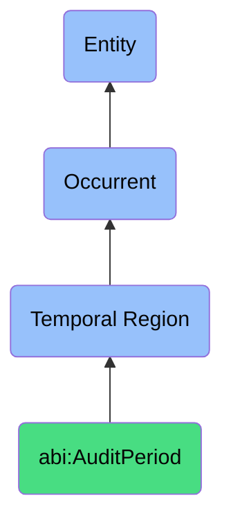

# AuditPeriod

## Definition
An audit period is a specific type of temporal region (bfo:0000008) that represents a formally designated time interval during which systematic examination, review, verification, or assessment activities are conducted to evaluate compliance with regulatory requirements, internal controls, standards, or performance metrics, characterized by clear temporal boundaries, methodological frameworks, and documentation practices that facilitate organizational governance, risk management, and continuous improvement.

## Hierarchy in BFO


## Ontological Schema (TBox)
```turtle
abi:AuditPeriod a owl:Class ;
  rdfs:subClassOf bfo:0000008 ;
  rdfs:label "Audit Period" ;
  skos:definition "A bounded window during which logs or actions are reviewed." .

bfo:0000008 a owl:Class ;
  rdfs:label "Temporal Region" ;
  skos:definition "A time span or interval in which occurrents take place." .

abi:has_start_datetime a owl:DatatypeProperty ;
  rdfs:domain abi:AuditPeriod ;
  rdfs:range xsd:dateTime ;
  rdfs:label "has start datetime" .

abi:has_end_datetime a owl:DatatypeProperty ;
  rdfs:domain abi:AuditPeriod ;
  rdfs:range xsd:dateTime ;
  rdfs:label "has end datetime" .

abi:has_audit_type a owl:DatatypeProperty ;
  rdfs:domain abi:AuditPeriod ;
  rdfs:range xsd:string ;
  rdfs:label "has audit type" .

abi:has_audit_scope a owl:DatatypeProperty ;
  rdfs:domain abi:AuditPeriod ;
  rdfs:range xsd:string ;
  rdfs:label "has audit scope" .

abi:has_auditor a owl:ObjectProperty ;
  rdfs:domain abi:AuditPeriod ;
  rdfs:range abi:Auditor ;
  rdfs:label "has auditor" .

abi:applies_compliance_standard a owl:ObjectProperty ;
  rdfs:domain abi:AuditPeriod ;
  rdfs:range abi:ComplianceStandard ;
  rdfs:label "applies compliance standard" .

abi:examines_organization_entity a owl:ObjectProperty ;
  rdfs:domain abi:AuditPeriod ;
  rdfs:range abi:OrganizationEntity ;
  rdfs:label "examines organization entity" .

abi:uses_audit_methodology a owl:ObjectProperty ;
  rdfs:domain abi:AuditPeriod ;
  rdfs:range abi:AuditMethodology ;
  rdfs:label "uses audit methodology" .

abi:produces_audit_finding a owl:ObjectProperty ;
  rdfs:domain abi:AuditPeriod ;
  rdfs:range abi:AuditFinding ;
  rdfs:label "produces audit finding" .

abi:results_in_audit_report a owl:ObjectProperty ;
  rdfs:domain abi:AuditPeriod ;
  rdfs:range abi:AuditReport ;
  rdfs:label "results in audit report" .

abi:has_audit_frequency a owl:DatatypeProperty ;
  rdfs:domain abi:AuditPeriod ;
  rdfs:range xsd:string ;
  rdfs:label "has audit frequency" .
```

## Ontological Instance (ABox)
```turtle
ex:Q1ComplianceAudit2023 a abi:AuditPeriod ;
  rdfs:label "Q1 2023 Compliance Audit" ;
  abi:has_start_datetime "2023-01-01T00:00:00Z"^^xsd:dateTime ;
  abi:has_end_datetime "2023-03-31T23:59:59Z"^^xsd:dateTime ;
  abi:has_audit_type "Regulatory Compliance" ;
  abi:has_audit_scope "Financial reporting and data privacy practices" ;
  abi:has_auditor ex:ComplianceTeam, ex:ExternalAuditor ;
  abi:applies_compliance_standard ex:GDPR, ex:SOX, ex:IndustryRegulations ;
  abi:examines_organization_entity ex:FinanceDepartment, ex:CustomerDataSystems ;
  abi:uses_audit_methodology ex:ControlSamplingApproach, ex:RiskBasedMethodology ;
  abi:produces_audit_finding ex:DataRetentionFinding, ex:AccessControlFinding ;
  abi:results_in_audit_report ex:Q1ComplianceReport2023 ;
  abi:has_audit_frequency "Quarterly" .

ex:AnnualSecurityAudit2023 a abi:AuditPeriod ;
  rdfs:label "Annual Security Audit 2023" ;
  abi:has_start_datetime "2023-09-01T00:00:00Z"^^xsd:dateTime ;
  abi:has_end_datetime "2023-10-31T23:59:59Z"^^xsd:dateTime ;
  abi:has_audit_type "Information Security" ;
  abi:has_audit_scope "IT infrastructure, access controls, and security protocols" ;
  abi:has_auditor ex:SecurityAuditTeam, ex:CybersecurityConsultant ;
  abi:applies_compliance_standard ex:ISO27001, ex:NIST, ex:CompanySecurityPolicy ;
  abi:examines_organization_entity ex:ITDepartment, ex:CloudInfrastructure, ex:UserAccessSystems ;
  abi:uses_audit_methodology ex:VulnerabilityScanning, ex:PenetrationTesting, ex:ControlAssessment ;
  abi:produces_audit_finding ex:PasswordPolicyFinding, ex:PatchManagementFinding ;
  abi:results_in_audit_report ex:AnnualSecurityAuditReport2023 ;
  abi:has_audit_frequency "Annual" .

ex:OperationalAudit2023 a abi:AuditPeriod ;
  rdfs:label "Operational Efficiency Audit 2023" ;
  abi:has_start_datetime "2023-05-15T00:00:00Z"^^xsd:dateTime ;
  abi:has_end_datetime "2023-06-30T23:59:59Z"^^xsd:dateTime ;
  abi:has_audit_type "Operational Performance" ;
  abi:has_audit_scope "Supply chain processes and warehouse operations" ;
  abi:has_auditor ex:InternalAuditTeam, ex:OperationsConsultant ;
  abi:applies_compliance_standard ex:ISO9001, ex:OperationalBestPractices ;
  abi:examines_organization_entity ex:SupplyChainDepartment, ex:WarehouseOperations ;
  abi:uses_audit_methodology ex:ProcessMapping, ex:KeyPerformanceIndicatorAnalysis ;
  abi:produces_audit_finding ex:InventoryManagementFinding, ex:ProcessEfficiencyFinding ;
  abi:results_in_audit_report ex:OperationalAuditReport2023 ;
  abi:has_audit_frequency "Biannual" .
```

## Examples
1. "AuditPeriod for compliance was Jan 1–Mar 31" - A formal review of compliance-related activities was conducted during the first quarter of the year.

2. "Security logs are examined during the monthly AuditPeriod" - Regular security audits occur within defined time windows on a monthly basis.

3. "The external auditor conducts reviews during the designated AuditPeriod" - Third-party audits are scheduled within specific temporal boundaries.

4. "Financial controls are evaluated in the annual AuditPeriod" - Financial audit activities are concentrated within a specific timeframe each year.

5. "The AuditPeriod for vendor assessment spans two weeks in June" - A specific audit type has its own designated temporal window.

## Related Classes
- **bfo:0000008 (Temporal Region)** - The parent class of AuditPeriod.
- **abi:ComplianceWindow** - A temporal region specifically for compliance activities.
- **abi:ReviewCycle** - A recurring temporal region for systematic reviews.
- **abi:AssessmentTimeframe** - A temporal region for evaluation activities.
- **abi:AuditActivity** - Specific activities conducted during an audit period.
- **abi:AuditFindings** - Results and outcomes produced during an audit period.
- **abi:ComplianceStandard** - Standards or frameworks applied during audit periods. 