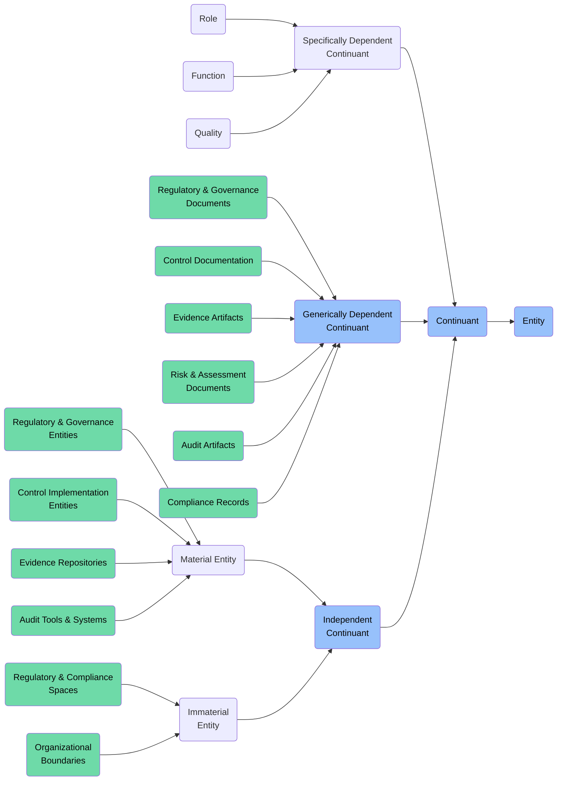

# Continuant: Audit & Compliance Foundry

This folder contains ontology classes representing **Continuants** in the context of the **Audit & Compliance Foundry** of the ABI Ontology.

Continuants are entities that **persist through time** and maintain their identity even as they undergo various changes. In the audit and compliance domain, these include frameworks, controls, evidence artifacts, compliance states, and governance structures.

## Purpose
To model all persistent entities involved in audit and compliance activities — including regulatory frameworks, control systems, governance structures, roles, qualities, and information artifacts that support compliance, audit, and assurance processes.

## Structure
This folder includes:

### 1. **Independent Continuants** (`bfo:0000004`)
Entities that do not depend on other entities for their existence.

#### a. **Material Entities** (`bfo:0000040`)
Physical or digital entities with material existence.

- **Regulatory & Governance Entities**
  - `abi:RegulatoryAuthority`
  - `abi:ComplianceTeam`
  - `abi:GovernanceCommittee`

- **Control Implementation Entities**
  - `abi:ControlSystem`
  - `abi:SecurityControl`
  - `abi:MonitoringTool`
  
- **Evidence Repositories**
  - `abi:EvidenceRepository`
  - `abi:DocumentManagementSystem`
  - `abi:AuditTrailSystem`
  
- **Audit Tools & Systems**
  - `abi:AuditSoftware`
  - `abi:ComplianceMonitoringSystem`
  - `abi:RiskAssessmentTool`

#### b. **Immaterial Entities** (`bfo:0000141`)
Independent continuants that have no material parts at any time.

- **Regulatory & Compliance Spaces**
  - `abi:ComplianceDomain`
  - `abi:RegulatoryJurisdiction`
  - `abi:ControlEnvironment`

- **Organizational Boundaries**
  - `abi:ComplianceBoundary`
  - `abi:AuditScope`
  - `abi:ControlRiskZone`

### 2. **Specifically Dependent Continuants** (`bfo:0000020`)
Entities that depend on specific bearers for their existence.

#### a. **Roles** (`bfo:0000023`)
Realizable entities that an entity can bear in certain contexts.
- `abi:AuditorRole`
- `abi:ComplianceOfficerRole`
- `abi:DataCustodianRole`
- `abi:ControlOwnerRole`
- `abi:RiskManagerRole`

#### b. **Functions** (`bfo:0000034`)
Special kinds of dispositions that exist because of an entity's physical makeup.
- `abi:ComplianceMonitoringFunction`
- `abi:EvidenceCollectionFunction`
- `abi:ControlTestingFunction`
- `abi:RiskAssessmentFunction`
- `abi:AuditReportingFunction`

#### c. **Qualities** (`bfo:0000019`)
Dependent entities that are fully realized in their bearers.
- `abi:ComplianceStatus`
- `abi:ControlEffectiveness`
- `abi:RiskLevel`
- `abi:EvidenceQuality`
- `abi:AuditMaturity`

### 3. **Generically Dependent Continuants** (`bfo:0000031`)
Information artifacts that can exist in multiple copies.

#### a. **Regulatory & Governance Documents**
- `abi:ComplianceFramework`
- `abi:PolicyDocument`
- `abi:RegulatoryRequirement`
- `abi:StandardOperatingProcedure`

#### b. **Control Documentation**
- `abi:ControlFramework`
- `abi:ControlDefinition`
- `abi:ControlMatrix`
- `abi:ControlTestPlan`

#### c. **Evidence Artifacts**
- `abi:AuditEvidence`
- `abi:ComplianceAttestation`
- `abi:ControlTestResult`
- `abi:DocumentaryEvidence`

#### d. **Risk & Assessment Documents**
- `abi:RiskRegister`
- `abi:RiskAssessment`
- `abi:ControlGapAnalysis`
- `abi:VulnerabilityReport`

#### e. **Audit Artifacts**
- `abi:AuditPlan`
- `abi:AuditReport`
- `abi:AuditFinding`
- `abi:AuditRecommendation`

#### f. **Compliance Records**
- `abi:ComplianceRecord`
- `abi:ViolationRecord`
- `abi:RemediationPlan`
- `abi:ComplianceCertification`

## BFO Hierarchy

## Usage
These classes are designed to:
- Model regulatory frameworks, controls, and governance structures
- Represent compliance states, evidence artifacts, and audit documentation
- Support compliance monitoring, audit planning, and risk assessment
- Enable end-to-end traceability from requirements to evidence
- Facilitate cross-framework mapping and regulatory reporting

## Alignment
All classes in this folder:
- Are subclasses of `bfo:Continuant`
- Are scoped specifically to the **Audit & Compliance Foundry**
- Can be imported modularly or reused in other domains

For time-bound processes, events, and activities related to audit and compliance, see the `Occurrent` folder.