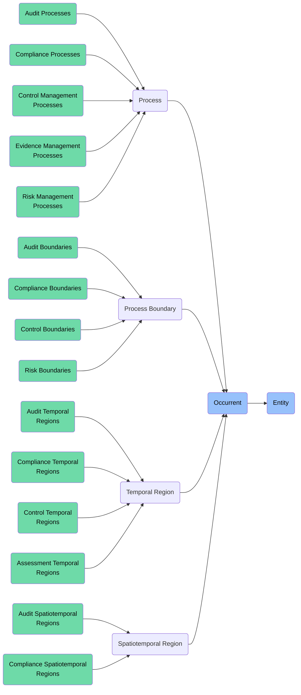

# Occurrent: Audit & Compliance Foundry

This folder contains ontology classes representing **Occurrents** in the context of the **Audit & Compliance Foundry** of the ABI Ontology.

Occurrents are entities that **unfold over time** through temporal parts or stages. In the audit and compliance domain, these include audit processes, compliance monitoring activities, control testing events, and regulatory reporting cycles.

## Purpose
To model all temporal processes and events involved in audit and compliance activities — including audit procedures, compliance verification processes, control testing, risk assessments, remediation activities, and the temporal boundaries that define audit and compliance periods.

## Structure
This folder includes:

### 1. **Processes** (`bfo:0000015`)
Entities that have temporal parts and unfold through time.

#### a. **Audit Processes**
- `abi:AuditProcess`
- `abi:AuditPlanning`
- `abi:AuditExecution`
- `abi:AuditReporting`
- `abi:AuditFollowUp`

#### b. **Compliance Processes**
- `abi:ComplianceMonitoring`
- `abi:ComplianceAssessment`
- `abi:ComplianceReporting`
- `abi:RegulatoryFiling`
- `abi:RuleUpdateDetection`

#### c. **Control Management Processes**
- `abi:ControlImplementation`
- `abi:ControlTesting`
- `abi:ControlMonitoring`
- `abi:ControlEffectivenessAssessment`
- `abi:ControlRemediationProcess`

#### d. **Evidence Management Processes**
- `abi:EvidenceCollection`
- `abi:EvidenceReview`
- `abi:EvidenceVerification`
- `abi:EvidenceRetention`
- `abi:EvidenceDestruction`

#### e. **Risk Management Processes**
- `abi:RiskIdentification`
- `abi:RiskAssessment`
- `abi:RiskMitigation`
- `abi:RiskMonitoring`
- `abi:RiskReporting`

### 2. **Process Boundaries** (`bfo:0000035`)
Beginning and ending points of processes.

#### a. **Audit Boundaries**
- `abi:AuditInitiation`
- `abi:AuditCompletion`
- `abi:AuditPhaseTransition`

#### b. **Compliance Boundaries**
- `abi:ComplianceStatusChange`
- `abi:RegulatoryDeadline`
- `abi:CompliancePeriodBoundary`

#### c. **Control Boundaries**
- `abi:ControlImplementationCompletion`
- `abi:ControlTestingInitiation`
- `abi:ControlFailureEvent`

#### d. **Risk Boundaries**
- `abi:RiskThresholdCrossing`
- `abi:RiskAssessmentCompletion`
- `abi:RiskMitigationMilestone`

### 3. **Temporal Regions** (`bfo:0000008`)
Intervals of time with defined boundaries.

#### a. **Audit Temporal Regions**
- `abi:AuditPeriod`
- `abi:FieldworkTimeframe`
- `abi:ReportingWindow`

#### b. **Compliance Temporal Regions**
- `abi:CompliancePeriod`
- `abi:RegulatoryReportingPeriod`
- `abi:RemediationWindow`

#### c. **Control Temporal Regions**
- `abi:ControlTestCycle`
- `abi:ControlMonitoringInterval`
- `abi:ControlEffectivenessPeriod`

#### d. **Assessment Temporal Regions**
- `abi:RiskAssessmentCycle`
- `abi:QualityReviewPeriod`
- `abi:CertificationValidity`

### 4. **Spatiotemporal Regions** (`bfo:0000011`)
Entities that have both spatial and temporal dimensions.

#### a. **Audit Spatiotemporal Regions**
- `abi:AuditScopeExecution`
- `abi:FieldworkLocation`
- `abi:TestEnvironmentTimeframe`

#### b. **Compliance Spatiotemporal Regions**
- `abi:JurisdictionalComplianceRegion`
- `abi:ComplianceMonitoringZone`
- `abi:RegulatoryEnforcementExpanse`

## BFO Hierarchy

## Usage
These classes are designed to:
- Model the temporal aspects of audit and compliance processes
- Represent compliance monitoring, control testing, and risk assessment activities
- Support scheduling, planning, and tracking of audit and compliance events
- Enable precise temporal reasoning about compliance states and control effectiveness
- Facilitate alignment of compliance activities with regulatory reporting cycles

## Alignment
All classes in this folder:
- Are subclasses of `bfo:Occurrent`
- Are scoped specifically to the **Audit & Compliance Foundry**
- Can be imported modularly or reused in other domains

For persistent entities related to audit and compliance, see the `Continuant` folder.