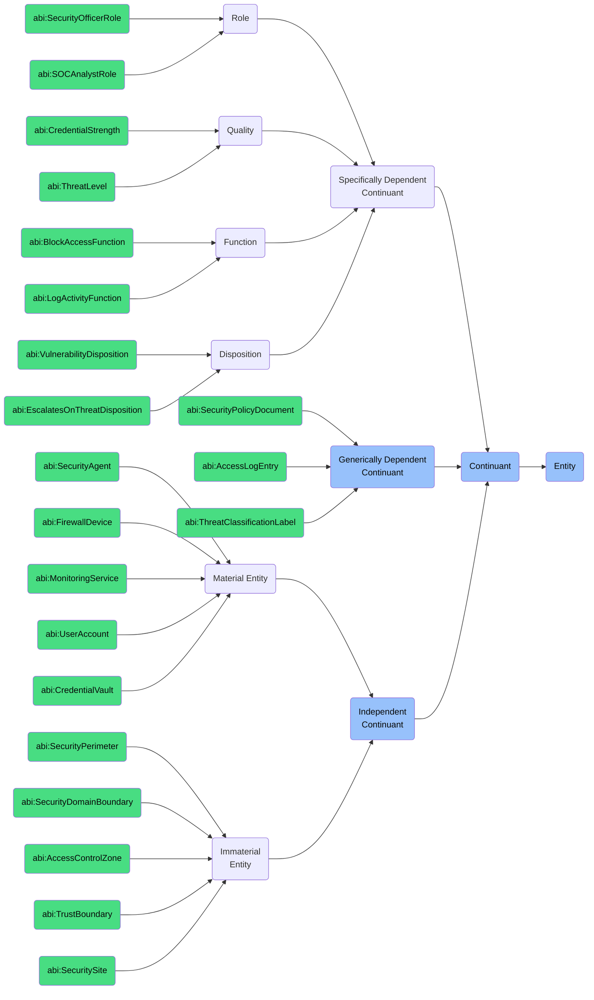

# Continuant: Cyber Security Foundry

This folder contains ontology classes representing **Continuants** in the context of the **Cyber Security Foundry** of the ABI Ontology.

Continuants are entities that **persist through time** and may carry roles, properties, or states that inform how security is modeled, enforced, or governed within an enterprise.

## Purpose
To model all stable entities involved in cybersecurity management — including agents, assets, access rights, and dependent properties (like trust, roles, or categories).

## Structure
In this folder, we include:

### 1. **Independent Continuants** (`bfo:0000004`)
Entities that do not depend on other entities for their existence.

#### a. **Material Entities** (`bfo:0000040`)
Entities that have physical or instantiated digital presence.
- `abi:SecurityAgent`
- `abi:FirewallDevice`
- `abi:MonitoringService`
- `abi:UserAccount`
- `abi:CredentialVault`

#### b. **Immaterial Entities** (`bfo:0000141`)
Independent continuants that have no material parts at any time.
- `abi:SecurityPerimeter`
- `abi:SecurityDomainBoundary` 
- `abi:AccessControlZone`
- `abi:TrustBoundary`
- `abi:SecuritySite`

### 2. **Specifically Dependent Continuants** (`bfo:0000020`)
Entities that depend on specific bearers for their existence.

#### a. **Roles** (`bfo:0000023`)
- `abi:SecurityOfficerRole`
- `abi:SOCAnalystRole`

#### b. **Qualities** (`bfo:0000019`)
- `abi:CredentialStrength`
- `abi:ThreatLevel`

#### c. **Functions** (`bfo:0000034`)
- `abi:BlockAccessFunction`
- `abi:LogActivityFunction`

#### d. **Dispositions** (`bfo:0000016`)
- `abi:VulnerabilityDisposition`
- `abi:EscalatesOnThreatDisposition`

### 3. **Generically Dependent Continuants** (`bfo:0000031`)
Information artifacts that can be concretized in multiple bearers.
- `abi:SecurityPolicyDocument`
- `abi:AccessLogEntry`
- `abi:ThreatClassificationLabel`

## BFO Hierarchy

## Usage
These classes are designed to:
- Represent agents and systems involved in security infrastructure
- Assign evaluative properties (e.g., credential risk, account trust level)
- Track semantic metadata such as audit logs or labels
- Enable linkage to Occurrent processes (e.g., threat detection, credential rotation)

## Alignment
All classes in this folder:
- Are subclasses of `bfo:Continuant`
- Are scoped specifically to the **Cyber Security Foundry**
- Can be imported modularly or reused in ESG, Governance, and Ops domains

For dynamic, time-based processes (e.g. detection, revocation), see the `Occurrent` folder.