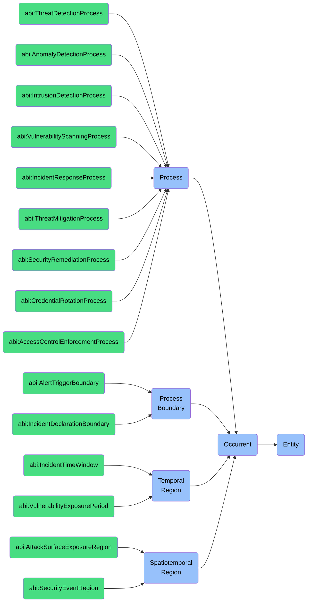

# Occurent: Cyber Security Foundry

This folder contains ontology classes representing **Occurents** in the context of the **Cyber Security Foundry** of the ABI Ontology.

Occurents are entities that **unfold themselves in time** and represent dynamic processes, events, temporal regions related to cybersecurity operations, threat detection, incident response, and security management.

## Purpose
To model all time-bound security processes, detections, responses, and temporal patterns that are essential for cybersecurity management — including threat detection, incident response, credential management, access control enforcement, and security monitoring.

## Ontology Mappings

### MITRE ATT&CK Ontology Mappings
The following ATT&CK concepts map to Occurrent entities:

* **`attack:Technique`** → `bfo:Process`
  * Attack techniques unfold over time with temporal parts
  * Examples: T1078 (Valid Accounts), T1110 (Brute Force), T1566 (Phishing)
* **`attack:Campaign`** → `bfo:Process`
  * Coordinated series of attacks that unfold in time
  * Examples: APT29 campaigns, FIN7 operations, NOBELIUM attack sequences
* **`attack:SubTechnique`** → `bfo:Process`
  * Specialized attack techniques with temporal parts
  * Examples: T1059.001 (PowerShell), T1078.004 (Cloud Accounts), T1098.001 (Additional Cloud Credentials)
* **Process Boundaries** → `bfo:ProcessBoundary`
  * Start/end boundaries of attack techniques
  * Examples: Initial access timepoints, exfiltration completion events, lateral movement transitions
* **Temporal Aspects** → `bfo:TemporalRegion`
  * Time periods relevant to attack techniques
  * Examples: Dwell time periods, credential compromise windows, privilege escalation sequences

### MITRE D3FEND Ontology Mappings
The following D3FEND concepts map to Occurrent entities:

* **`d3f:AccessDeniedEvent`** → `bfo:ProcessBoundary`
  * Instantaneous boundary of access control processes
  * Examples: Failed login attempt events, unauthorized resource access denials, permission boundary violations
* **`d3f:AccessGrantedEvent`** → `bfo:ProcessBoundary`
  * Instantaneous boundary of access granting processes
  * Examples: Successful authentication events, token issuance moments, access control granting points
* **`d3f:AccessMediationEvent`** → `bfo:Process`
  * Process of mediating access requests
  * Examples: Authentication workflows, authorization verification processes, credential validation sequences
* **`d3f:AuthenticateUser`** → `bfo:Process`
  * Process of verifying user identity
  * Examples: Multi-factor authentication processes, biometric verification sequences, credential validation flows
* **Detection Models** → `bfo:Process`
  * Various analytical processes that unfold over time
  * Examples: 
    * `d3f:ARIMAModel` - Time series modeling for anomaly detection
    * `d3f:ARMA_Model` - Autoregressive-moving-average model analysis
    * `d3f:Actor-Critic` - Reinforcement learning detection processes
    * `d3f:AdaptiveResonanceTheoryClustering` - Neural network clustering processes
    * `d3f:AgglomerativeClustering` - Hierarchical clustering of security events
    * `d3f:AlethicLogic` - Logical reasoning processes for threat analysis
    * `d3f:AnswerSetProgramming` - Declarative programming for security analysis
    * `d3f:AssociationRuleLearning` - Mining security patterns from event data

## Structure
This folder includes:

### 1. **Process** (`bfo:0000015`)
Entities that unfold through time with different temporal parts in different time periods.

#### a. **Detection Processes**
- `abi:ThreatDetectionProcess`
- `abi:AnomalyDetectionProcess`
- `abi:IntrusionDetectionProcess`
- `abi:VulnerabilityScanningProcess`
- `abi:MalwareDetectionProcess`
- `attack:Technique` (specific examples):
  - T1560 (Archive Collected Data) - Process of identifying data collection/compression
  - T1046 (Network Service Discovery) - Process of detecting network scanning
  - T1059 (Command and Scripting Interpreter) - Process of identifying malicious script execution
  - T1027 (Obfuscated Files or Information) - Process of detecting obfuscation techniques
- `d3f:AccessMediationEvent` - Process of mediating/monitoring all system access requests
- `d3f:AuthenticateUser` - Process of validating user identity through various authentication factors

#### b. **Response Processes**
- `abi:IncidentResponseProcess`
- `abi:ThreatMitigationProcess`
- `abi:SecurityRemediationProcess`
- `abi:ForensicAnalysisProcess`
- `abi:ContainmentProcess`
- `attack:Campaign` - Coordinated attack response sequences:
  - APT29 campaign response coordination
  - Ransomware incident containment processes
  - Zero-day vulnerability mitigation sequences
- `d3f:ARIMAModel` - Time-series analytical response processes for anomaly detection
- `d3f:AgglomerativeClustering` - Threat grouping processes for incident response:
  - IoC clustering for attribution
  - Attack pattern clustering for tactical response
  - Event correlation for comprehensive defense

#### c. **Management Processes**
- `abi:CredentialRotationProcess`
- `abi:AccessControlEnforcementProcess`
- `abi:SecurityPatchingProcess`
- `abi:AuditReviewProcess`
- `abi:ComplianceVerificationProcess`
- `attack:SubTechnique` - Specific management-related techniques:
  - T1098.001 (Additional Cloud Credentials) - Cloud credential management
  - T1078.004 (Cloud Accounts) - Cloud account management
  - T1552.001 (Credentials In Files) - Credentials storage management
- `d3f:TimeSeriesAnalysis` - Ongoing security monitoring:
  - User behavior analytics monitoring
  - Network traffic baseline monitoring
  - Authentication pattern monitoring
  - System resource usage monitoring

### 2. **Process Boundary** (`bfo:0000035`)
Instantaneous temporal boundaries of security-related processes.
- `abi:AlertTriggerBoundary`
- `abi:IncidentDeclarationBoundary`
- `abi:RemediationCompletionBoundary`
- `abi:BreachDiscoveryBoundary`
- `d3f:AccessDeniedEvent` - Specific boundaries of access attempt processes:
  - Failed authentication boundaries
  - Authorization failure points
  - Permission boundary violations
  - Access control enforcement points
- `d3f:AccessGrantedEvent` - Specific boundaries of successful authentication:
  - Session establishment points
  - Token issuance moments
  - Successful login boundaries
  - Authorization grant points

### 3. **Temporal Region** (`bfo:0000008`)
Time periods relevant to security operations.
- `abi:IncidentTimeWindow`
- `abi:VulnerabilityExposurePeriod`
- `abi:AccessSessionDuration`
- `abi:ThreatDwellTime`
- Attack campaign duration periods:
  - APT dwell time windows (avg. 21 days)
  - Zero-day exploitation windows
  - Credential abuse periods
  - Lateral movement time windows
- Vulnerability exposure windows:
  - CVE exposure periods
  - Patch availability to deployment gaps
  - Zero-day vulnerability windows
  - Legacy system exposure periods

### 4. **Spatiotemporal Region** (`bfo:0000011`)
Space-time regions in which security events occur.
- `abi:AttackSurfaceExposureRegion`
- `abi:SecurityEventRegion`
- `abi:ThreatProliferationRegion`
- Network segments during specific attack periods:
  - DMZ during brute force attacks
  - Cloud resources during ransomware propagation
  - Internal networks during lateral movement phases
  - API gateways during DDoS events
- Data exfiltration pathways during breach events:
  - DNS tunneling channels during exfiltration
  - Encrypted web traffic during data theft
  - Command & control infrastructure during persistent access
  - Email attachments during data smuggling

## BFO Hierarchy

## Usage
These classes are designed to:
- Model the lifecycle of security events, from detection to response
- Represent temporal aspects of security operations and incident management
- Capture the dynamic nature of threat landscapes and security postures
- Enable reasoning about security processes, their boundaries, and temporal relationships
- Map to standards like MITRE ATT&CK (techniques, campaigns) and MITRE D3FEND (events, processes)

## Alignment
All classes in this folder:
- Are subclasses of `bfo:Occurrent`
- Are scoped specifically to the **Cyber Security Foundry**
- Can be imported modularly or reused in ESG, Governance, and Ops domains
- Align with industry-standard cybersecurity ontologies and frameworks

For persistent entities related to security (e.g., agents, systems, policies), see the `Continuant` folder.
