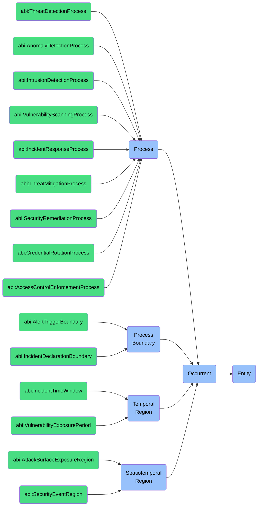

# Occurent: Cyber Security Foundry

This folder contains ontology classes representing **Occurents** in the context of the **Cyber Security Foundry** of the ABI Ontology.

Occurents are entities that **unfold themselves in time** and represent dynamic processes, events, and temporal regions related to cybersecurity operations, threat detection, incident response, and security management.

## Purpose
To model all time-bound security processes, detections, responses, and temporal patterns that are essential for cybersecurity management — including threat detection, incident response, credential management, access control enforcement, and security monitoring.

## Structure
This folder includes:

### 1. **Process** (`bfo:0000015`)
Entities that unfold through time with different temporal parts in different time periods.

#### a. **Detection Processes**
- `abi:ThreatDetectionProcess`
- `abi:AnomalyDetectionProcess`
- `abi:IntrusionDetectionProcess`
- `abi:VulnerabilityScanningProcess`
- `abi:MalwareDetectionProcess`

#### b. **Response Processes**
- `abi:IncidentResponseProcess`
- `abi:ThreatMitigationProcess`
- `abi:SecurityRemediationProcess`
- `abi:ForensicAnalysisProcess`
- `abi:ContainmentProcess`

#### c. **Management Processes**
- `abi:CredentialRotationProcess`
- `abi:AccessControlEnforcementProcess`
- `abi:SecurityPatchingProcess`
- `abi:AuditReviewProcess`
- `abi:ComplianceVerificationProcess`

### 2. **Process Boundary** (`bfo:0000035`)
Instantaneous temporal boundaries of security-related processes.
- `abi:AlertTriggerBoundary`
- `abi:IncidentDeclarationBoundary`
- `abi:RemediationCompletionBoundary`
- `abi:BreachDiscoveryBoundary`

### 3. **Temporal Region** (`bfo:0000008`)
Time periods relevant to security operations.
- `abi:IncidentTimeWindow`
- `abi:VulnerabilityExposurePeriod`
- `abi:AccessSessionDuration`
- `abi:ThreatDwellTime`

### 4. **Spatiotemporal Region** (`bfo:0000011`)
Space-time regions in which security events occur.
- `abi:AttackSurfaceExposureRegion`
- `abi:SecurityEventRegion`
- `abi:ThreatProliferationRegion`

## BFO Hierarchy

## Usage
These classes are designed to:
- Model the lifecycle of security events, from detection to response
- Represent temporal aspects of security operations and incident management
- Capture the dynamic nature of threat landscapes and security postures
- Enable reasoning about security processes, their boundaries, and temporal relationships

## Alignment
All classes in this folder:
- Are subclasses of `bfo:Occurrent`
- Are scoped specifically to the **Cyber Security Foundry**
- Can be imported modularly or reused in ESG, Governance, and Ops domains

For persistent entities related to security (e.g., agents, systems, policies), see the `Continuant` folder.
