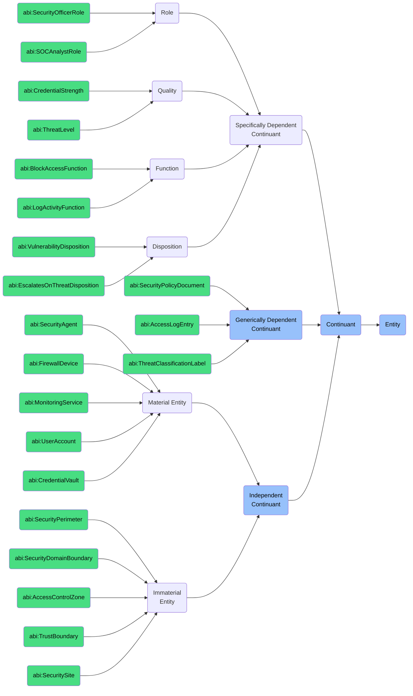

# Continuant: Cyber Security Foundry

This folder contains ontology classes representing **Continuants** in the context of the **Cyber Security Foundry** of the ABI Ontology.

Continuants are entities that **persist through time** and may carry roles, properties, or states that inform how security is modeled, enforced, or governed within an enterprise.

## Purpose
To model all stable entities involved in cybersecurity management — including agents, assets, access rights, and dependent properties (like trust, roles, or categories).

## Ontology Mappings

### MITRE ATT&CK Ontology Mappings
The following ATT&CK concepts map to Continuant entities:

* **`attack:AdversaryGroup`** → `bfo:MaterialEntity`
  * Groups that persist through time as security threats
  * Examples: APT29 (Cozy Bear), FIN7, Lazarus Group, APT33 (Shamoon)
* **`attack:Malware`** → `bfo:MaterialEntity`
  * Malicious software that persists on systems
  * Examples: Emotet, TrickBot, Conti Ransomware, Cobalt Strike
* **`attack:Software`** → `bfo:MaterialEntity`
  * Software tools used in attacks
  * Examples: Mimikatz, PsExec, PowerShell Empire, Metasploit
* **`attack:Mitigation`** → `bfo:GenericallyDependentContinuant`
  * Reusable security measures that persist
  * Examples: M1028 (Operating System Configuration), M1027 (Password Policies), M1042 (Disable or Remove Feature or Program)
* **`attack:Reference`** → `bfo:GenericallyDependentContinuant`
  * Documentation that persists independently
  * Examples: CVE entries, security advisories, research papers, vendor bulletins
* **`attack:Asset`** → `bfo:MaterialEntity`
  * Target systems that persist through attacks
  * Examples: Domain controllers, cloud servers, endpoint workstations, IoT devices
* **Security Roles** → `bfo:Role`
  * Security roles that persist through time
  * Examples: System Administrator, Domain Admin, Service Account, Regular User
* **Security Qualities** → `bfo:Quality`
  * Security qualities like threat levels
  * Examples: High-value target designation, system criticality rating, data sensitivity classification

### MITRE D3FEND Ontology Mappings
The following D3FEND concepts map to Continuant entities:

* **`d3f:ApplicationProcessConfiguration`** → `bfo:MaterialEntity`
  * Software configurations that persist
  * Examples: Firewall rule configurations, IDS signature sets, EDR policy configurations, SIEM correlation rules
* **`d3f:ApplicationShim`** → `bfo:MaterialEntity`
  * Persistent software components
  * Examples: API security gateways, protocol translators, compatibility layers, security wrappers
* **`d3f:ApplicationInventorySensor`** → `bfo:MaterialEntity`
  * Security monitoring tools
  * Examples: Asset discovery tools, vulnerability scanners, configuration management databases, software inventory systems
* **`d3f:Alias`** → `bfo:GenericallyDependentContinuant`
  * Identity references that persist
  * Examples: Username aliases, email addresses, service account identifiers, DNS CNAME records
* **`d3f:DomainName`** → `bfo:GenericallyDependentContinuant`
  * Network identifiers that persist
  * Examples: DNS domain names, Active Directory domains, Kerberos realms, cloud tenants
* **`d3f:ActivityDependency`** → `bfo:SpecificallyDependentContinuant`
  * Relationships between security entities
  * Examples: Service dependencies, authentication chains, trust relationships, authorization dependencies

## Structure
In this folder, we include:

### 1. **Independent Continuants** (`bfo:0000004`)
Entities that do not depend on other entities for their existence.

#### a. **Material Entities** (`bfo:0000040`)
Entities that have physical or instantiated digital presence.
- `abi:SecurityAgent`
- `abi:FirewallDevice`
- `abi:MonitoringService`
- `abi:UserAccount`
- `abi:CredentialVault`
- `attack:AdversaryGroup` - Threat actor organizations:
  - APT29 (Cozy Bear) - Russian intelligence-linked group
  - FIN7 - Financial crime-focused group
  - APT41 - Chinese state-sponsored group
  - Lazarus Group - North Korean state-sponsored group
- `attack:Malware` - Persistent malicious code:
  - Emotet - Banking trojan and malware delivery vehicle
  - TrickBot - Modular banking trojan
  - Ryuk - Ransomware targeting large organizations
  - CobaltStrike - Commercial penetration testing tool misused by attackers
- `attack:Software` - Attack tools:
  - Mimikatz - Credential theft tool
  - PsExec - Remote process execution tool
  - BloodHound - Active Directory reconnaissance tool
  - PowerShell Empire - Post-exploitation framework
- `attack:Asset` - Target systems:
  - Domain controllers
  - Web application servers
  - Database systems
  - Network infrastructure devices
- `d3f:ApplicationProcessConfiguration` - Security configurations:
  - Firewall rule sets
  - Security policy configurations
  - Application whitelisting rules
  - Protocol filtering configurations
- `d3f:ApplicationShim` - Interoperability components:
  - API security gateways
  - Protocol translators
  - Security wrappers
  - Runtime application self-protection (RASP) components
- `d3f:ApplicationInventorySensor` - Asset discovery tools:
  - Network discovery sensors
  - Asset inventory systems
  - Software bill of materials (SBOM) generators
  - Continuous monitoring agents

#### b. **Immaterial Entities** (`bfo:0000141`)
Independent continuants that have no material parts at any time.
- `abi:SecurityPerimeter`
- `abi:SecurityDomainBoundary` 
- `abi:AccessControlZone`
- `abi:TrustBoundary`
- `abi:SecuritySite`
- Security boundaries from D3FEND:
  - Network segmentation boundaries
  - Trust zones (DMZ, internal, restricted)
  - Data classification domains
  - Identity and access management boundaries
  - Defensive perimeters (network, endpoint, application)
- Network segmentation zones from ATT&CK mitigations:
  - M1030 (Network Segmentation) zones
  - M1037 (Filter Network Traffic) boundaries
  - Cloud service boundaries
  - Microsegmentation domains

### 2. **Specifically Dependent Continuants** (`bfo:0000020`)
Entities that depend on specific bearers for their existence.

#### a. **Roles** (`bfo:0000023`)
- `abi:SecurityOfficerRole`
- `abi:SOCAnalystRole`
- Security roles referenced in ATT&CK:
  - Administrator roles (target for privilege escalation)
  - Service account roles (persistence mechanism)
  - System roles (used for lateral movement)
  - Privileged user roles (phishing targets)
- `d3f:ActivityDependency` roles:
  - Security monitoring roles
  - Incident response roles
  - Threat hunting roles
  - Vulnerability management roles

#### b. **Qualities** (`bfo:0000019`)
- `abi:CredentialStrength`
- `abi:ThreatLevel`
- Threat severity levels from ATT&CK:
  - Technique impact severity (high, medium, low)
  - Tactic significance ratings
  - Adversary capability levels
  - Threat persistence characteristics
- Detection confidence from D3FEND:
  - Alert confidence scores
  - False positive rates
  - Detection reliability metrics
  - Signal-to-noise ratios
  - Evidence quality indicators

#### c. **Functions** (`bfo:0000034`)
- `abi:BlockAccessFunction`
- `abi:LogActivityFunction`
- Functions implemented by `attack:Mitigation` techniques:
  - M1028 (OS Configuration) hardening functions
  - M1026 (Privileged Account Management) functions
  - M1031 (Network Intrusion Prevention) functions
  - M1032 (Multi-factor Authentication) functions
- D3FEND defensive functions:
  - `d3f:FileContentRules` - Content filtering functions
  - `d3f:DecoyEnvironment` - Deception functions
  - `d3f:UserBehaviorAnalytics` - Anomaly detection functions
  - `d3f:ProcessSpawnAnalysis` - Process monitoring functions
  - `d3f:AuthenticationCacheInvalidation` - Session security functions
  - `d3f:CredentialCompromiseScope` - Credential protection functions
  - `d3f:DomainTrustPolicy` - Trust management functions
  - `d3f:EncryptedTime` - Secure time synchronization functions

#### d. **Dispositions** (`bfo:0000016`)
- `abi:VulnerabilityDisposition`
- `abi:EscalatesOnThreatDisposition`
- Exploitability dispositions from ATT&CK:
  - CVE exploitation likelihood
  - Zero-day vulnerability potential
  - Legacy system susceptibility
  - Configuration weakness tendencies
- Detection sensitivity from D3FEND:
  - Anomaly detection thresholds
  - Signature matching tolerances
  - Behavioral analysis sensitivities
  - Machine learning model confidence thresholds

### 3. **Generically Dependent Continuants** (`bfo:0000031`)
Information artifacts that can be concretized in multiple bearers.
- `abi:SecurityPolicyDocument`
- `abi:AccessLogEntry`
- `abi:ThreatClassificationLabel`
- `attack:Reference` - Documentation entities:
  - CVE database entries
  - CAPEC attack pattern references
  - Threat intelligence reports
  - Security advisory bulletins
  - Academic research citations
- `attack:Mitigation` - Security countermeasures:
  - M1028 (Operating System Configuration)
  - M1042 (Disable or Remove Feature or Program)
  - M1027 (Password Policies)
  - M1026 (Privileged Account Management)
  - M1032 (Multi-factor Authentication)
- `d3f:Alias` - Entity identifiers:
  - Username aliases in systems
  - Service principal names
  - Account identifiers
  - Certificate subject names
- `d3f:DomainName` - Network naming entities:
  - DNS domain names
  - Active Directory domain names
  - Kerberos realm identifiers
  - Cloud tenant identifiers

## BFO Hierarchy

## Usage
These classes are designed to:
- Represent agents and systems involved in security infrastructure
- Assign evaluative properties (e.g., credential risk, account trust level)
- Track semantic metadata such as audit logs or labels
- Enable linkage to Occurrent processes (e.g., threat detection, credential rotation)
- Map to standards like MITRE ATT&CK (groups, malware) and MITRE D3FEND (configurations, sensors)

## Alignment
All classes in this folder:
- Are subclasses of `bfo:Continuant`
- Are scoped specifically to the **Cyber Security Foundry**
- Can be imported modularly or reused in ESG, Governance, and Ops domains
- Align with industry-standard cybersecurity ontologies and frameworks

For dynamic, time-based processes (e.g. detection, revocation), see the `Occurrent` folder.