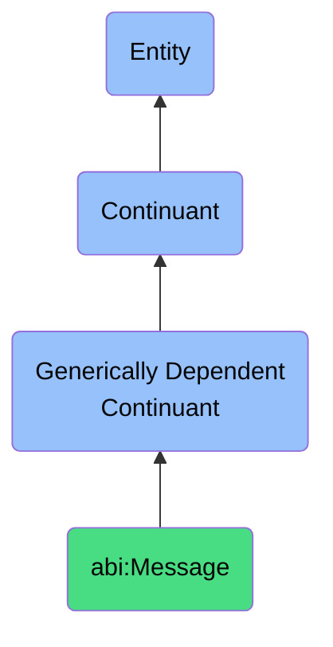

# Message

## Definition
A message is a generically dependent continuant that represents a bounded unit of communication transmitted synchronously or asynchronously between agents.

## Hierarchy in BFO

## Related Classes
- **abi:ConversationThread** - A generically dependent continuant that captures a sequence of related messages exchanged among participants over time.
- **abi:EmailMessage** - A generically dependent continuant that provides a time-stamped, directed communication artifact used to convey structured or unstructured content between agents.
- **abi:Comment** - A generically dependent continuant that provides a reactive textual note attached to another artifact expressing support, disagreement, or elaboration. 