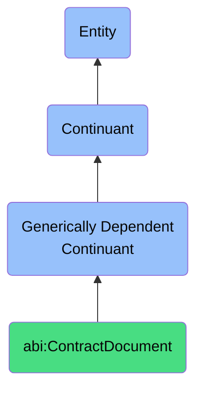

# ContractDocument

## Definition
A contract document is a generically dependent continuant that expresses the agreed obligations and rights between agents.

## Hierarchy in BFO

## Related Classes
- **abi:Report** - A report is a generically dependent continuant that communicates structured analysis or findings about a specific topic.
- **abi:SlideDeck** - A slide deck is a generically dependent continuant that conveys ideas or insights through a sequential set of visual or textual frames.
- **abi:Invoice** - An invoice is a generically dependent continuant that records a payment request for goods or services delivered.