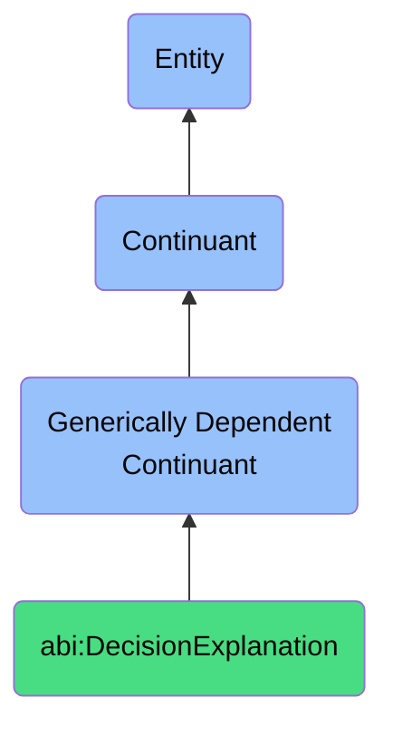

# DecisionExplanation

## Definition
A decision explanation is a generically dependent continuant that offers a justification that clarifies the logic or rationale behind a specific course of action.

## Hierarchy in BFO

## Related Classes
- **abi:ScenarioDescription** - A generically dependent continuant that provides a narrated or structured description of a hypothetical or historical event used for analysis or planning.
- **abi:ConceptualModel** - A generically dependent continuant that provides a representation that structures and relates concepts relevant to a domain or system.
- **abi:NormativeStatement** - A generically dependent continuant that expresses a declarative expression prescribing what should be done or valued, rather than what is. 