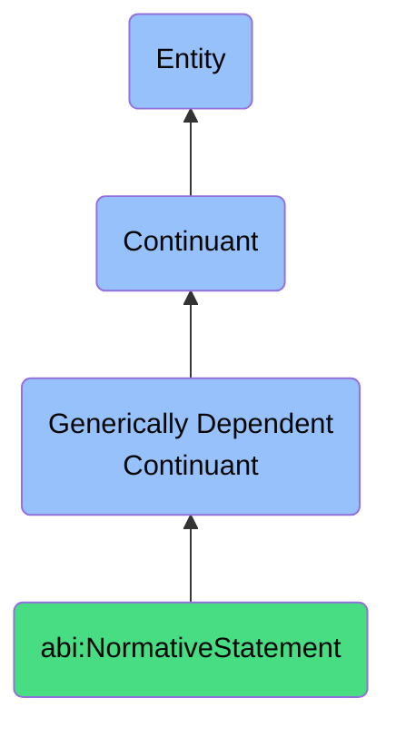

# NormativeStatement

## Definition
A normative statement is a generically dependent continuant that expresses a declarative expression prescribing what should be done or valued, rather than what is.

## Hierarchy in BFO

## Related Classes
- **abi:DecisionExplanation** - A generically dependent continuant that offers a justification that clarifies the logic or rationale behind a specific course of action.
- **abi:ConceptualModel** - A generically dependent continuant that provides a representation that structures and relates concepts relevant to a domain or system.
- **abi:EvidenceReference** - A generically dependent continuant that provides a citation or link that supports the credibility or relevance of a claim or observation. 