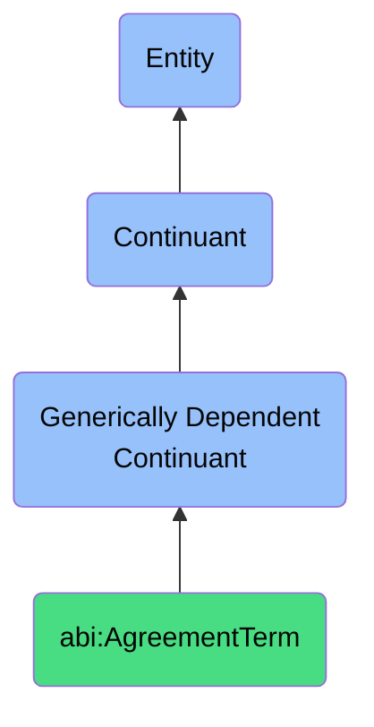

# AgreementTerm

## Definition
An agreement term is a generically dependent continuant that defines a clause or statement within a contract that specifies duties, restrictions, or conditions.

## Hierarchy in BFO

## Related Classes
- **abi:BusinessRule** - A generically dependent continuant that expresses a declarative constraint that governs or influences business behavior.
- **abi:Policy** - A generically dependent continuant that articulates formal guiding principles or rules for decision-making or behavior within a context.
- **abi:SOP** - A generically dependent continuant that provides a codified sequence of actions or responsibilities used to standardize recurring procedures. 