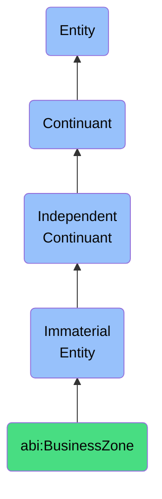

# BusinessZone

## Definition
A business zone is an immaterial entity that constitutes a logical grouping of related capabilities, roles, or functions within an organizational context, establishing coherent operational boundaries that facilitate management, collaboration, and resource allocation.

## Hierarchy in BFO


## Ontological Schema (TBox)
```turtle
abi:BusinessZone a owl:Class ;
  rdfs:subClassOf bfo:0000141 ;
  rdfs:label "Business Zone" ;
  skos:definition "An immaterial entity that constitutes a logical grouping of related capabilities, roles, or functions within an organizational context, establishing coherent operational boundaries that facilitate management, collaboration, and resource allocation." .

abi:encompasses_capabilities a owl:ObjectProperty ;
  rdfs:domain abi:BusinessZone ;
  rdfs:range abi:BusinessCapability ;
  rdfs:label "encompasses capabilities" .

abi:includes_roles a owl:ObjectProperty ;
  rdfs:domain abi:BusinessZone ;
  rdfs:range abi:BusinessRole ;
  rdfs:label "includes roles" .

abi:groups_functions a owl:ObjectProperty ;
  rdfs:domain abi:BusinessZone ;
  rdfs:range abi:BusinessFunction ;
  rdfs:label "groups functions" .

abi:has_operational_objective a owl:ObjectProperty ;
  rdfs:domain abi:BusinessZone ;
  rdfs:range abi:OperationalObjective ;
  rdfs:label "has operational objective" .

abi:has_strategic_alignment a owl:DatatypeProperty ;
  rdfs:domain abi:BusinessZone ;
  rdfs:range xsd:string ;
  rdfs:label "has strategic alignment" .
```

## Ontological Instance (ABox)
```turtle
ex:RevenueZone a abi:BusinessZone ;
  rdfs:label "Revenue Generation Zone" ;
  abi:encompasses_capabilities ex:MarketingCapability, ex:SalesCapability, ex:PricingCapability ;
  abi:includes_roles ex:MarketingSpecialist, ex:SalesRepresentative, ex:PricingAnalyst ;
  abi:groups_functions ex:LeadGeneration, ex:OpportunityManagement, ex:PriceOptimization ;
  abi:has_operational_objective ex:RevenueGrowthObjective ;
  abi:has_strategic_alignment "Growth and Market Expansion" .

ex:CustomerSuccessZone a abi:BusinessZone ;
  rdfs:label "Customer Success Zone" ;
  abi:encompasses_capabilities ex:CustomerSupportCapability, ex:AccountManagementCapability, ex:RetentionCapability ;
  abi:includes_roles ex:CustomerSuccessManager, ex:SupportAgent, ex:AccountManager ;
  abi:groups_functions ex:IssueResolution, ex:RelationshipManagement, ex:ChurnPrevention ;
  abi:has_operational_objective ex:CustomerRetentionObjective ;
  abi:has_strategic_alignment "Customer-Centricity and Loyalty" .
```

## Related Classes
- **abi:PersonaTerritory** - An immaterial entity that represents a segmentation based on audience behavior or job roles, establishing targeted interaction boundaries.
- **abi:WorkflowStage** - An immaterial entity that delineates a distinct phase within a broader business or operational process.
- **abi:LifecycleSegment** - An immaterial entity that identifies a specific stretch of time or state within a content, contract, or asset lifecycle.
- **abi:ComplianceZone** - An immaterial entity that designates an area where specific regulatory, legal, or policy requirements apply and must be adhered to. 