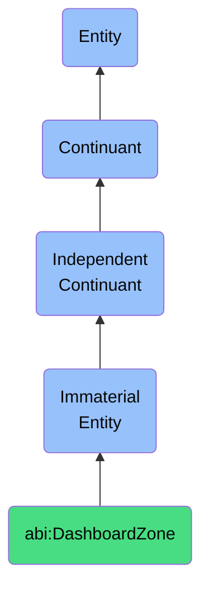

# DashboardZone

## Definition
A dashboard zone is an immaterial entity that constitutes a semantic region of a digital dashboard used to cluster or filter data presentations, establishing logical boundaries for information organization that facilitate insight generation, comparative analysis, and targeted monitoring of related metrics.

## Hierarchy in BFO


## Ontological Schema (TBox)
```turtle
abi:DashboardZone a owl:Class ;
  rdfs:subClassOf bfo:0000141 ;
  rdfs:label "Dashboard Zone" ;
  skos:definition "An immaterial entity that constitutes a semantic region of a digital dashboard used to cluster or filter data presentations, establishing logical boundaries for information organization that facilitate insight generation, comparative analysis, and targeted monitoring of related metrics." .

abi:contains_visualizations a owl:ObjectProperty ;
  rdfs:domain abi:DashboardZone ;
  rdfs:range abi:DataVisualization ;
  rdfs:label "contains visualizations" .

abi:focuses_on_metrics a owl:ObjectProperty ;
  rdfs:domain abi:DashboardZone ;
  rdfs:range abi:BusinessMetric ;
  rdfs:label "focuses on metrics" .

abi:supports_filtering a owl:ObjectProperty ;
  rdfs:domain abi:DashboardZone ;
  rdfs:range abi:FilterCriteria ;
  rdfs:label "supports filtering" .

abi:has_audience_targeting a owl:ObjectProperty ;
  rdfs:domain abi:DashboardZone ;
  rdfs:range abi:UserRole ;
  rdfs:label "has audience targeting" .

abi:has_refresh_frequency a owl:DatatypeProperty ;
  rdfs:domain abi:DashboardZone ;
  rdfs:range xsd:duration ;
  rdfs:label "has refresh frequency" .

abi:has_display_priority a owl:DatatypeProperty ;
  rdfs:domain abi:DashboardZone ;
  rdfs:range xsd:integer ;
  rdfs:label "has display priority" .
```

## Ontological Instance (ABox)
```turtle
ex:TopPerformingCampaignsZone a abi:DashboardZone ;
  rdfs:label "Top Performing Campaigns Zone" ;
  abi:contains_visualizations ex:CampaignROIBarChart, ex:LeadConversionFunnelVisualization, ex:CampaignPerformanceTable ;
  abi:focuses_on_metrics ex:CampaignROIMetric, ex:LeadConversionRateMetric, ex:CostPerAcquisitionMetric ;
  abi:supports_filtering ex:TimeRangeFilter, ex:CampaignTypeFilter, ex:ChannelFilter ;
  abi:has_audience_targeting ex:MarketingDirector, ex:CampaignManager ;
  abi:has_refresh_frequency "PT1H"^^xsd:duration ;
  abi:has_display_priority "1"^^xsd:integer .

ex:CustomerRetentionZone a abi:DashboardZone ;
  rdfs:label "Customer Retention Metrics Zone" ;
  abi:contains_visualizations ex:ChurnRateTrendLine, ex:CustomerLifetimeValueChart, ex:RetentionCohortAnalysis ;
  abi:focuses_on_metrics ex:ChurnRateMetric, ex:CustomerLifetimeValueMetric, ex:RepeatPurchaseRateMetric ;
  abi:supports_filtering ex:CustomerSegmentFilter, ex:SubscriptionTypeFilter, ex:TenureRangeFilter ;
  abi:has_audience_targeting ex:CustomerSuccessDirector, ex:RetentionAnalyst ;
  abi:has_refresh_frequency "P1D"^^xsd:duration ;
  abi:has_display_priority "2"^^xsd:integer .
```

## Related Classes
- **abi:GraphSubregion** - An immaterial entity that represents a cluster within a graph where related entities and edges are contextually grouped.
- **abi:ContentPlacementZone** - An immaterial entity that defines a surface within a web page or slide deck where specific types of information are placed.
- **abi:VisualizationContext** - An immaterial entity that establishes the interpretive framework for understanding data visualizations and their interrelationships.
- **abi:InsightScope** - An immaterial entity that delineates a conceptual boundary within which specific analytical observations, patterns, or conclusions are derived and contextualized. 