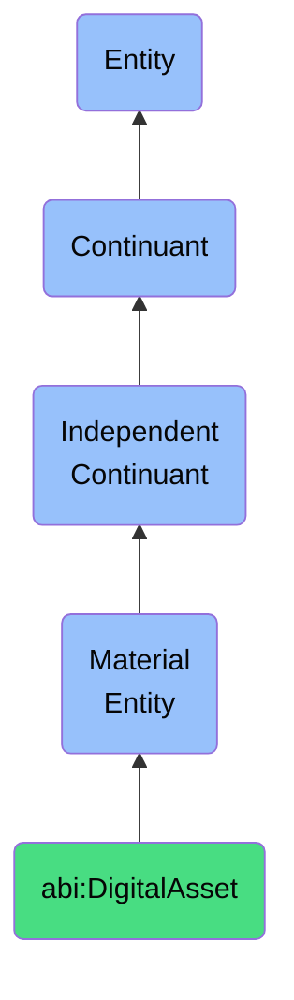

# DigitalAsset

## Definition
A digital asset is a material entity that is a file-based or database-stored resource that represents content, knowledge, or configuration, and can be versioned, deployed, or referenced.

## Hierarchy in BFO


## Ontological Schema (TBox)
```turtle
abi:DigitalAsset a owl:Class ;
  rdfs:subClassOf bfo:0000040 ;
  rdfs:label "Digital Asset" ;
  skos:definition "A file-based or database-stored resource that represents content, knowledge, or configuration, and can be versioned, deployed, or referenced." .

abi:has_version a owl:DatatypeProperty ;
  rdfs:domain abi:DigitalAsset ;
  rdfs:range xsd:string ;
  rdfs:label "has version" .

abi:stored_in a owl:ObjectProperty ;
  rdfs:domain abi:DigitalAsset ;
  rdfs:range abi:StorageSystem ;
  rdfs:label "stored in" .

abi:created_by a owl:ObjectProperty ;
  rdfs:domain abi:DigitalAsset ;
  rdfs:range abi:Agent ;
  rdfs:label "created by" .

abi:has_format a owl:DatatypeProperty ;
  rdfs:domain abi:DigitalAsset ;
  rdfs:range xsd:string ;
  rdfs:label "has format" .
```

## Ontological Instance (ABox)
```turtle
ex:ProductWhitepaper a abi:DigitalAsset ;
  rdfs:label "Product Whitepaper" ;
  abi:has_version "1.2" ;
  abi:stored_in ex:DocumentRepository ;
  abi:created_by ex:MarketingTeam ;
  abi:has_format "PDF" .

ex:CustomerDatabase a abi:DigitalAsset ;
  rdfs:label "Customer Database" ;
  abi:has_version "2023.11.1" ;
  abi:stored_in ex:CloudDatabaseSystem ;
  abi:created_by ex:DataEngineeringTeam ;
  abi:has_format "PostgreSQL" .
```

## Related Classes
- **abi:KnowledgeGraph** - A material entity that is a stored network of semantically linked entities, relationships, and annotations deployed within the ABI system.
- **abi:WorkflowInstance** - A material entity that is a materialized instantiation of a process or set of tasks executing across systems or agents.
- **abi:ContractRecord** - A material entity that is a legally binding instance of an agreement between two or more parties, stored in a system with semantic links to conditions and deliverables. 