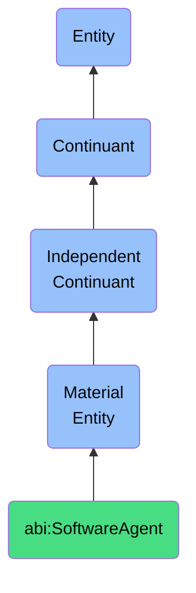

# SoftwareAgent

## Definition
A software agent is a material entity that is a materialized computational unit that autonomously executes tasks defined by workflows, prompts, or APIs.

## Hierarchy in BFO


## Ontological Schema (TBox)
```turtle
abi:SoftwareAgent a owl:Class ;
  rdfs:subClassOf bfo:0000040 ;
  rdfs:label "Software Agent" ;
  skos:definition "A materialized computational unit that autonomously executes tasks defined by workflows, prompts, or APIs." .

abi:executes a owl:ObjectProperty ;
  rdfs:domain abi:SoftwareAgent ;
  rdfs:range abi:Task ;
  rdfs:label "executes" .

abi:hosted_on a owl:ObjectProperty ;
  rdfs:domain abi:SoftwareAgent ;
  rdfs:range abi:ComputeContainer ;
  rdfs:label "hosted on" .

abi:has_access_to a owl:ObjectProperty ;
  rdfs:domain abi:SoftwareAgent ;
  rdfs:range abi:DigitalAsset ;
  rdfs:label "has access to" .
```

## Ontological Instance (ABox)
```turtle
ex:DataProcessingAgent a abi:SoftwareAgent ;
  rdfs:label "Data Processing Agent" ;
  abi:executes ex:DataScrubTask, ex:FeatureEngineering ;
  abi:hosted_on ex:AWSLambdaContainer ;
  abi:has_access_to ex:CustomerDataLake .

ex:SchedulingBot a abi:SoftwareAgent ;
  rdfs:label "Scheduling Bot" ;
  abi:executes ex:MeetingSchedulingTask ;
  abi:hosted_on ex:AzureFunction ;
  abi:has_access_to ex:SharedCalendarSystem .
```

## Related Classes
- **abi:AIAssistant** - A material entity that is a software-controlled agent that performs tasks on behalf of a user but is represented ontologically as a service-deployed entity with memory, identity, and role.
- **abi:OpenAIAgent** - A material entity that is a subclass of SoftwareAgent that interacts with OpenAI services to generate observations.
- **abi:PerplexityAgent** - A material entity that is a software agent that queries and retrieves summaries or documents from Perplexity. 