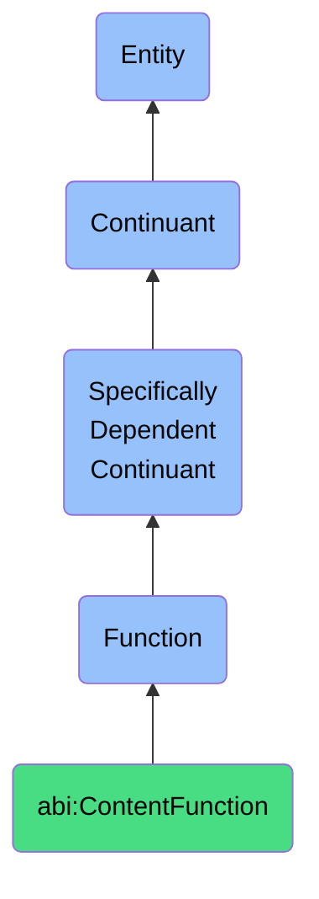

# ContentFunction

## Definition
A content function is a specifically dependent continuant that inheres in its bearer, providing capabilities related to the creation, processing, transformation, or delivery of content in various forms including textual, visual, or multimedia formats to support communication, business intelligence, and decision-making processes.

## Hierarchy in BFO


## Ontological Schema (TBox)
```turtle
abi:ContentFunction a owl:Class ;
  rdfs:subClassOf bfo:0000034 ;
  rdfs:label "Content Function" ;
  skos:definition "A function related to the creation, transformation, or delivery of content." .

abi:inheres_in a owl:ObjectProperty ;
  rdfs:domain abi:ContentFunction ;
  rdfs:range abi:ContentProcessor ;
  rdfs:label "inheres in" .

abi:processes_content_type a owl:ObjectProperty ;
  rdfs:domain abi:ContentFunction ;
  rdfs:range abi:Content ;
  rdfs:label "processes content type" .

abi:supports_communication_goal a owl:ObjectProperty ;
  rdfs:domain abi:ContentFunction ;
  rdfs:range abi:CommunicationGoal ;
  rdfs:label "supports communication goal" .

abi:has_processing_pattern a owl:ObjectProperty ;
  rdfs:domain abi:ContentFunction ;
  rdfs:range abi:ContentProcessingPattern ;
  rdfs:label "has processing pattern" .

abi:requires_input a owl:ObjectProperty ;
  rdfs:domain abi:ContentFunction ;
  rdfs:range abi:ContentInput ;
  rdfs:label "requires input" .

abi:produces_output a owl:ObjectProperty ;
  rdfs:domain abi:ContentFunction ;
  rdfs:range abi:ContentOutput ;
  rdfs:label "produces output" .

abi:supports_business_process a owl:ObjectProperty ;
  rdfs:domain abi:ContentFunction ;
  rdfs:range abi:BusinessProcess ;
  rdfs:label "supports business process" .

abi:has_performance_metric a owl:DatatypeProperty ;
  rdfs:domain abi:ContentFunction ;
  rdfs:range xsd:string ;
  rdfs:label "has performance metric" .

abi:has_capability_level a owl:DatatypeProperty ;
  rdfs:domain abi:ContentFunction ;
  rdfs:range xsd:string ;
  rdfs:label "has capability level" .
```

## Ontological Instance (ABox)
```turtle
# ContentFunction is a parent class with subclasses:
# - abi:GenerateContentFunction
# - abi:SummarizeTextFunction
# - abi:TranslateInsightFunction
# and other content-related functions
```

## Related Classes
- **abi:GenerateContentFunction** - A specialized function for producing written, visual, or multimedia content.
- **abi:SummarizeTextFunction** - A specialized function for extracting concise insights from larger textual inputs.
- **abi:TranslateInsightFunction** - A specialized function for transforming technical content into business language.
- **abi:AnalysisFunction** - A related function focused on examining and interpreting information.
- **abi:CommunicationFunction** - A related function focused on information exchange between parties. 