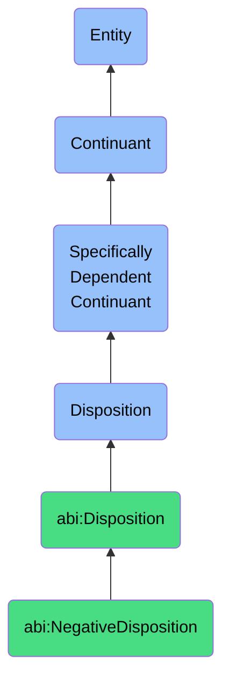

# NegativeDisposition

## Overview
### Definition
A negative disposition is a specifically dependent continuant that inheres in its bearer, representing inherent tendencies that are detrimental to enterprise functioning and value creation when realized. These dispositions describe an entity's propensity to manifest behaviors, properties, or reactions that introduce risk, reduce efficiency, increase cost, or otherwise compromise business objectives when triggered under specific conditions requiring mitigation or remediation.

### Example
A legacy software system's tendency to experience increasing failure rates as it ages represents a negative disposition. This disposition inheres in the system due to accumulating technical debt, outdated components, and diminishing compatibility with modern infrastructure. Another example is the disposition of certain organizational structures to create information bottlenecks, where critical data becomes siloed within departments, inhibiting enterprise-wide decision making. These dispositions manifest as operational inefficiencies, delayed responses to market changes, and diminished competitive capability, requiring specific mitigation strategies to prevent business impact.

### Comment
Negative dispositions serve as critical indicators in enterprise risk management frameworks, identifying inherent vulnerabilities that require proactive mitigation. Unlike incidents or failures which represent realized events, negative dispositions capture the underlying potential for harm, allowing organizations to implement controls before triggering conditions occur. The systematic cataloging of negative dispositions enables more sophisticated risk modeling, supports resource allocation for preventative measures, and informs architectural decisions to minimize inherent weaknesses. Effective enterprise management requires not just responding to negative outcomes, but understanding and addressing the dispositional nature of risks across people, processes, and technology.

## Hierarchy in BFO


## Ontological Schema (TBox)
```turtle
abi:NegativeDisposition a owl:Class ;
  rdfs:subClassOf bfo:0000016 ;
  rdfs:label "Negative Disposition" ;
  skos:definition "A disposition that is inherently detrimental to enterprise functioning when realized, requiring mitigation or remediation." .

abi:inheres_in a owl:ObjectProperty ;
  rdfs:domain abi:NegativeDisposition ;
  rdfs:range abi:EnterpriseEntity ;
  rdfs:label "inheres in" .

abi:has_triggering_condition a owl:ObjectProperty ;
  rdfs:domain abi:NegativeDisposition ;
  rdfs:range abi:ContextualCondition ;
  rdfs:label "has triggering condition" .

abi:requires_mitigation_through a owl:ObjectProperty ;
  rdfs:domain abi:NegativeDisposition ;
  rdfs:range abi:MitigationProcess ;
  rdfs:label "requires mitigation through" .

abi:has_risk_impact a owl:ObjectProperty ;
  rdfs:domain abi:NegativeDisposition ;
  rdfs:range abi:BusinessRisk ;
  rdfs:label "has risk impact" .

abi:has_remediation_cost a owl:ObjectProperty ;
  rdfs:domain abi:NegativeDisposition ;
  rdfs:range abi:ResourceRequirement ;
  rdfs:label "has remediation cost" .

abi:has_realization_likelihood a owl:DatatypeProperty ;
  rdfs:domain abi:NegativeDisposition ;
  rdfs:range xsd:float ;
  rdfs:label "has realization likelihood" .

abi:has_severity a owl:DatatypeProperty ;
  rdfs:domain abi:NegativeDisposition ;
  rdfs:range xsd:integer ;
  rdfs:label "has severity" .

abi:has_detectability a owl:DatatypeProperty ;
  rdfs:domain abi:NegativeDisposition ;
  rdfs:range xsd:integer ;
  rdfs:label "has detectability" .

abi:has_remediation_complexity a owl:DatatypeProperty ;
  rdfs:domain abi:NegativeDisposition ;
  rdfs:range xsd:integer ;
  rdfs:label "has remediation complexity" .
```

## Ontological Instance (ABox)
```turtle
ex:SecuritySkillDecayDisposition a abi:NegativeDisposition ;
  rdfs:label "Security Skill Decay Disposition" ;
  skos:definition "The disposition of security staff skills to deteriorate without continual training and practice, leading to reduced capability to handle threats." ;
  abi:inheres_in ex:SecurityTeam, ex:SecurityStaff, ex:CyberDefenseCapability ;
  abi:has_triggering_condition ex:SkillObsolescence, ex:LackOfPractice, ex:TechnologyChange ;
  abi:requires_mitigation_through ex:ContinuousTrainingProgram, ex:SkillAssessmentProcess, ex:KnowledgeRefreshmentProgram ;
  abi:has_risk_impact ex:SecurityIncidentRisk, ex:ResponseTimeRisk, ex:ThreatDetectionRisk ;
  abi:has_remediation_cost ex:TrainingBudget, ex:StaffTimeAllocation, ex:LearningResourcesCost ;
  abi:has_realization_likelihood "0.78"^^xsd:float ;
  abi:has_severity "8"^^xsd:integer ;
  abi:has_detectability "4"^^xsd:integer ;
  abi:has_remediation_complexity "6"^^xsd:integer .

ex:ComplianceViolationDisposition a abi:NegativeDisposition ;
  rdfs:label "Compliance Violation Disposition" ;
  skos:definition "The disposition of organizational practices to drift from regulatory and compliance requirements without active governance, creating legal and financial exposure." ;
  abi:inheres_in ex:BusinessProcess, ex:DocumentManagementSystem, ex:PrivacyControlFramework ;
  abi:has_triggering_condition ex:RegulatoryChange, ex:ProcessDeviation, ex:LackOfOversight ;
  abi:requires_mitigation_through ex:ComplianceMonitoringProcess, ex:RegulatoryAuditProcess, ex:GapRemediationProcess ;
  abi:has_risk_impact ex:RegulatoryFineRisk, ex:ReputationDamageRisk, ex:LegalActionRisk ;
  abi:has_remediation_cost ex:ComplianceStaffCost, ex:AuditExpense, ex:RemediationProjectCost ;
  abi:has_realization_likelihood "0.68"^^xsd:float ;
  abi:has_severity "9"^^xsd:integer ;
  abi:has_detectability "5"^^xsd:integer ;
  abi:has_remediation_complexity "8"^^xsd:integer .

ex:OrganizationalSiloDisposition a abi:NegativeDisposition ;
  rdfs:label "Organizational Silo Disposition" ;
  skos:definition "The disposition of business units to operate in isolation from each other, creating communication barriers, duplicating efforts, and preventing effective coordination." ;
  abi:inheres_in ex:DepartmentalStructure, ex:FunctionalTeam, ex:BusinessUnit ;
  abi:has_triggering_condition ex:SpecializedFocus, ex:CompetingPriorities, ex:LackOfCrossFunctionalProcess ;
  abi:requires_mitigation_through ex:CrossFunctionalIntegrationProcess, ex:MatrixManagementStructure, ex:InformationSharingProgram ;
  abi:has_risk_impact ex:OperationalInefficiencyRisk, ex:CustomerExperienceRisk, ex:InnovationBarrierRisk ;
  abi:has_remediation_cost ex:OrganizationalRedesignCost, ex:IntegrationToolCost, ex:ChangeManagementExpense ;
  abi:has_realization_likelihood "0.85"^^xsd:float ;
  abi:has_severity "7"^^xsd:integer ;
  abi:has_detectability "6"^^xsd:integer ;
  abi:has_remediation_complexity "9"^^xsd:integer .

ex:SecurityDebtAccumulationDisposition a abi:NegativeDisposition ;
  rdfs:label "Security Debt Accumulation Disposition" ;
  skos:definition "The disposition of organizations to defer security investments and improvements, creating accumulated risk that becomes increasingly costly to address over time." ;
  abi:inheres_in ex:EnterpriseSecurityProgram, ex:ITInfrastructure, ex:ApplicationPortfolio ;
  abi:has_triggering_condition ex:BudgetConstraint, ex:TimeToMarketPressure, ex:CompetingPriorities ;
  abi:requires_mitigation_through ex:SecurityDebtInventoryProcess, ex:RiskPrioritizationProcess, ex:RemediationRoadmapping ;
  abi:has_risk_impact ex:DataBreachRisk, ex:SystemCompromiseRisk, ex:ComplianceViolationRisk ;
  abi:has_remediation_cost ex:RemediationInvestment, ex:SecurityConsultingCost, ex:ImplementationResourceCost ;
  abi:has_realization_likelihood "0.82"^^xsd:float ;
  abi:has_severity "9"^^xsd:integer ;
  abi:has_detectability "3"^^xsd:integer ;
  abi:has_remediation_complexity "8"^^xsd:integer .
```

## Related Classes
- **abi:NeutralDisposition** - Dispositions that are neither intrinsically positive nor negative for enterprise functioning
- **abi:PositiveDisposition** - Dispositions that are beneficial for enterprise functioning when realized
- **abi:SecuritySkillDecayDisposition** - A specific negative disposition related to deterioration of security capabilities
- **abi:ComplianceViolationDisposition** - A specific negative disposition related to regulatory non-adherence
- **abi:ResourceConstraintDisposition** - A specific negative disposition reflecting insufficient resources for effective operations
- **abi:IneffectiveOversightDisposition** - A specific negative disposition related to governance weaknesses
- **abi:UnwantedCapabilityExposureDisposition** - A specific negative disposition for unnecessary functionality exposure
- **abi:KnowledgeFragmentationDisposition** - A specific negative disposition for isolated institutional knowledge
