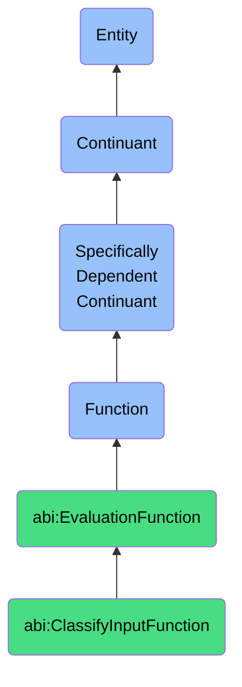

# ClassifyInputFunction

## Definition
A classify input function is a specifically dependent continuant that inheres in its bearer, providing the capability to analyze incoming data or content and systematically assign predefined categories, labels, or tags based on the content's features, characteristics, or patterns according to established classification models, rules, or taxonomies.

## Hierarchy in BFO


## Ontological Schema (TBox)
```turtle
abi:ClassifyInputFunction a owl:Class ;
  rdfs:subClassOf abi:EvaluationFunction ;
  rdfs:label "Classify Input Function" ;
  skos:definition "A function that assigns labels or tags to inputs using models or rules." .

abi:EvaluationFunction a owl:Class ;
  rdfs:subClassOf bfo:0000034 ;
  rdfs:label "Evaluation Function" ;
  skos:definition "A function that enables assessment, measurement, categorization, or scoring against defined criteria." .

abi:inheres_in a owl:ObjectProperty ;
  rdfs:domain abi:ClassifyInputFunction ;
  rdfs:range abi:ContentClassifier ;
  rdfs:label "inheres in" .

abi:classifies_input a owl:ObjectProperty ;
  rdfs:domain abi:ClassifyInputFunction ;
  rdfs:range abi:ClassifiableInput ;
  rdfs:label "classifies input" .

abi:applies_classification_model a owl:ObjectProperty ;
  rdfs:domain abi:ClassifyInputFunction ;
  rdfs:range abi:ClassificationModel ;
  rdfs:label "applies classification model" .

abi:assigns_category a owl:ObjectProperty ;
  rdfs:domain abi:ClassifyInputFunction ;
  rdfs:range abi:Category ;
  rdfs:label "assigns category" .

abi:uses_feature_extraction a owl:ObjectProperty ;
  rdfs:domain abi:ClassifyInputFunction ;
  rdfs:range abi:FeatureExtractionMethod ;
  rdfs:label "uses feature extraction" .

abi:follows_classification_rules a owl:ObjectProperty ;
  rdfs:domain abi:ClassifyInputFunction ;
  rdfs:range abi:ClassificationRule ;
  rdfs:label "follows classification rules" .

abi:references_taxonomy a owl:ObjectProperty ;
  rdfs:domain abi:ClassifyInputFunction ;
  rdfs:range abi:Taxonomy ;
  rdfs:label "references taxonomy" .

abi:supports_routing_process a owl:ObjectProperty ;
  rdfs:domain abi:ClassifyInputFunction ;
  rdfs:range abi:RoutingProcess ;
  rdfs:label "supports routing process" .

abi:has_classification_accuracy a owl:DatatypeProperty ;
  rdfs:domain abi:ClassifyInputFunction ;
  rdfs:range xsd:decimal ;
  rdfs:label "has classification accuracy" .

abi:has_multi_label_capability a owl:DatatypeProperty ;
  rdfs:domain abi:ClassifyInputFunction ;
  rdfs:range xsd:boolean ;
  rdfs:label "has multi label capability" .

abi:has_confidence_threshold a owl:DatatypeProperty ;
  rdfs:domain abi:ClassifyInputFunction ;
  rdfs:range xsd:decimal ;
  rdfs:label "has confidence threshold" .
```

## Ontological Instance (ABox)
```turtle
ex:DEIDocumentClassifierFunction a abi:ClassifyInputFunction ;
  rdfs:label "DE&I Document Classification Function" ;
  abi:inheres_in ex:ContentAnalysisSystem ;
  abi:classifies_input ex:CorporateDocument, ex:MarketingMaterial, ex:PolicyDocument ;
  abi:applies_classification_model ex:DEIClassificationModel, ex:TopicClassificationModel ;
  abi:assigns_category ex:DEICategory, ex:NonDEICategory, ex:PartialDEICategory ;
  abi:uses_feature_extraction ex:NLPKeywordExtraction, ex:SemanticAnalysisMethod ;
  abi:follows_classification_rules ex:DEITerminologyRules, ex:InclusiveLanguageRules ;
  abi:references_taxonomy ex:DEITerminologyTaxonomy, ex:CorporateDocumentTaxonomy ;
  abi:supports_routing_process ex:DEIReviewProcess, ex:ComplianceCheckProcess ;
  abi:has_classification_accuracy "0.92"^^xsd:decimal ;
  abi:has_multi_label_capability "true"^^xsd:boolean ;
  abi:has_confidence_threshold "0.75"^^xsd:decimal .

ex:CustomerSupportTicketClassifierFunction a abi:ClassifyInputFunction ;
  rdfs:label "Customer Support Ticket Classification Function" ;
  abi:inheres_in ex:CustomerSupportSystem ;
  abi:classifies_input ex:SupportTicket, ex:CustomerEmail, ex:ChatTranscript ;
  abi:applies_classification_model ex:TicketPriorityModel, ex:ProductCategoryModel, ex:IssueTypeModel ;
  abi:assigns_category ex:UrgentPriorityCategory, ex:BillingIssueCategory, ex:TechnicalProblemCategory ;
  abi:uses_feature_extraction ex:CustomerLanguageAnalysis, ex:HistoricalContextExtraction ;
  abi:follows_classification_rules ex:SLAComplianceRules, ex:EscalationTriggerRules ;
  abi:references_taxonomy ex:SupportIssueTaxonomy, ex:ProductHierarchyTaxonomy ;
  abi:supports_routing_process ex:AgentAssignmentProcess, ex:TeamDistributionProcess ;
  abi:has_classification_accuracy "0.88"^^xsd:decimal ;
  abi:has_multi_label_capability "true"^^xsd:boolean ;
  abi:has_confidence_threshold "0.65"^^xsd:decimal .
```

## Related Classes
- **abi:ScoreObservationFunction** - A related function that assigns quantitative scores rather than categorical labels.
- **abi:RatePersonaMatchFunction** - A specific type of evaluation that may leverage classification to determine persona fit.
- **abi:ContentFilteringFunction** - A function that uses classification results to determine which content to include or exclude.
- **abi:PatternRecognitionFunction** - A function that identifies patterns in data, often as a precursor to classification.
- **abi:DataEnrichmentFunction** - A function that may use classification results to add contextual metadata to content. 