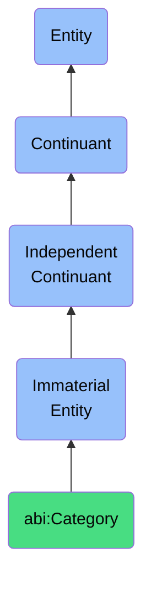

# Category

## Definition
A category is an immaterial entity that serves to classify a bearer within a known, structured set of groupings, enabling systematic organization, comparative analysis, and contextual interpretation of entities based on shared characteristics, functions, or domains.

## Hierarchy in BFO


## Ontological Schema (TBox)
```turtle
abi:Category a owl:Class ;
  rdfs:subClassOf bfo:0000141 ;
  rdfs:label "Category" ;
  skos:definition "An immaterial entity that serves to classify a bearer within a known, structured set of groupings, enabling systematic organization, comparative analysis, and contextual interpretation of entities based on shared characteristics, functions, or domains." .

abi:classifies_entity a owl:ObjectProperty ;
  rdfs:domain abi:Category ;
  rdfs:range owl:Thing ;
  rdfs:label "classifies entity" .

abi:belongs_to_taxonomy a owl:ObjectProperty ;
  rdfs:domain abi:Category ;
  rdfs:range abi:Taxonomy ;
  rdfs:label "belongs to taxonomy" .

abi:has_parent_category a owl:ObjectProperty ;
  rdfs:domain abi:Category ;
  rdfs:range abi:Category ;
  rdfs:label "has parent category" .

abi:has_subcategory a owl:ObjectProperty ;
  rdfs:domain abi:Category ;
  rdfs:range abi:Category ;
  rdfs:label "has subcategory" .

abi:defined_by_criteria a owl:ObjectProperty ;
  rdfs:domain abi:Category ;
  rdfs:range abi:CategoryCriteria ;
  rdfs:label "defined by criteria" .

abi:has_category_name a owl:DatatypeProperty ;
  rdfs:domain abi:Category ;
  rdfs:range xsd:string ;
  rdfs:label "has category name" .

abi:has_code a owl:DatatypeProperty ;
  rdfs:domain abi:Category ;
  rdfs:range xsd:string ;
  rdfs:label "has code" .

abi:has_description a owl:DatatypeProperty ;
  rdfs:domain abi:Category ;
  rdfs:range xsd:string ;
  rdfs:label "has description" .
```

## Ontological Instance (ABox)
```turtle
ex:MidLevelManagementCategory a abi:Category ;
  rdfs:label "Mid-Level Management Category" ;
  abi:classifies_entity ex:BusinessPersona123, ex:BusinessPersona456 ;
  abi:belongs_to_taxonomy ex:OrganizationalRoleTaxonomy ;
  abi:has_parent_category ex:ManagementCategory ;
  abi:has_subcategory ex:DepartmentManagerCategory, ex:TeamLeadCategory ;
  abi:defined_by_criteria ex:ReportingStructureCriteria, ex:DecisionAuthorityScope ;
  abi:has_category_name "Mid-Level Management" ;
  abi:has_code "ORG-MLM" ;
  abi:has_description "Professionals who manage operational teams or departments, typically reporting to senior executives while overseeing junior staff or individual contributors." .

ex:EnterpriseSoftwareCategory a abi:Category ;
  rdfs:label "Enterprise Software Category" ;
  abi:classifies_entity ex:ProductOffering789, ex:ProductOffering101 ;
  abi:belongs_to_taxonomy ex:ProductCategoryTaxonomy ;
  abi:has_parent_category ex:SoftwareProductCategory ;
  abi:has_subcategory ex:ERPSoftwareCategory, ex:CRMSoftwareCategory ;
  abi:defined_by_criteria ex:OrganizationalSizeCriteria, ex:UseContextCriteria ;
  abi:has_category_name "Enterprise Software" ;
  abi:has_code "PROD-ENT-SW" ;
  abi:has_description "Software applications designed for large organizations with complex requirements, typically featuring extensive customization, integration capabilities, and organizational-scale deployment." .
```

## Related Classes
- **abi:Taxonomy** - An immaterial entity that represents a hierarchical classification system organizing entities based on shared characteristics and relationships.
- **abi:TopicLabel** - An immaterial entity that links content to a specific semantic domain or subject area.
- **abi:Classification** - An immaterial entity that represents the act or result of assigning entities to categories based on shared attributes or properties.
- **abi:CategoryCriteria** - An immaterial entity that defines the specific attributes, characteristics, or conditions that determine category membership. 