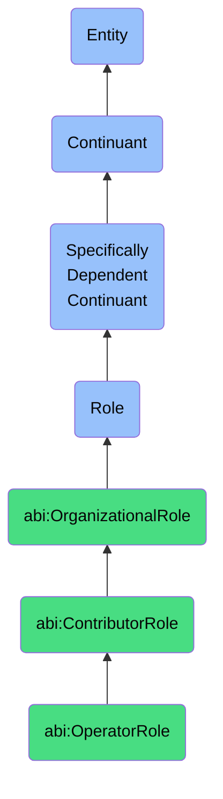

# OperatorRole

## Definition
An operator role is a specifically dependent continuant that an agent bears when executing specialized operational functions that require domain-specific skills, tools, and processes to deliver defined outputs or outcomes within organizational workflows, characterized by hands-on execution rather than management responsibilities.

## Hierarchy in BFO


## Ontological Schema (TBox)
```turtle
abi:OperatorRole a owl:Class ;
  rdfs:subClassOf abi:ContributorRole ;
  rdfs:label "Operator Role" ;
  skos:definition "A contributor role focused on executing specific operational functions with specialized skills in a particular domain." .

abi:ContributorRole a owl:Class ;
  rdfs:subClassOf abi:OrganizationalRole ;
  rdfs:label "Contributor Role" ;
  skos:definition "An organizational role focused on specialized individual work rather than management or leadership responsibilities." .

abi:has_bearer a owl:ObjectProperty ;
  rdfs:domain abi:OperatorRole ;
  rdfs:range abi:Agent ;
  rdfs:label "has bearer" .

abi:requires_skill a owl:ObjectProperty ;
  rdfs:domain abi:OperatorRole ;
  rdfs:range abi:Skill ;
  rdfs:label "requires skill" .

abi:executes_function a owl:ObjectProperty ;
  rdfs:domain abi:OperatorRole ;
  rdfs:range abi:BusinessFunction ;
  rdfs:label "executes function" .

abi:uses_tool a owl:ObjectProperty ;
  rdfs:domain abi:OperatorRole ;
  rdfs:range abi:Tool ;
  rdfs:label "uses tool" .

abi:reports_to a owl:ObjectProperty ;
  rdfs:domain abi:OperatorRole ;
  rdfs:range abi:TeamLeadRole ;
  rdfs:label "reports to" .

abi:participates_in a owl:ObjectProperty ;
  rdfs:domain abi:OperatorRole ;
  rdfs:range abi:BusinessProcess ;
  rdfs:label "participates in" .

abi:delivers_output a owl:ObjectProperty ;
  rdfs:domain abi:OperatorRole ;
  rdfs:range abi:WorkOutput ;
  rdfs:label "delivers output" .

abi:has_performance_metric a owl:ObjectProperty ;
  rdfs:domain abi:OperatorRole ;
  rdfs:range abi:PerformanceMetric ;
  rdfs:label "has performance metric" .

abi:has_specialization a owl:DatatypeProperty ;
  rdfs:domain abi:OperatorRole ;
  rdfs:range xsd:string ;
  rdfs:label "has specialization" .

abi:has_experience_level a owl:DatatypeProperty ;
  rdfs:domain abi:OperatorRole ;
  rdfs:range xsd:string ;
  rdfs:label "has experience level" .

abi:has_role_start_date a owl:DatatypeProperty ;
  rdfs:domain abi:OperatorRole ;
  rdfs:range xsd:date ;
  rdfs:label "has role start date" .
```

## Ontological Instance (ABox)
```turtle
# OperatorRole is an abstract class, so instances should be of its subclasses:
# - abi:EngineerRole
# - abi:AnalystRole
# - abi:ContentCreatorRole
# - abi:SalesDevelopmentRepresentativeRole
# and other specific operator roles
```

## Related Classes
- **abi:EngineerRole** - A specialized operator role focused on designing, building, or maintaining technical systems.
- **abi:AnalystRole** - A specialized operator role focused on extracting insights from data to support decisions.
- **abi:ContentCreatorRole** - A specialized operator role focused on producing and managing content for distribution.
- **abi:SalesDevelopmentRepresentativeRole** - A specialized operator role focused on outbound prospecting and lead qualification.
- **abi:TeamLeadRole** - A management role that typically supervises operators and coordinates their work.
- **abi:IndividualContributorRole** - A broader category of roles that includes operators but may also include advisory or specialized roles that aren't purely operational. 