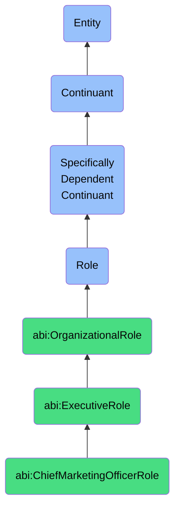

# ChiefMarketingOfficerRole

## Definition
A chief marketing officer role is a specifically dependent continuant that an agent bears when responsible for an organization's branding, marketing communications, and growth strategy, characterized by oversight of market positioning, customer acquisition, promotion activities, and development of the company's overall brand identity and value proposition.

## Hierarchy in BFO


## Ontological Schema (TBox)
```turtle
abi:ChiefMarketingOfficerRole a owl:Class ;
  rdfs:subClassOf bfo:0000023 ;
  rdfs:label "Chief Marketing Officer Role" ;
  skos:definition "A role that an agent bears when responsible for an organization's branding, marketing communications, and growth strategy, characterized by oversight of market positioning, customer acquisition, promotion activities, and development of the company's overall brand identity and value proposition." .

abi:ExecutiveRole a owl:Class ;
  rdfs:subClassOf bfo:0000023 ;
  rdfs:label "Executive Role" ;
  skos:definition "A high-level organizational role with significant decision-making authority and strategic responsibility." .

abi:has_bearer a owl:ObjectProperty ;
  rdfs:domain abi:ChiefMarketingOfficerRole ;
  rdfs:range abi:Agent ;
  rdfs:label "has bearer" .

abi:realized_in a owl:ObjectProperty ;
  rdfs:domain abi:ChiefMarketingOfficerRole ;
  rdfs:range abi:MarketingProcess ;
  rdfs:label "realized in" .

abi:has_responsibility a owl:ObjectProperty ;
  rdfs:domain abi:ChiefMarketingOfficerRole ;
  rdfs:range abi:MarketingResponsibility ;
  rdfs:label "has responsibility" .

abi:directs_marketing_function a owl:ObjectProperty ;
  rdfs:domain abi:ChiefMarketingOfficerRole ;
  rdfs:range abi:MarketingFunction ;
  rdfs:label "directs marketing function" .

abi:manages_brand_asset a owl:ObjectProperty ;
  rdfs:domain abi:ChiefMarketingOfficerRole ;
  rdfs:range abi:BrandAsset ;
  rdfs:label "manages brand asset" .

abi:oversees_marketing_channel a owl:ObjectProperty ;
  rdfs:domain abi:ChiefMarketingOfficerRole ;
  rdfs:range abi:MarketingChannel ;
  rdfs:label "oversees marketing channel" .

abi:reports_to a owl:ObjectProperty ;
  rdfs:domain abi:ChiefMarketingOfficerRole ;
  rdfs:range abi:ChiefExecutiveOfficerRole ;
  rdfs:label "reports to" .

abi:has_growth_target a owl:DatatypeProperty ;
  rdfs:domain abi:ChiefMarketingOfficerRole ;
  rdfs:range xsd:string ;
  rdfs:label "has growth target" .

abi:has_role_start_date a owl:DatatypeProperty ;
  rdfs:domain abi:ChiefMarketingOfficerRole ;
  rdfs:range xsd:date ;
  rdfs:label "has role start date" .
```

## Ontological Instance (ABox)
```turtle
ex:SarahCMORole a abi:ChiefMarketingOfficerRole ;
  rdfs:label "Sarah's CMO Role in Pipeline Acceleration" ;
  abi:has_bearer ex:SarahPerson ;
  abi:realized_in ex:LeadGenerationProcess, ex:BrandStrategyDevelopment ;
  abi:has_responsibility ex:MarketPositioningResponsibility, ex:CustomerAcquisitionResponsibility ;
  abi:directs_marketing_function ex:DigitalMarketingFunction, ex:ContentMarketingFunction ;
  abi:manages_brand_asset ex:CorporateBrandGuidelines, ex:ProductMessaging ;
  abi:oversees_marketing_channel ex:SocialMediaChannel, ex:EmailMarketingChannel, ex:EventsChannel ;
  abi:reports_to ex:CompanyCEORole ;
  abi:has_growth_target "30% pipeline growth year-over-year" ;
  abi:has_role_start_date "2022-04-01"^^xsd:date .

ex:MarcCMORole a abi:ChiefMarketingOfficerRole ;
  rdfs:label "Marc's CMO Role for Consumer Products Division" ;
  abi:has_bearer ex:MarcPerson ;
  abi:realized_in ex:BrandRevitalizationProcess, ex:MarketExpansionStrategy ;
  abi:has_responsibility ex:ConsumerInsightResponsibility, ex:DigitalTransformationResponsibility ;
  abi:directs_marketing_function ex:BrandMarketingFunction, ex:CustomerExperienceFunction ;
  abi:manages_brand_asset ex:ConsumerProductBranding, ex:RetailPointOfSaleMaterials ;
  abi:oversees_marketing_channel ex:InfluencerMarketingChannel, ex:RetailMarketingChannel ;
  abi:reports_to ex:DivisionPresidentRole ;
  abi:has_growth_target "15% market share increase in primary segments" ;
  abi:has_role_start_date "2021-11-15"^^xsd:date .
```

## Related Classes
- **abi:ChiefExecutiveOfficerRole** - The highest-ranking executive role with overall responsibility for organizational strategy and performance.
- **abi:ChiefRevenueOfficerRole** - An executive role focused on revenue generation and growth across sales, customer success, and related functions.
- **abi:VicePresidentOfMarketingRole** - A senior management role focused on executing marketing strategies within specific business units or regions.
- **abi:DirectorOfBrandRole** - A management role specifically focused on brand strategy, identity, and management. 