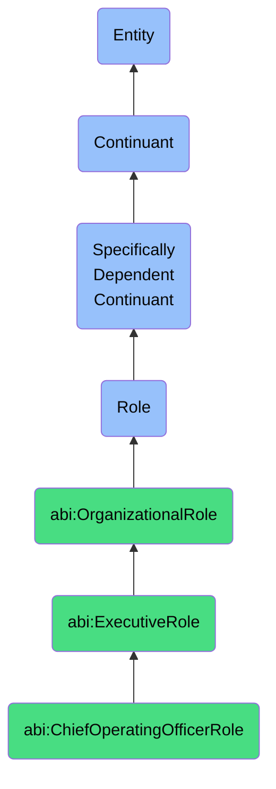

# ChiefOperatingOfficerRole

## Definition
A chief operating officer role is a specifically dependent continuant that an agent bears when responsible for managing and optimizing day-to-day operations within an organization, characterized by oversight of operational processes, resource allocation, and execution of strategic initiatives to ensure organizational efficiency and effectiveness.

## Hierarchy in BFO


## Ontological Schema (TBox)
```turtle
abi:ChiefOperatingOfficerRole a owl:Class ;
  rdfs:subClassOf bfo:0000023 ;
  rdfs:label "Chief Operating Officer Role" ;
  skos:definition "A role that an agent bears when responsible for managing and optimizing day-to-day operations within an organization, characterized by oversight of operational processes, resource allocation, and execution of strategic initiatives to ensure organizational efficiency and effectiveness." .

abi:ExecutiveRole a owl:Class ;
  rdfs:subClassOf bfo:0000023 ;
  rdfs:label "Executive Role" ;
  skos:definition "A high-level organizational role with significant decision-making authority and strategic responsibility." .

abi:has_bearer a owl:ObjectProperty ;
  rdfs:domain abi:ChiefOperatingOfficerRole ;
  rdfs:range abi:Agent ;
  rdfs:label "has bearer" .

abi:realized_in a owl:ObjectProperty ;
  rdfs:domain abi:ChiefOperatingOfficerRole ;
  rdfs:range abi:OperationalProcess ;
  rdfs:label "realized in" .

abi:has_responsibility a owl:ObjectProperty ;
  rdfs:domain abi:ChiefOperatingOfficerRole ;
  rdfs:range abi:OrganizationalResponsibility ;
  rdfs:label "has responsibility" .

abi:oversees_operational_division a owl:ObjectProperty ;
  rdfs:domain abi:ChiefOperatingOfficerRole ;
  rdfs:range abi:OperationalDivision ;
  rdfs:label "oversees operational division" .

abi:implements_strategic_initiative a owl:ObjectProperty ;
  rdfs:domain abi:ChiefOperatingOfficerRole ;
  rdfs:range abi:StrategicInitiative ;
  rdfs:label "implements strategic initiative" .

abi:reports_to a owl:ObjectProperty ;
  rdfs:domain abi:ChiefOperatingOfficerRole ;
  rdfs:range abi:ChiefExecutiveOfficerRole ;
  rdfs:label "reports to" .

abi:has_kpi a owl:ObjectProperty ;
  rdfs:domain abi:ChiefOperatingOfficerRole ;
  rdfs:range abi:KeyPerformanceIndicator ;
  rdfs:label "has kpi" .

abi:has_role_start_date a owl:DatatypeProperty ;
  rdfs:domain abi:ChiefOperatingOfficerRole ;
  rdfs:range xsd:date ;
  rdfs:label "has role start date" .
```

## Ontological Instance (ABox)
```turtle
ex:LouiseCOORole a abi:ChiefOperatingOfficerRole ;
  rdfs:label "Louise's COO Role for Platform Delivery" ;
  abi:has_bearer ex:LouisePerson ;
  abi:realized_in ex:PlatformDeliveryProcess, ex:ResourceOptimizationProcess ;
  abi:has_responsibility ex:OperationalExcellenceResponsibility, ex:DeliveryTimelineResponsibility ;
  abi:oversees_operational_division ex:PlatformDeliveryDivision, ex:CustomerSuccessDivision ;
  abi:implements_strategic_initiative ex:DigitalTransformationInitiative, ex:OperationalEfficiencyInitiative ;
  abi:reports_to ex:CompanyCEORole ;
  abi:has_kpi ex:DeliveryTimeKPI, ex:CustomerSatisfactionKPI, ex:OperationalCostKPI ;
  abi:has_role_start_date "2022-03-15"^^xsd:date .

ex:RobertCOORole a abi:ChiefOperatingOfficerRole ;
  rdfs:label "Robert's COO Role for Manufacturing Operations" ;
  abi:has_bearer ex:RobertPerson ;
  abi:realized_in ex:SupplyChainOptimizationProcess, ex:QualityAssuranceProcess ;
  abi:has_responsibility ex:ProductionEfficiencyResponsibility, ex:SupplyChainResponsibility ;
  abi:oversees_operational_division ex:ManufacturingDivision, ex:LogisticsDivision ;
  abi:implements_strategic_initiative ex:LeanManufacturingInitiative, ex:GlobalDistributionNetworkInitiative ;
  abi:reports_to ex:ManufacturerCEORole ;
  abi:has_kpi ex:ProductionCycleTimeKPI, ex:DefectRateKPI, ex:InventoryTurnoverKPI ;
  abi:has_role_start_date "2021-09-01"^^xsd:date .
```

## Related Classes
- **abi:ChiefExecutiveOfficerRole** - The highest-ranking executive role with overall responsibility for organizational strategy and performance.
- **abi:ChiefTechnologyOfficerRole** - An executive role responsible for technological vision, strategy, and innovation.
- **abi:ChiefFinancialOfficerRole** - An executive role focused on financial strategy, planning, and risk management.
- **abi:VicePresidentOfOperationsRole** - A senior management role focused on operational execution within a specific business unit or function. 