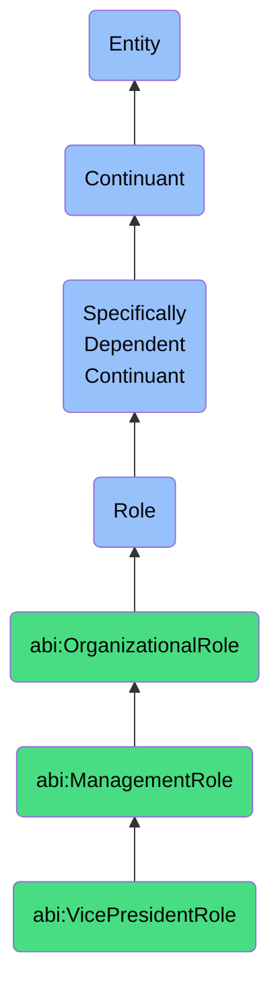

# VicePresidentRole

## Definition
A vice president role is a specifically dependent continuant that an agent bears when serving in a senior leadership position typically overseeing one or more departments or business functions, characterized by strategic decision-making responsibility within their domain and serving as a bridge between executive leadership and operational management.

## Hierarchy in BFO


## Ontological Schema (TBox)
```turtle
abi:VicePresidentRole a owl:Class ;
  rdfs:subClassOf bfo:0000023 ;
  rdfs:label "Vice President Role" ;
  skos:definition "A role that an agent bears when serving in a senior leadership position typically overseeing one or more departments or business functions, characterized by strategic decision-making responsibility within their domain and serving as a bridge between executive leadership and operational management." .

abi:ManagementRole a owl:Class ;
  rdfs:subClassOf bfo:0000023 ;
  rdfs:label "Management Role" ;
  skos:definition "An organizational role involving leadership, coordination, and oversight of teams, resources, or business functions." .

abi:has_bearer a owl:ObjectProperty ;
  rdfs:domain abi:VicePresidentRole ;
  rdfs:range abi:Agent ;
  rdfs:label "has bearer" .

abi:realized_in a owl:ObjectProperty ;
  rdfs:domain abi:VicePresidentRole ;
  rdfs:range abi:ManagementProcess ;
  rdfs:label "realized in" .

abi:has_responsibility a owl:ObjectProperty ;
  rdfs:domain abi:VicePresidentRole ;
  rdfs:range abi:OrganizationalResponsibility ;
  rdfs:label "has responsibility" .

abi:oversees_department a owl:ObjectProperty ;
  rdfs:domain abi:VicePresidentRole ;
  rdfs:range abi:Department ;
  rdfs:label "oversees department" .

abi:manages_function a owl:ObjectProperty ;
  rdfs:domain abi:VicePresidentRole ;
  rdfs:range abi:BusinessFunction ;
  rdfs:label "manages function" .

abi:reports_to a owl:ObjectProperty ;
  rdfs:domain abi:VicePresidentRole ;
  rdfs:range abi:ExecutiveRole ;
  rdfs:label "reports to" .

abi:has_functional_area a owl:DatatypeProperty ;
  rdfs:domain abi:VicePresidentRole ;
  rdfs:range xsd:string ;
  rdfs:label "has functional area" .

abi:has_role_start_date a owl:DatatypeProperty ;
  rdfs:domain abi:VicePresidentRole ;
  rdfs:range xsd:date ;
  rdfs:label "has role start date" .
```

## Ontological Instance (ABox)
```turtle
ex:ClaraVPProductRole a abi:VicePresidentRole ;
  rdfs:label "Clara's VP of Product Role" ;
  abi:has_bearer ex:ClaraPerson ;
  abi:realized_in ex:ProductStrategyProcess, ex:ProductDevelopmentOversightProcess ;
  abi:has_responsibility ex:ProductRoadmapResponsibility, ex:UserExperienceResponsibility ;
  abi:oversees_department ex:ProductManagementDepartment ;
  abi:manages_function ex:ProductDevelopmentFunction ;
  abi:reports_to ex:ChiefProductOfficerRole ;
  abi:has_functional_area "Product Management" ;
  abi:has_role_start_date "2021-09-01"^^xsd:date .

ex:MichaelVPSalesRole a abi:VicePresidentRole ;
  rdfs:label "Michael's VP of Sales Role" ;
  abi:has_bearer ex:MichaelPerson ;
  abi:realized_in ex:SalesStrategyProcess, ex:SalesTeamManagementProcess ;
  abi:has_responsibility ex:RevenueGrowthResponsibility, ex:SalesPerformanceResponsibility ;
  abi:oversees_department ex:SalesDepartment ;
  abi:manages_function ex:CustomerAcquisitionFunction ;
  abi:reports_to ex:ChiefRevenueOfficerRole ;
  abi:has_functional_area "Sales" ;
  abi:has_role_start_date "2022-03-15"^^xsd:date .
```

## Related Classes
- **abi:ChiefExecutiveOfficerRole** - The highest-ranking executive role with overall responsibility for an organization's strategy and operations.
- **abi:DepartmentManagerRole** - A management role focused on leading specific teams and achieving departmental KPIs.
- **abi:TeamLeadRole** - A role that involves supervising a small unit within a broader function.
- **abi:DirectorRole** - A senior management role that typically sits between VP and Manager levels in the organizational hierarchy. 