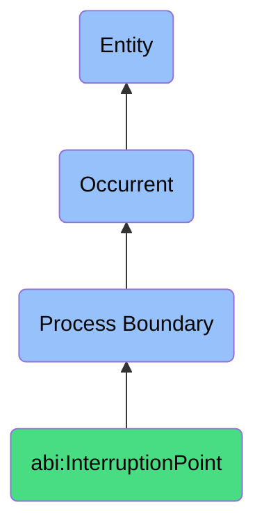

# InterruptionPoint

## Definition
An interruption point is a specific type of process boundary (bfo:0000035) that marks the temporal discontinuation of a process before its natural completion, representing the moment at which a process is prematurely paused or terminated due to exceptional circumstances, errors, resource constraints, external interventions, or other disruptive factors, establishing a suspended or terminated state that diverges from the process's intended flow and providing a reference point for process exception handling, recovery planning, or termination analysis.

## Hierarchy in BFO


## Ontological Schema (TBox)
```turtle
abi:InterruptionPoint a owl:Class ;
  rdfs:subClassOf bfo:0000035 ;
  rdfs:label "Interruption Point" ;
  skos:definition "A boundary where a process was prematurely stopped." .

bfo:0000035 a owl:Class ;
  rdfs:label "Process Boundary" ;
  skos:definition "Boundaries that mark the beginning or end of a process." .

abi:interrupts_process a owl:ObjectProperty ;
  rdfs:domain abi:InterruptionPoint ;
  rdfs:range bfo:0000015 ;
  rdfs:label "interrupts process" .

abi:has_interruption_timestamp a owl:DatatypeProperty ;
  rdfs:domain abi:InterruptionPoint ;
  rdfs:range xsd:dateTime ;
  rdfs:label "has interruption timestamp" .

abi:has_interruption_trigger a owl:ObjectProperty ;
  rdfs:domain abi:InterruptionPoint ;
  rdfs:range abi:InterruptionTrigger ;
  rdfs:label "has interruption trigger" .

abi:has_interrupting_agent a owl:ObjectProperty ;
  rdfs:domain abi:InterruptionPoint ;
  rdfs:range abi:InterruptingAgent ;
  rdfs:label "has interrupting agent" .

abi:establishes_interrupted_state a owl:ObjectProperty ;
  rdfs:domain abi:InterruptionPoint ;
  rdfs:range abi:ProcessState ;
  rdfs:label "establishes interrupted state" .

abi:has_interruption_context a owl:ObjectProperty ;
  rdfs:domain abi:InterruptionPoint ;
  rdfs:range abi:InterruptionContext ;
  rdfs:label "has interruption context" .

abi:has_interruption_reason a owl:ObjectProperty ;
  rdfs:domain abi:InterruptionPoint ;
  rdfs:range abi:InterruptionReason ;
  rdfs:label "has interruption reason" .

abi:has_recovery_action a owl:ObjectProperty ;
  rdfs:domain abi:InterruptionPoint ;
  rdfs:range abi:RecoveryAction ;
  rdfs:label "has recovery action" .

abi:captures_process_state a owl:ObjectProperty ;
  rdfs:domain abi:InterruptionPoint ;
  rdfs:range abi:CapturedProcessState ;
  rdfs:label "captures process state" .

abi:has_interruption_severity a owl:DatatypeProperty ;
  rdfs:domain abi:InterruptionPoint ;
  rdfs:range xsd:string ;
  rdfs:label "has interruption severity" .
```

## Ontological Instance (ABox)
```turtle
ex:APIIntegrationInterruption a abi:InterruptionPoint ;
  rdfs:label "API Integration Process Interruption" ;
  abi:interrupts_process ex:DataSyncProcess ;
  abi:has_interruption_timestamp "2023-11-19T10:23:45Z"^^xsd:dateTime ;
  abi:has_interruption_trigger ex:APIFailureEvent, ex:TimeoutExceededEvent ;
  abi:has_interrupting_agent ex:IntegrationMonitoringSystem, ex:SystemWatchdog ;
  abi:establishes_interrupted_state ex:SyncProcessFailedState ;
  abi:has_interruption_context ex:ScheduledDataIntegration ;
  abi:has_interruption_reason ex:ExternalServiceUnavailable, ex:NetworkConnectivityIssue ;
  abi:has_recovery_action ex:RetryIntegration, ex:NotifySystemAdministrator ;
  abi:captures_process_state ex:PartialSyncState ;
  abi:has_interruption_severity "Critical" .

ex:DeploymentPipelineInterruption a abi:InterruptionPoint ;
  rdfs:label "Continuous Deployment Pipeline Interruption" ;
  abi:interrupts_process ex:SoftwareDeploymentProcess ;
  abi:has_interruption_timestamp "2023-11-20T14:12:33Z"^^xsd:dateTime ;
  abi:has_interruption_trigger ex:TestFailureEvent, ex:ValidationErrorEvent ;
  abi:has_interrupting_agent ex:CIPipelineSystem ;
  abi:establishes_interrupted_state ex:DeploymentFailedState ;
  abi:has_interruption_context ex:ProductionReleaseCycle ;
  abi:has_interruption_reason ex:UnitTestFailure, ex:SecurityValidationRejection ;
  abi:has_recovery_action ex:NotifyDevelopmentTeam, ex:RevertToLastSuccessfulBuild ;
  abi:captures_process_state ex:PartiallyDeployedState ;
  abi:has_interruption_severity "High" .

ex:ManufacturingLineInterruption a abi:InterruptionPoint ;
  rdfs:label "Manufacturing Line Process Interruption" ;
  abi:interrupts_process ex:ProductAssemblyProcess ;
  abi:has_interruption_timestamp "2023-11-18T09:45:22Z"^^xsd:dateTime ;
  abi:has_interruption_trigger ex:EquipmentFailureEvent, ex:SafetyIncidentEvent ;
  abi:has_interrupting_agent ex:LineOperator, ex:SafetyMonitoringSystem ;
  abi:establishes_interrupted_state ex:AssemblyLinePausedState ;
  abi:has_interruption_context ex:DailyProductionRun ;
  abi:has_interruption_reason ex:ComponentSupplyDepletion, ex:MechanicalFailure ;
  abi:has_recovery_action ex:DispatchMaintenanceTechnician, ex:ReplenishComponents ;
  abi:captures_process_state ex:PartialBatchCompletedState ;
  abi:has_interruption_severity "Medium" .
```

## Examples
1. "The execution hit InterruptionPoint due to failed API call" - An integration process was interrupted when an API failure prevented the process from proceeding normally.

2. "Deployment process reached InterruptionPoint when tests failed" - A software deployment process was halted due to failed validation tests.

3. "Manufacturing process encountered InterruptionPoint when safety system activated" - A production process was interrupted when a safety mechanism detected a hazardous condition.

4. "Data processing reached InterruptionPoint with resource exhaustion" - A data transformation process was interrupted when system resources were depleted.

5. "Customer onboarding hit InterruptionPoint awaiting additional verification" - A customer enrollment process was paused to await additional documentation verification.

## Related Classes
- **bfo:0000035 (Process Boundary)** - The parent class of which InterruptionPoint is a subclass.
- **abi:StartPoint** - A process boundary marking the beginning of a process.
- **abi:EndPoint** - A process boundary marking the completion of a process.
- **abi:ProcessResumptionPoint** - A point from which an interrupted process may be resumed.
- **abi:ProcessExceptionHandler** - Components responsible for managing process interruptions.
- **abi:ProcessRecoveryPlan** - A plan for restoring an interrupted process to functioning state.
- **abi:ProcessAbortHandler** - Components responsible for managing terminated processes. 