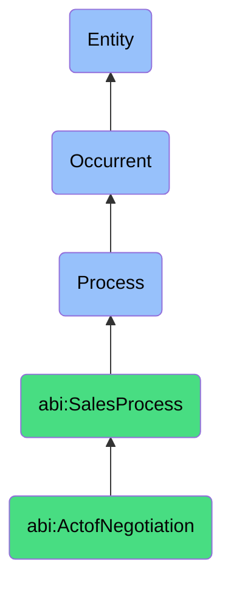

# ActofNegotiation

## Definition
An act of negotiation is an occurrent process that unfolds through time, involving the deliberate exchange, discussion, and modification of proposed deal terms, conditions, and value propositions between sales representatives and prospective customers, aiming to identify mutually acceptable parameters that address both the seller's requirements for profit and viability and the buyer's needs for value and solution fit, ultimately resulting in refined commercial agreements.

## Hierarchy in BFO


## Ontological Schema (TBox)
```turtle
abi:ActofNegotiation a owl:Class ;
  rdfs:subClassOf abi:SalesProcess ;
  rdfs:label "Act of Negotiation" ;
  skos:definition "A process of exchanging, discussing, and modifying deal terms to reach a mutually beneficial agreement." .

abi:SalesProcess a owl:Class ;
  rdfs:subClassOf bfo:0000015 ;
  rdfs:label "Sales Process" ;
  skos:definition "A time-bound interaction or conversion of relationships into economic transactions." .

abi:has_negotiator a owl:ObjectProperty ;
  rdfs:domain abi:ActofNegotiation ;
  rdfs:range abi:Negotiator ;
  rdfs:label "has negotiator" .

abi:negotiates_with_counterparty a owl:ObjectProperty ;
  rdfs:domain abi:ActofNegotiation ;
  rdfs:range abi:NegotiationCounterparty ;
  rdfs:label "negotiates with counterparty" .

abi:discusses_deal_element a owl:ObjectProperty ;
  rdfs:domain abi:ActofNegotiation ;
  rdfs:range abi:DealElement ;
  rdfs:label "discusses deal element" .

abi:employs_negotiation_strategy a owl:ObjectProperty ;
  rdfs:domain abi:ActofNegotiation ;
  rdfs:range abi:NegotiationStrategy ;
  rdfs:label "employs negotiation strategy" .

abi:addresses_objection a owl:ObjectProperty ;
  rdfs:domain abi:ActofNegotiation ;
  rdfs:range abi:SalesObjection ;
  rdfs:label "addresses objection" .

abi:offers_concession a owl:ObjectProperty ;
  rdfs:domain abi:ActofNegotiation ;
  rdfs:range abi:DealConcession ;
  rdfs:label "offers concession" .

abi:produces_negotiation_outcome a owl:ObjectProperty ;
  rdfs:domain abi:ActofNegotiation ;
  rdfs:range abi:NegotiationOutcome ;
  rdfs:label "produces negotiation outcome" .

abi:has_negotiation_duration a owl:DatatypeProperty ;
  rdfs:domain abi:ActofNegotiation ;
  rdfs:range xsd:duration ;
  rdfs:label "has negotiation duration" .

abi:has_negotiation_stage a owl:DatatypeProperty ;
  rdfs:domain abi:ActofNegotiation ;
  rdfs:range xsd:string ;
  rdfs:label "has negotiation stage" .

abi:has_agreement_probability a owl:DatatypeProperty ;
  rdfs:domain abi:ActofNegotiation ;
  rdfs:range xsd:decimal ;
  rdfs:label "has agreement probability" .
```

## Ontological Instance (ABox)
```turtle
ex:EnterpriseContractNegotiationProcess a abi:ActofNegotiation ;
  rdfs:label "Enterprise Contract Negotiation Process" ;
  abi:has_negotiator ex:SeniorAccountExecutive, ex:LegalCounsel ;
  abi:negotiates_with_counterparty ex:ClientProcurementTeam, ex:ClientLegalTeam ;
  abi:discusses_deal_element ex:ContractDuration, ex:PricingStructure, ex:ServiceLevelTerms, ex:DataSecurityClauses ;
  abi:employs_negotiation_strategy ex:ValueBasedNegotiation, ex:RelationshipLeveraging ;
  abi:addresses_objection ex:BudgetConcerns, ex:CompetitorComparison, ex:ImplementationTimelineObjection ;
  abi:offers_concession ex:ExtendedPaymentTerms, ex:EnhancedSupportPackage, ex:CustomReportingFeature ;
  abi:produces_negotiation_outcome ex:RevisionToMasterServiceAgreement, ex:PricingAddendum ;
  abi:has_negotiation_duration "P14D"^^xsd:duration ;
  abi:has_negotiation_stage "FinalTerms" ;
  abi:has_agreement_probability "0.85"^^xsd:decimal .

ex:SoftwareUpgradeNegotiationProcess a abi:ActofNegotiation ;
  rdfs:label "Software Upgrade Negotiation Process" ;
  abi:has_negotiator ex:AccountManager ;
  abi:negotiates_with_counterparty ex:ITDirector, ex:FinanceManager ;
  abi:discusses_deal_element ex:UpgradeCost, ex:MaintenanceTerms, ex:TransitionSupport, ex:LicensingModel ;
  abi:employs_negotiation_strategy ex:ROIJustification, ex:CompetitivePressure ;
  abi:addresses_objection ex:DisruptionConcerns, ex:FeatureParityQuestion, ex:InternalResourceAvailability ;
  abi:offers_concession ex:PhaseImplementation, ex:TrainingCredit, ex:MaintenanceDiscount ;
  abi:produces_negotiation_outcome ex:UpgradeContractModification, ex:ImplementationSchedule ;
  abi:has_negotiation_duration "P5D"^^xsd:duration ;
  abi:has_negotiation_stage "TechnicalConfirmation" ;
  abi:has_agreement_probability "0.75"^^xsd:decimal .
```

## Related Classes
- **abi:ActofDealCreation** - A process that typically precedes negotiation, establishing the initial deal structure.
- **abi:ActofClosing** - A process that follows successful negotiation to finalize the agreement.
- **abi:ActofMeeting** - A process often used during negotiation for face-to-face or virtual discussion.
- **abi:ContractReviewProcess** - A process often occurring in parallel with negotiation.
- **abi:ValuePropositionDefinitionProcess** - A process that informs negotiation strategy and value articulation. 