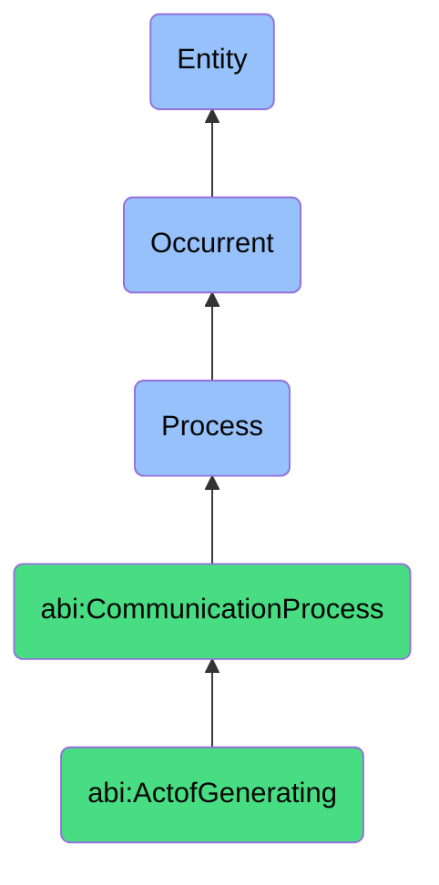

# ActofGenerating

## Definition
An act of generating is an occurrent process that unfolds through time, involving the creation, composition, or production of original textual, visual, or multimedia content through the application of creative, algorithmic, or transformative techniques, resulting in new informational artifacts that express ideas, convey messages, or fulfill communication objectives.

## Hierarchy in BFO


## Ontological Schema (TBox)
```turtle
abi:ActofGenerating a owl:Class ;
  rdfs:subClassOf abi:CommunicationProcess ;
  rdfs:label "Act of Generating" ;
  skos:definition "A process that creates new textual or multimedia content." .

abi:CommunicationProcess a owl:Class ;
  rdfs:subClassOf bfo:0000015 ;
  rdfs:label "Communication Process" ;
  skos:definition "A process involving the creation, transformation, or dissemination of information or content to convey meaning or prompt action." .

abi:has_content_creator a owl:ObjectProperty ;
  rdfs:domain abi:ActofGenerating ;
  rdfs:range abi:ContentCreator ;
  rdfs:label "has content creator" .

abi:uses_generation_method a owl:ObjectProperty ;
  rdfs:domain abi:ActofGenerating ;
  rdfs:range abi:ContentGenerationMethod ;
  rdfs:label "uses generation method" .

abi:follows_creative_guidelines a owl:ObjectProperty ;
  rdfs:domain abi:ActofGenerating ;
  rdfs:range abi:CreativeGuidelines ;
  rdfs:label "follows creative guidelines" .

abi:uses_source_material a owl:ObjectProperty ;
  rdfs:domain abi:ActofGenerating ;
  rdfs:range abi:SourceMaterial ;
  rdfs:label "uses source material" .

abi:produces_content a owl:ObjectProperty ;
  rdfs:domain abi:ActofGenerating ;
  rdfs:range abi:GeneratedContent ;
  rdfs:label "produces content" .

abi:addresses_creative_brief a owl:ObjectProperty ;
  rdfs:domain abi:ActofGenerating ;
  rdfs:range abi:CreativeBrief ;
  rdfs:label "addresses creative brief" .

abi:targets_content_purpose a owl:ObjectProperty ;
  rdfs:domain abi:ActofGenerating ;
  rdfs:range abi:ContentPurpose ;
  rdfs:label "targets content purpose" .

abi:has_generation_duration a owl:DatatypeProperty ;
  rdfs:domain abi:ActofGenerating ;
  rdfs:range xsd:duration ;
  rdfs:label "has generation duration" .

abi:has_originality_score a owl:DatatypeProperty ;
  rdfs:domain abi:ActofGenerating ;
  rdfs:range xsd:decimal ;
  rdfs:label "has originality score" .

abi:has_content_word_count a owl:DatatypeProperty ;
  rdfs:domain abi:ActofGenerating ;
  rdfs:range xsd:integer ;
  rdfs:label "has content word count" .
```

## Ontological Instance (ABox)
```turtle
ex:OpenAIBlogCopyGenerationProcess a abi:ActofGenerating ;
  rdfs:label "OpenAI Blog Copy Generation Process" ;
  abi:has_content_creator ex:OpenAIAssistant ;
  abi:uses_generation_method ex:NaturalLanguageGeneration, ex:ContentExpansion ;
  abi:follows_creative_guidelines ex:BrandVoiceGuidelines, ex:BlogStyleGuide ;
  abi:uses_source_material ex:MarketingBrief, ex:ProductSpecifications, ex:CompetitiveAnalysis ;
  abi:produces_content ex:ProductLaunchBlogPost ;
  abi:addresses_creative_brief ex:ContentMarketingBrief ;
  abi:targets_content_purpose ex:ProductAwareness, ex:LeadGeneration ;
  abi:has_generation_duration "PT12M"^^xsd:duration ;
  abi:has_originality_score "0.86"^^xsd:decimal ;
  abi:has_content_word_count "1200"^^xsd:integer .

ex:VideoScriptGenerationProcess a abi:ActofGenerating ;
  rdfs:label "Explainer Video Script Generation Process" ;
  abi:has_content_creator ex:ContentTeam ;
  abi:uses_generation_method ex:StoryboardTechnique, ex:NarrativeStructuring ;
  abi:follows_creative_guidelines ex:VideoScriptingGuidelines, ex:BrandMessagingFramework ;
  abi:uses_source_material ex:CustomerResearch, ex:ProductDocumentation, ex:ExpertInterviews ;
  abi:produces_content ex:ProductExplainerVideoScript, ex:VideoShotList ;
  abi:addresses_creative_brief ex:VideoProductionBrief ;
  abi:targets_content_purpose ex:CustomerEducation, ex:ConversionOptimization ;
  abi:has_generation_duration "P2D"^^xsd:duration ;
  abi:has_originality_score "0.78"^^xsd:decimal ;
  abi:has_content_word_count "850"^^xsd:integer .
```

## Related Classes
- **abi:ActofPublishing** - A process that distributes the content created through generation.
- **abi:ActofTranslating** - A process that may transform generated content for different audiences.
- **abi:ActofExplaining** - A process that may interpret or elaborate on generated content.
- **abi:ContentEditingProcess** - A process that refines and improves generated content.
- **abi:ContentApprovalProcess** - A process that evaluates and authorizes generated content for use. 